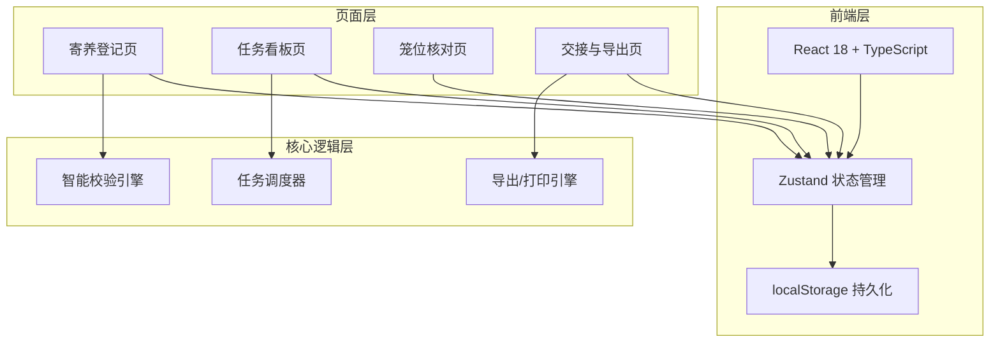
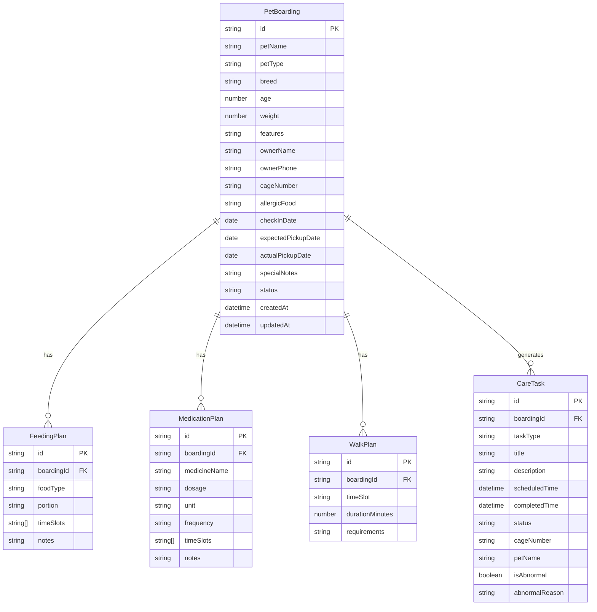

## 1. 架构设计



## 2. 技术说明

- **前端框架**：React@18 + TypeScript
- **样式方案**：Tailwind CSS@3
- **构建工具**：Vite
- **状态管理**：Zustand（含 localStorage 中间件）
- **路由**：react-router-dom
- **图标库**：lucide-react
- **后端**：无（纯前端，localStorage 持久化）
- **数据库**：localStorage（结构化 JSON）

## 3. 路由定义

| 路由 | 用途 |
|------|------|
| `/` | 重定向到任务看板 |
| `/register` | 寄养登记页 - 新增/编辑寄养记录 |
| `/board` | 任务看板页 - 今日待做/已完成/异常 |
| `/cage-check` | 笼位核对页 - 按笼位核对任务 |
| `/handover` | 交接与导出页 - 打印交接单/导出异常 |

## 4. 数据模型

### 4.1 数据模型定义



### 4.2 数据定义

```typescript
interface PetBoarding {
  id: string;
  petName: string;
  petType: 'dog' | 'cat' | 'bird' | 'rabbit' | 'other';
  breed: string;
  age: number;
  weight: number;
  features: string;
  ownerName: string;
  ownerPhone: string;
  cageNumber: string;
  allergicFood: string;
  checkInDate: string;
  expectedPickupDate: string;
  actualPickupDate?: string;
  specialNotes: string;
  status: 'active' | 'picked_up';
  createdAt: string;
  updatedAt: string;
}

interface FeedingPlan {
  id: string;
  boardingId: string;
  foodType: string;
  portion: string;
  timeSlots: string[];
  notes: string;
}

interface MedicationPlan {
  id: string;
  boardingId: string;
  medicineName: string;
  dosage: string;
  unit: string;
  frequency: string;
  timeSlots: string[];
  notes: string;
}

interface WalkPlan {
  id: string;
  boardingId: string;
  timeSlot: string;
  durationMinutes: number;
  requirements: string;
}

type TaskType = 'feeding' | 'medication' | 'walk' | 'other';
type TaskStatus = 'pending' | 'completed' | 'abnormal';

interface CareTask {
  id: string;
  boardingId: string;
  taskType: TaskType;
  title: string;
  description: string;
  scheduledTime: string;
  completedTime?: string;
  status: TaskStatus;
  cageNumber: string;
  petName: string;
  isAbnormal: boolean;
  abnormalReason?: string;
}

interface Warning {
  type: 'same_name' | 'missing_unit' | 'cage_conflict' | 'early_pickup';
  message: string;
  severity: 'warning' | 'error';
  relatedIds: string[];
}
```

## 5. 智能校验规则

| 校验项 | 触发条件 | 提示级别 | 处理方式 |
|--------|----------|----------|----------|
| 同名宠物 | 当前在住宠物中存在同名 | ⚠ 警告 | 黄色提示条，显示笼位号区分 |
| 药量缺单位 | dosage 非空但 unit 为空 | ❌ 错误 | 红色提示，阻止保存 |
| 笼位冲突 | 同一笼位已有在住宠物 | ❌ 错误 | 红色提示，阻止保存 |
| 提前接回未处理 | 实际接回日期 < 预期且有未完成任务 | ⚠ 警告 | 黄色提示，列出未完成任务 |
