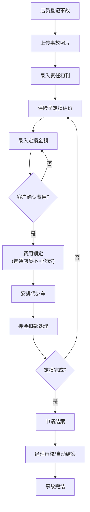

## 1. 产品概述

租车事故交接台是面向租车门店的事故处理管理系统，解决剐蹭事故中信息分散、押金扣款争议、定损流程不透明等痛点。系统集中管理车辆信息、客户信息、事故照片时间线、责任判定、定损金额、代步车安排和押金处理，实现全流程可追溯。

目标用户为门店店员和区域经理，核心价值在于：规范事故处理流程、减少客户投诉、实现责任可追溯、提升管理透明度。

## 2. 核心 Features

### 2.1 用户角色

| 角色 | 注册方式 | 核心权限 |
|------|----------|----------|
| 门店店员 | 系统分配账号 | 登记事故、上传照片、初步定损、安排代步车、提交结案申请 |
| 区域经理 | 系统分配账号 | 全部店员权限 + 查看审计日志、导出报表、费用争议处理、强制结案 |

### 2.2 功能模块

1. **事故列表页**：事故概览、筛选查询、状态标签、快捷操作
2. **事故详情/登记页**：车辆信息、客户信息、事故照片时间线、责任初判、定损金额管理、代步车安排、押金处理、操作记录
3. **经理工作台**：未结案清单、超期定损清单、扣款争议清单、审计对比视图、数据导出

### 2.3 页面详情

| 页面名称 | 模块名称 | 功能描述 |
|----------|----------|----------|
| 事故列表页 | 顶部筛选栏 | 按状态、时间段、门店、车牌号筛选 |
| 事故列表页 | 事故卡片列表 | 展示事故概要信息、状态标签、剩余处理时间 |
| 事故列表页 | 新建事故按钮 | 快速进入事故登记流程 |
| 事故详情页 | 基本信息区 | 车辆信息、客户信息、还车时间、事故时间 |
| 事故详情页 | 照片时间线 | 按时间顺序展示照片，支持分组对比，显示上传人 |
| 事故详情页 | 责任与定损区 | 责任初判、定损金额、保险员估价、客户确认状态 |
| 事故详情页 | 费用处理区 | 代步车安排、扣款金额、押金处理、客户确认锁定 |
| 事故详情页 | 操作日志 | 所有变更记录，包括字段前后值对比 |
| 经理工作台 | 未结案清单 | 展示所有未结案事故，支持一键导出 |
| 经理工作台 | 超期定损清单 | 展示定损超时的事故，标注超期天数 |
| 经理工作台 | 扣款争议清单 | 展示有客户投诉的扣款记录 |
| 经理工作台 | 审计对比视图 | 照片与费用变更时间轴对比，检测后补照片行为 |

## 3. 核心流程

事故处理主流程：店员登记事故基本信息 → 上传事故照片 → 录入责任初判和定损金额 → 客户确认费用（锁定后不可被普通店员修改）→ 安排代步车（如需）→ 处理押金扣款 → 定损完成后申请结案 → 经理审核/系统自动结案。

审计追踪流程：每次字段修改 → 记录旧值新值 → 记录操作人时间 → 经理可查看完整变更历史。

## 4. 界面设计

### 4.1 设计风格

- **主色调**：深海蓝 (#0F3460) 代表专业和信任，搭配警示橙 (#E94560) 突出异常状态
- **辅助色**：成功绿 (#16C79A)、警告黄 (#FFC93C)、信息灰 (#533483)
- **按钮风格**：圆角矩形，主按钮有微妙的悬浮阴影效果，禁用状态灰度显示
- **字体**：标题使用 Noto Serif SC 彰显专业感，正文使用 Inter 保证可读性
- **布局风格**：左右分栏布局，左侧导航+右侧内容，卡片式信息分组，清晰的视觉层级
- **图标风格**：线性图标，统一2px描边，保持简洁专业

### 4.2 页面设计概览

| 页面名称 | 模块名称 | UI 元素 |
|----------|----------|----------|
| 事故列表页 | 顶部筛选栏 | 下拉选择器、日期范围、搜索框、重置按钮 |
| 事故列表页 | 状态统计卡片 | 四个状态统计卡（处理中/定损中/待结案/有争议），带渐变背景 |
| 事故列表页 | 事故列表 | 表格形式，行悬停高亮，状态标签彩色区分 |
| 事故详情页 | 基本信息卡片 | 双列布局，关键信息加粗，标签右对齐 |
| 事故详情页 | 照片时间线 | 竖向时间轴，照片卡片带上传时间和操作人，支持点击放大 |
| 事故详情页 | 费用管理区 | 金额输入框带锁定图标，客户确认后显示锁状态 |
| 事故详情页 | 操作日志 | 可折叠面板，每条记录显示变更字段和前后对比 |
| 经理工作台 | 清单面板 | 三色标签区分三类清单，带数字角标 |
| 经理工作台 | 审计对比 | 双时间轴并排展示，照片上传与费用变更关联高亮 |

### 4.3 响应式设计

桌面端优先设计，针对1280px及以上屏幕优化。平板端采用弹性布局，列表可切换为卡片视图。移动端保留核心信息展示和拍照上传功能，复杂操作引导至桌面端处理。触摸操作区域不小于44x44px。

## 5. 业务规则约束

1. **定损未完成不可结案**：定损金额为空或状态为"定损中"时，结案按钮禁用
2. **客户确认费用锁定**：客户确认后，定损金额和扣款金额字段对普通店员变为只读
3. **照片时间线归并**：同一事故下所有照片按上传时间排序，支持按上传人/时间筛选
4. **审计不可篡改**：所有操作日志永久保存，不可删除或修改
5. **超期预警**：定损超过3个工作日标记为超期，显示红色警告
