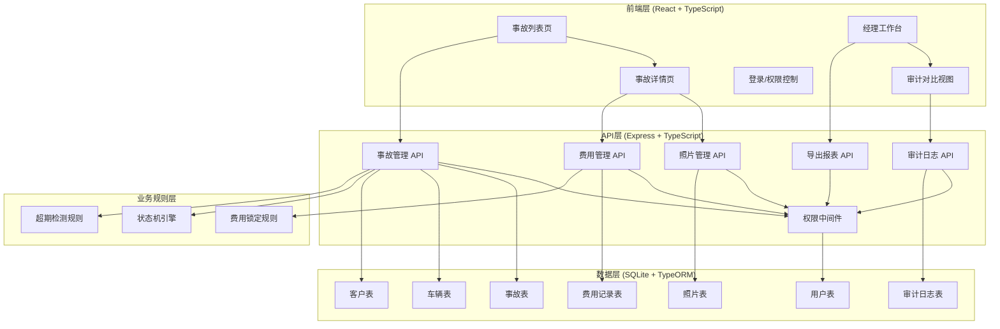
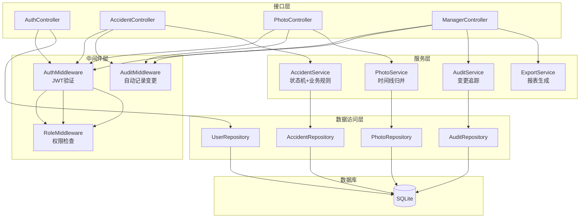
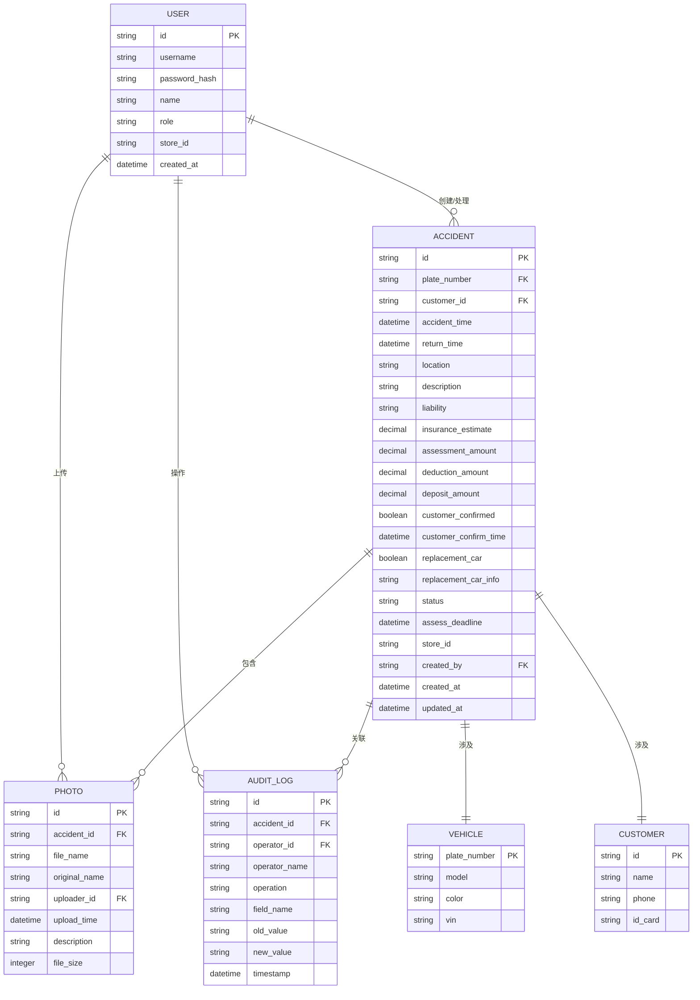

## 1. 架构设计



## 2. 技术选型说明

- **前端**：React@18 + TypeScript + Vite + TailwindCSS@3 + React Router@6 + Zustand（状态管理）+ Lucide React（图标）
- **后端**：Express@4 + TypeScript + TypeORM + SQLite（嵌入式数据库，无需额外部署）
- **认证**：JWT + bcrypt（密码加密）
- **文件存储**：本地文件系统（photos目录），文件名使用UUID+时间戳
- **导出功能**：SheetJS (xlsx) 生成Excel报表

## 3. 路由定义

| 路由 | 页面/用途 | 权限要求 |
|------|----------|----------|
| /login | 登录页面 | 公开 |
| /accidents | 事故列表页 | 店员/经理 |
| /accidents/new | 新建事故 | 店员/经理 |
| /accidents/:id | 事故详情页 | 店员/经理 |
| /manager | 经理工作台 | 经理 |
| /manager/audit/:id | 审计对比视图 | 经理 |

## 4. API 定义

### 4.1 类型定义

```typescript
// 事故状态枚举
enum AccidentStatus {
  REGISTERED = 'registered',      // 已登记
  ASSESSING = 'assessing',        // 定损中
  ASSESSED = 'assessed',          // 已定损
  PENDING_CONFIRM = 'pending_confirm', // 待客户确认
  CONFIRMED = 'confirmed',        // 客户已确认
  PENDING_CLOSE = 'pending_close', // 待结案
  CLOSED = 'closed',              // 已结案
  DISPUTED = 'disputed'           // 有争议
}

// 用户角色
enum UserRole {
  STAFF = 'staff',
  MANAGER = 'manager'
}

// 事故信息
interface Accident {
  id: string;
  plateNumber: string;
  vehicleModel: string;
  customerName: string;
  customerPhone: string;
  customerIdCard: string;
  accidentTime: Date;
  returnTime: Date;
  location: string;
  description: string;
  liability: string;               // 责任初判
  insuranceEstimate: number;       // 保险员估价
  assessmentAmount: number;        // 定损金额
  deductionAmount: number;         // 扣款金额
  depositAmount: number;           // 押金金额
  customerConfirmed: boolean;      // 客户是否确认
  customerConfirmTime: Date;
  replacementCar: boolean;         // 是否需要代步车
  replacementCarInfo: string;
  status: AccidentStatus;
  assessDeadline: Date;            // 定损截止时间
  storeId: string;
  createdAt: Date;
  updatedAt: Date;
}

// 照片信息
interface Photo {
  id: string;
  accidentId: string;
  fileName: string;
  originalName: string;
  uploaderId: string;
  uploaderName: string;
  uploadTime: Date;
  description: string;
  fileSize: number;
}

// 审计日志
interface AuditLog {
  id: string;
  accidentId: string;
  operatorId: string;
  operatorName: string;
  operation: string;
  fieldName: string;
  oldValue: string;
  newValue: string;
  timestamp: Date;
}

// 用户
interface User {
  id: string;
  username: string;
  name: string;
  role: UserRole;
  storeId: string;
}
```

### 4.2 RESTful API

| 方法 | 路径 | 描述 |
|------|------|------|
| POST | /api/auth/login | 登录，返回JWT |
| GET | /api/accidents | 获取事故列表（支持筛选） |
| POST | /api/accidents | 创建事故 |
| GET | /api/accidents/:id | 获取事故详情 |
| PUT | /api/accidents/:id | 更新事故信息（触发审计） |
| POST | /api/accidents/:id/photos | 上传照片 |
| GET | /api/accidents/:id/photos | 获取照片列表 |
| POST | /api/accidents/:id/confirm | 客户确认费用（锁定） |
| POST | /api/accidents/:id/close | 申请结案 |
| GET | /api/accidents/:id/audit | 获取审计日志 |
| GET | /api/manager/unclosed | 获取未结案清单 |
| GET | /api/manager/overdue | 获取超期定损清单 |
| GET | /api/manager/disputed | 获取扣款争议清单 |
| GET | /api/manager/export/:type | 导出报表（Excel） |
| GET | /api/manager/audit-timeline/:id | 获取审计时间线对比数据 |

## 5. 服务端架构



## 6. 数据模型

### 6.1 ER 图



### 6.2 DDL 语句

```sql
-- 用户表
CREATE TABLE user (
  id VARCHAR(36) PRIMARY KEY,
  username VARCHAR(50) UNIQUE NOT NULL,
  password_hash VARCHAR(255) NOT NULL,
  name VARCHAR(50) NOT NULL,
  role VARCHAR(20) NOT NULL CHECK (role IN ('staff', 'manager')),
  store_id VARCHAR(50) NOT NULL,
  created_at DATETIME DEFAULT CURRENT_TIMESTAMP
);

-- 车辆表
CREATE TABLE vehicle (
  plate_number VARCHAR(20) PRIMARY KEY,
  model VARCHAR(100) NOT NULL,
  color VARCHAR(30),
  vin VARCHAR(50)
);

-- 客户表
CREATE TABLE customer (
  id VARCHAR(36) PRIMARY KEY,
  name VARCHAR(50) NOT NULL,
  phone VARCHAR(20) NOT NULL,
  id_card VARCHAR(30)
);

-- 事故表
CREATE TABLE accident (
  id VARCHAR(36) PRIMARY KEY,
  plate_number VARCHAR(20) REFERENCES vehicle(plate_number),
  customer_id VARCHAR(36) REFERENCES customer(id),
  accident_time DATETIME NOT NULL,
  return_time DATETIME,
  location VARCHAR(200),
  description TEXT,
  liability VARCHAR(50),
  insurance_estimate DECIMAL(10,2),
  assessment_amount DECIMAL(10,2),
  deduction_amount DECIMAL(10,2),
  deposit_amount DECIMAL(10,2),
  customer_confirmed BOOLEAN DEFAULT 0,
  customer_confirm_time DATETIME,
  replacement_car BOOLEAN DEFAULT 0,
  replacement_car_info VARCHAR(200),
  status VARCHAR(30) NOT NULL DEFAULT 'registered',
  assess_deadline DATETIME,
  store_id VARCHAR(50) NOT NULL,
  created_by VARCHAR(36) REFERENCES user(id),
  created_at DATETIME DEFAULT CURRENT_TIMESTAMP,
  updated_at DATETIME DEFAULT CURRENT_TIMESTAMP
);

-- 照片表
CREATE TABLE photo (
  id VARCHAR(36) PRIMARY KEY,
  accident_id VARCHAR(36) NOT NULL REFERENCES accident(id),
  file_name VARCHAR(100) NOT NULL,
  original_name VARCHAR(200) NOT NULL,
  uploader_id VARCHAR(36) NOT NULL REFERENCES user(id),
  uploader_name VARCHAR(50) NOT NULL,
  upload_time DATETIME DEFAULT CURRENT_TIMESTAMP,
  description VARCHAR(500),
  file_size INTEGER NOT NULL
);

CREATE INDEX idx_photo_accident ON photo(accident_id);
CREATE INDEX idx_photo_time ON photo(upload_time);

-- 审计日志表
CREATE TABLE audit_log (
  id VARCHAR(36) PRIMARY KEY,
  accident_id VARCHAR(36) NOT NULL REFERENCES accident(id),
  operator_id VARCHAR(36) NOT NULL REFERENCES user(id),
  operator_name VARCHAR(50) NOT NULL,
  operation VARCHAR(50) NOT NULL,
  field_name VARCHAR(50),
  old_value TEXT,
  new_value TEXT,
  timestamp DATETIME DEFAULT CURRENT_TIMESTAMP
);

CREATE INDEX idx_audit_accident ON audit_log(accident_id);
CREATE INDEX idx_audit_time ON audit_log(timestamp);

-- 初始化测试用户
INSERT INTO user (id, username, password_hash, name, role, store_id) VALUES
('staff-001', 'staff1', '$2b$10$...', '张三', 'staff', 'store-001'),
('manager-001', 'manager1', '$2b$10$...', '李经理', 'manager', 'store-001');
```

### 6.3 业务规则引擎实现要点

1. **状态机规则**：
   - REGISTERED → ASSESSING：录入定损信息时
   - ASSESSING → ASSESSED：定损金额录入完成
   - ASSESSED → PENDING_CONFIRM：发送客户确认
   - PENDING_CONFIRM → CONFIRMED：客户确认后
   - CONFIRMED → PENDING_CLOSE：申请结案
   - PENDING_CLOSE → CLOSED：经理审核/自动通过
   - 任意状态 → DISPUTED：标记争议

2. **费用锁定规则**：
   - 中间件拦截PUT /api/accidents/:id请求
   - 检查customer_confirmed字段是否为true
   - 若为true且用户角色为staff，禁止修改assessment_amount和deduction_amount

3. **结案校验规则**：
   - 结案前检查status是否≥CONFIRMED
   - 检查assessment_amount是否非空
   - 检查所有必填字段是否完整

4. **超期检测**：
   - 每次查询时计算accident_time到当前的工作日
   - 超过3个工作日且状态<ASSESSED标记为overdue
