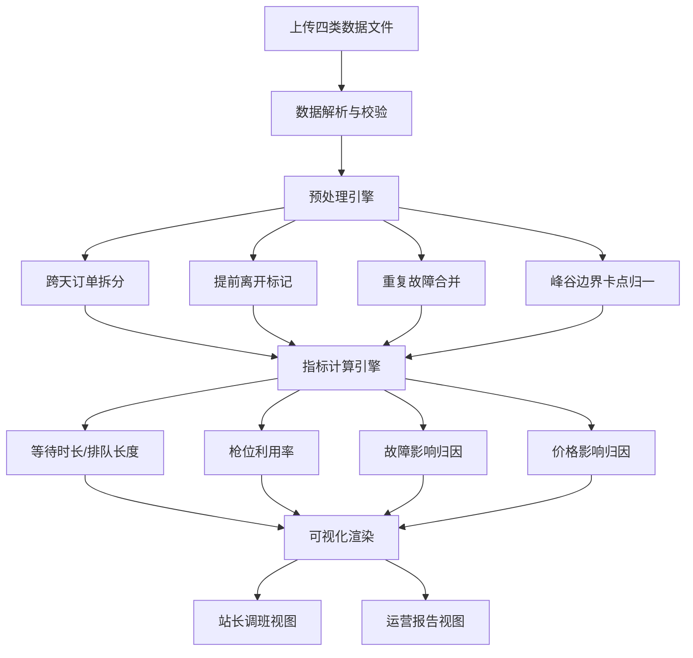

## 1. 产品概述

高速充电站排队峰谷分析系统，用于解决节假日充电拥堵归因难的问题。系统通过整合充电订单、排队记录、电价时段和设备故障数据，可视化呈现全站排队峰谷规律，帮助站长优化排班、帮助运营判断是否需要临时引导分流，并将设备故障与价格因素的影响独立呈现，避免错误归因。

- **目标用户**：充电站站长（一线运营）、区域运营经理（决策层）
- **核心价值**：将"为什么堵"从经验判断变为数据可解释，支持精准排班与分流决策

## 2. 核心功能

### 2.1 用户角色

| 角色 | 说明 | 核心权限 |
|------|------|----------|
| 站长 | 充电站现场管理人员 | 查看排队峰谷图、枪位利用率、排班建议、故障影响明细 |
| 运营经理 | 区域运营决策者 | 查看运营报告、峰谷统计、故障/价格归因对比、分流建议 |

### 2.2 功能模块

1. **数据导入页**：上传四类数据源（订单、排队、电价、故障），预览解析结果
2. **排队峰谷总览**：全站/分枪位的等待时长热力图、排队长度时间曲线、利用率柱状图
3. **多维钻取分析**：按时段/车型/枪位维度下钻，查看等待时长、充电时长、排队订单数
4. **故障与价格归因**：独立展示设备故障影响的订单、电价促销时段的排队变化，避免混淆
5. **站长调班视图**：推荐排班时段、人员缺口、高峰预警时段
6. **运营报告视图**：峰谷统计摘要、异常时段标注、分流建议与成本收益对比

### 2.3 页面详情

| 页面名称 | 模块名称 | 功能描述 |
|----------|----------|----------|
| 数据导入页 | 文件上传区 | 拖拽或点击上传CSV/Excel文件，支持订单、排队、电价、故障四类 |
| 数据导入页 | 解析预览表 | 显示各数据源的解析条数、字段识别结果、异常数据提示 |
| 排队峰谷总览 | 时间选择器 | 选择分析日期范围，支持节假日快捷选择 |
| 排队峰谷总览 | 等待时长热力图 | 24小时×枪位的二维热力图，颜色深浅代表平均等待时长 |
| 排队峰谷总览 | 排队长度曲线 | 实时排队车辆数随时间变化的折线图，叠加峰谷时段背景色 |
| 排队峰谷总览 | 利用率柱状图 | 各枪位按小时的利用率，空闲/充电/故障三段堆叠 |
| 多维钻取分析 | 维度筛选器 | 时段（平/峰/谷）、车型、枪位多条件组合筛选 |
| 多维钻取分析 | 等待时长分布 | 筛选条件下的等待时长箱线图/直方图 |
| 多维钻取分析 | 订单明细列表 | 符合筛选条件的订单列表，含跨天/提前离开标注 |
| 故障与价格归因 | 故障影响卡片 | 故障时段、故障枪、受影响订单数、额外等待时长总计 |
| 故障与价格归因 | 价格影响卡片 | 促销/峰谷电价时段对应的排队变化率、订单增量 |
| 故障与价格归因 | 并排对比图 | 同时展示故障和价格在同一时间轴上的影响 |
| 站长调班视图 | 排班推荐表 | 按小时推荐在岗人数，标注高峰预警时段 |
| 站长调班视图 | 枪位分配建议 | 高峰时段建议开放的枪位数量与类型 |
| 运营报告视图 | 峰谷摘要 | 最堵TOP3时段、平均等待时长、最长等待时长等关键指标 |
| 运营报告视图 | 异常分析 | 标注异常拥堵时段及其可能原因（故障/价格/车流突增） |
| 运营报告视图 | 分流建议 | 是否需要临时引导、引导到附近哪个站、预估收益 |

## 3. 核心流程

用户从数据导入开始，系统自动解析并预处理四类数据，处理跨天订单、车辆提前离开、重复故障、峰谷边界卡点等特殊情况。计算引擎输出各维度的等待时长、利用率、故障影响等指标，再通过图表分别呈现给站长（调班视角）和运营（决策视角）。

## 4. 用户界面设计

### 4.1 设计风格

- **主色调**：深电蓝 `#0A2540`（专业、稳重）+ 电光绿 `#00D4AA`（数据、能源感）
- **辅助色**：警示橙 `#FF6B35`（高峰/故障）、柔和黄 `#F4C430`（预警）、中性灰 `#E8ECF0`
- **风格定位**：工业科技感 + 数据可视化专业风，暗色调为主，突出数据密度
- **字体**：标题使用 Space Grotesk（几何工业感），正文使用 JetBrains Mono（数据密集易读）
- **按钮**：方形微圆角（2px）、实心主色按钮配细边框、hover有轻微发光效果
- **图标**：使用 Lucide 线性图标，统一 1.5px 线宽
- **布局**：卡片式网格布局，卡片有细边框和微弱阴影，重要卡片带左侧彩色状态条

### 4.2 页面设计概述

| 页面名称 | 模块名称 | UI元素 |
|----------|----------|--------|
| 数据导入页 | 文件上传区 | 虚线边框上传框、拖拽态高亮、四类数据图标、文件大小/条数预览 |
| 排队峰谷总览 | 等待时长热力图 | 24列×N行网格单元格，渐变填充，hover显示精确数值，枪位标签在左 |
| 排队峰谷总览 | 排队长度曲线 | SVG折线图，区域填充渐变，背景按峰/平/谷电价横向着色 |
| 多维钻取分析 | 维度筛选器 | 下拉多选芯片、日期范围选择器、车型标签、枪位按钮组 |
| 故障与价格归因 | 并排对比图 | 双Y轴时间序列，故障用橙色竖条标记，价格用背景色区分 |
| 站长调班视图 | 排班推荐表 | 24行时间表，每行显示推荐人数、高峰等级、颜色背景条 |
| 运营报告视图 | 峰谷摘要 | 大号数字卡片，带趋势箭头和同比变化率 |

### 4.3 响应式

- 桌面端优先（1280px+），站长和运营均在PC查看
- 平板端（768-1280px）：热力图简化为12小时聚合，卡片自动换行
- 移动端（<768px）：仅保留关键指标和排队曲线，支持横屏查看热力图

### 4.4 动效设计

- 页面加载：卡片从下往上依次淡入（staggered reveal，间隔80ms）
- 数据切换：图表数据用数值滚动动画过渡（0.6s ease-out）
- 热力图hover：单元格放大1.1倍，显示十字参考线
- 高峰预警：警示卡片有轻微呼吸灯效果（橙色透明度脉动）
- Tab切换：下方有滑动指示条，0.3s cubic-bezier过渡
