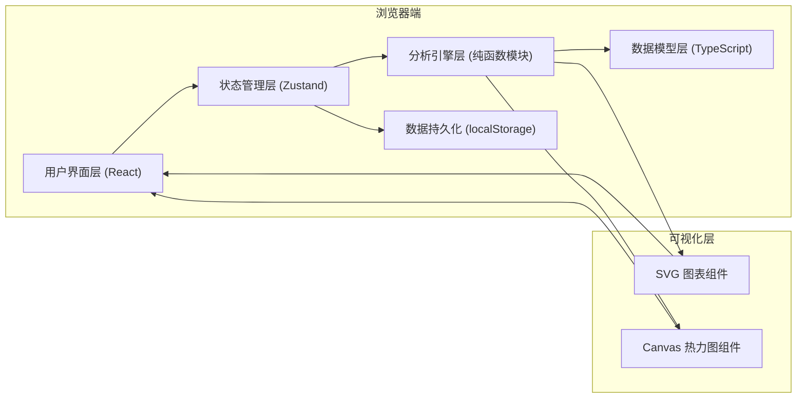
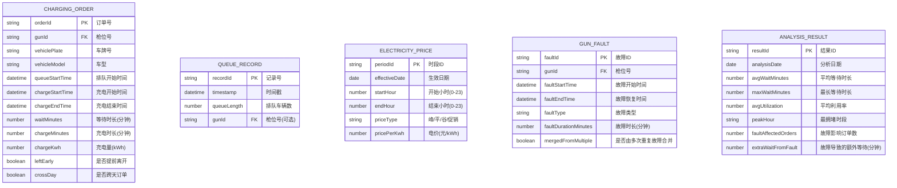

## 1. 架构设计

本系统为纯前端单页应用，所有数据解析、指标计算、可视化渲染均在浏览器端完成，无需后端服务。数据存储采用浏览器 localStorage 缓存已上传的数据集。



## 2. 技术描述

- **前端框架**：React@18 + TypeScript@5
- **构建工具**：Vite@5
- **样式方案**：TailwindCSS@3 + CSS 变量（主题系统）
- **状态管理**：Zustand@4（轻量、支持中间件持久化）
- **文件解析**：PapaParse（CSV）、SheetJS/xlsx（Excel）
- **图表渲染**：原生 SVG + 自研 Canvas 热力图（不依赖 ECharts/Chart.js，保持轻量与定制性）
- **图标库**：Lucide React
- **日期处理**：date-fns（轻量替代 Moment.js）
- **后端**：无（纯前端应用）
- **数据库**：localStorage + IndexedDB（可选大数据量场景）
- **Mock 数据**：内置演示数据集（真实节假日充电站数据模拟）

## 3. 路由定义

| 路由 | 页面组件 | 用途 |
|------|----------|------|
| `/` | OverviewPage | 排队峰谷总览（首页，默认展示演示数据） |
| `/import` | ImportPage | 数据导入与解析 |
| `/analysis` | AnalysisPage | 多维钻取分析 |
| `/attribution` | AttributionPage | 故障与价格归因对比 |
| `/station-master` | StationMasterPage | 站长调班视图 |
| `/report` | ReportPage | 运营报告视图 |

## 4. 数据模型

### 4.1 数据实体关系



### 4.2 TypeScript 类型定义

```typescript
// 充电订单
export interface ChargingOrder {
  orderId: string;
  gunId: string;
  vehiclePlate: string;
  vehicleModel: string;
  queueStartTime: Date;
  chargeStartTime: Date;
  chargeEndTime: Date;
  waitMinutes: number;
  chargeMinutes: number;
  chargeKwh: number;
  leftEarly: boolean;
  crossDay: boolean;
  affectedByFault?: string; // 关联故障ID
  pricePeriod?: string; // 所属电价时段
}

// 排队记录
export interface QueueRecord {
  recordId: string;
  timestamp: Date;
  queueLength: number;
  gunId?: string;
}

// 电价时段
export interface ElectricityPrice {
  periodId: string;
  effectiveDate: string; // YYYY-MM-DD
  startHour: number;
  endHour: number;
  priceType: 'peak' | 'flat' | 'valley' | 'promotion';
  pricePerKwh: number;
}

// 枪位故障
export interface GunFault {
  faultId: string;
  gunId: string;
  faultStartTime: Date;
  faultEndTime: Date;
  faultType: string;
  faultDurationMinutes: number;
  mergedFromMultiple: boolean;
  originalFaultIds?: string[];
}

// 小时级统计指标
export interface HourlyMetric {
  date: string;
  hour: number; // 0-23
  gunId?: string; // 可选，按枪位统计时有值
  avgWaitMinutes: number;
  maxWaitMinutes: number;
  orderCount: number;
  queueLengthAvg: number;
  utilizationRate: number; // 0-1
  idleMinutes: number;
  chargingMinutes: number;
  faultMinutes: number;
  priceType?: 'peak' | 'flat' | 'valley' | 'promotion';
}

// 归因分析结果
export interface AttributionResult {
  faultImpact: {
    totalAffectedOrders: number;
    totalExtraWaitMinutes: number;
    affectedGuns: string[];
    byFault: Record<string, { orders: number; extraWait: number }>;
  };
  priceImpact: {
    peakHourOrders: number;
    valleyHourOrders: number;
    promotionOrders: number;
    orderChangeRate: Record<string, number>; // priceType -> 变化率
  };
}
```

## 5. 核心模块划分

```
src/
├── types/              # 类型定义
├── data/               # Mock 演示数据
├── engine/             # 分析引擎（纯函数）
│   ├── parser.ts       # CSV/Excel 数据解析
│   ├── preprocessor.ts # 预处理（跨天拆分、提前离开标记、故障合并、峰谷归一）
│   ├── metrics.ts      # 指标计算（等待时长、利用率、排队长度）
│   └── attribution.ts  # 归因分析（故障影响、价格影响）
├── store/              # Zustand 状态管理
├── components/         # React 组件
│   ├── charts/         # 图表组件（热力图、折线图、柱状图等）
│   ├── layout/         # 布局组件（导航、卡片、Tab等）
│   └── filters/        # 筛选组件
├── pages/              # 页面组件
├── hooks/              # 自定义 Hooks
├── utils/              # 工具函数（日期、格式化等）
└── styles/             # 全局样式与主题
```

## 6. 关键算法说明

### 6.1 跨天订单拆分
- 检测 `chargeStartTime` 和 `chargeEndTime` 是否跨零点
- 拆分时按分钟比例分配 `chargeMinutes` 和 `chargeKwh` 到相邻两天
- 保留原始订单关联，标记 `crossDay: true`

### 6.2 重复故障合并
- 按 `gunId` 分组后，检测同枪故障时间间隔 < 30 分钟的相邻故障
- 合并为一条故障记录，记录 `originalFaultIds`
- 合并后的故障时长 = 最早开始 - 最晚结束

### 6.3 峰谷边界卡点归一
- 订单/排队落在时段边界前后5分钟内的，统一归入主体时段
- 如 19:03 的订单（19:00为峰段开始）归入峰段而非前一段

### 6.4 故障影响归因
- 计算故障时间窗内开始排队的订单
- 额外等待时长 = 实际等待时长 - 同时段同枪位无故障时的历史平均等待
- 标记 `affectedByFault` 关联故障ID

### 6.5 枪位利用率计算
- 每小时利用率 = (充电分钟数 + 故障分钟数) / 60
- 三段堆叠展示：空闲 / 充电 / 故障
