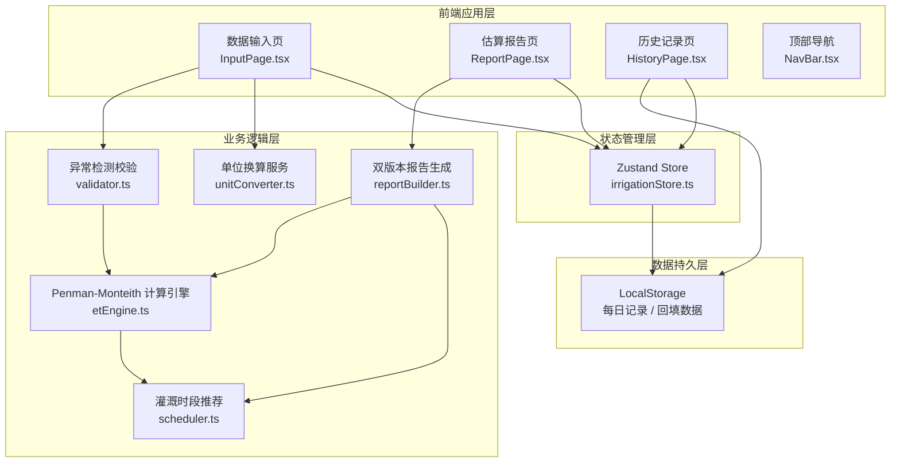

## 1. 架构设计



## 2. 技术描述

- **前端框架**：React@18 + TypeScript@5
- **构建工具**：Vite@5
- **样式方案**：TailwindCSS@3 + CSS 变量主题系统
- **路由管理**：React Router DOM@6
- **状态管理**：Zustand@4
- **图表库**：Recharts（柱状图 + 折线图，轻量且支持 TS）
- **图标库**：lucide-react
- **动画方案**：Framer Motion（卡片动效、数字滚动）+ 原生 CSS 过渡
- **数据持久化**：localStorage（封装自定义 hook + 自动 JSON 序列化）
- **初始化方式**：`pnpm create vite-init@latest . --template react-ts --force`

## 3. 路由定义

| 路由路径 | 页面组件 | 主要用途 |
|---------|---------|---------|
| `/` | InputPage | 数据录入：气象参数 + 作物阶段 + 土壤 + 灌溉系统 |
| `/report` | ReportPage | 估算报告：需水量展示 + 时段建议 + 双版本切换 |
| `/history` | HistoryPage | 历史回填：实际灌水量录入 + 建议 vs 实际对比 |

## 4. 核心数据模型

### 4.1 类型定义

```typescript
// shared/types.ts

export type CropStage = 'seedling' | 'flowering' | 'fruit_set' | 'fruit_expansion' | 'mature' | null;

export type Unit = {
  temperature: 'celsius' | 'fahrenheit';
  humidity: 'percent';
  radiation: 'w_m2' | 'lux';
  wind: 'm_s' | 'km_h';
  soilMoisture: 'vol_percent' | 'mbar';
  irrigation: 'mm' | 'm3_per_mu';
};

export interface SensorInput {
  temperature: number | null;      // 气温（换算成℃存储）
  temperatureRaw: { value: number; unit: Unit['temperature'] } | null;
  humidity: number | null;         // 相对湿度 %
  humidityPrevious: number | null; // 上次读数，用于跳变检测
  radiation: number | null;        // 太阳辐射（换算成 W/m² 存储）
  radiationRaw: { value: number; unit: Unit['radiation'] } | null;
  wind: number | null;             // 风速（换算成 m/s 存储）
  windRaw: { value: number; unit: Unit['wind'] } | null;
  cropStage: CropStage;
  soilMoisture: number | null;     // 土壤湿度（换算成体积%存储）
  soilMoistureRaw: { value: number; unit: Unit['soilMoisture'] } | null;
  irrigationEfficiency: number;    // 灌溉系统效率 0~1，默认 0.8
  irrigationMethod: 'drip' | 'sprinkler' | 'furrow';
}

export interface ValidationWarning {
  type: 'missing' | 'jump' | 'stage_unselected' | 'out_of_range';
  field: keyof SensorInput;
  message: string;
  conservativeFactor: number; // 保守估算修正系数，如 1.15 表示+15%
}

export interface ETResult {
  et0: number;                 // 参考蒸散量 mm/day
  kc: number;                  // 作物系数
  etc: number;                 // 作物实际蒸散 mm/day
  soilCorrection: number;      // 土壤湿度修正系数
  netIrrigation: number;       // 净灌溉量 mm
  grossIrrigation: number;     // 毛灌溉量 mm（含效率损失）
  grossIrrigationM3Mu: number; // 换算成 方/亩
  scheduledWindows: IrrigationWindow[];
  warnings: ValidationWarning[];
  totalConservativeFactor: number;
}

export interface IrrigationWindow {
  startHour: number;   // 0~23
  endHour: number;
  reason: string;      // 人话说明理由
  priority: 'primary' | 'secondary';
}

export interface DailyRecord {
  date: string;              // YYYY-MM-DD
  input: SensorInput;
  result: ETResult;
  actualIrrigation: number | null;  // 实际灌水量 mm
  note: string;
  createdAt: number;
}

export interface WeeklySummary {
  weekStart: string;
  totalSuggested: number;
  totalActual: number;
  deviationPercent: number;
  advice: string;
}
```

### 4.2 作物系数表（番茄温室）

| 作物阶段 | CropStage 枚举 | Kc 范围 | 默认取中值 |
|---------|---------------|---------|----------|
| 育苗期 | seedling | 0.45 ~ 0.55 | 0.50 |
| 开花期 | flowering | 0.70 ~ 0.80 | 0.75 |
| 坐果期 | fruit_set | 0.85 ~ 0.95 | 0.90 |
| 膨果期 | fruit_expansion | 1.05 ~ 1.20 | 1.12 |
| 成熟期 | mature | 0.75 ~ 0.85 | 0.80 |
| 未选（null） | null | 0.85 ~ 0.95 ×1.15 保守 | 0.92 ×1.15 |

### 4.3 Penman-Monteith FAO-56 公式实现要点

```
ET₀ = [0.408·Δ·(Rn - G) + γ·(900/(T+273))·u₂·(es - ea)]
      ÷ [Δ + γ·(1 + 0.34·u₂)]
```

其中：
- Δ：饱和水汽压斜率，kPa/℃
- Rn：净辐射，MJ/m²/day（由 W/m²×0.0864 换算）
- G：土壤热通量，取 0（日均值）
- γ：干湿表常数，0.067 kPa/℃
- T：平均气温，℃
- u₂：2m 高处风速，m/s（温室默认×0.6 折减）
- es：饱和水汽压，kPa
- ea：实际水汽压，kPa = es × RH/100

## 5. 核心算法模块划分

| 文件路径 | 模块职责 | 导出函数 |
|---------|---------|---------|
| `src/utils/unitConverter.ts` | 多单位换算 | tempConvert, radiationConvert, windConvert, soilMoistureConvert, mmToM3Mu |
| `src/utils/validator.ts` | 输入校验与异常检测 | validateInputs, detectHumidityJump, getConservativeFactor |
| `src/utils/etEngine.ts` | Penman-Monteith 计算 | calcDelta, calcEs, calcRnPenman, calcET0, calcETc, calcNetIrrigation |
| `src/utils/scheduler.ts` | 灌溉时段推荐 | suggestIrrigationWindows |
| `src/utils/reportBuilder.ts` | 双版本报告构建 | buildFarmerReport, buildTechnicianReport |
| `src/utils/storage.ts` | 本地存储封装 | saveDailyRecord, getRecordsByWeek, getWeeklySummary |
| `src/store/irrigationStore.ts` | Zustand 全局状态 | SensorInput, warnings, result, records, 全部 action |

## 6. 组件拆分

| 组件路径 | 组件名 | 单一职责 |
|---------|-------|---------|
| `src/components/NavBar.tsx` | 顶部导航 | 页面路由切换 + 日期显示 |
| `src/components/InputGroup.tsx` | 输入分组容器 | 带图标标题 + 卡片包裹 |
| `src/components/UnitInput.tsx` | 带单位切换的数字输入 | 数值输入 + 单位下拉 + 校验提示 |
| `src/components/CropStageTimeline.tsx` | 作物阶段时间线 | 5 段可视化选择器 |
| `src/components/WarningBanner.tsx` | 保守提示横幅 | 顶部固定，展开/收起异常列表 |
| `src/components/ResultCard.tsx` | 水量结果卡片 | 大号数字 + 单位切换 + 渐变进度条 |
| `src/components/TimelineHeatmap.tsx` | 24h 灌溉时间轴 | 热力图 + 推荐窗口标注 |
| `src/components/ReportTabs.tsx` | 双版本报告切换 | Tab 动画切换 |
| `src/components/FarmerReport.tsx` | 农户版报告 | 人话描述 + 操作指引卡片 |
| `src/components/TechnicianReport.tsx` | 农技员版报告 | 参数表 + 公式步骤 + 结果推导 |
| `src/components/BackfillForm.tsx` | 回填表单 | 日期选择 + 实际水量 + 备注 |
| `src/components/CompareChart.tsx` | 对比图表 | Recharts 柱状图 + 折线图 |
| `src/components/WeeklySummaryCard.tsx` | 周度总结卡 | 偏差率 + 节水/超水 + 建议 |
