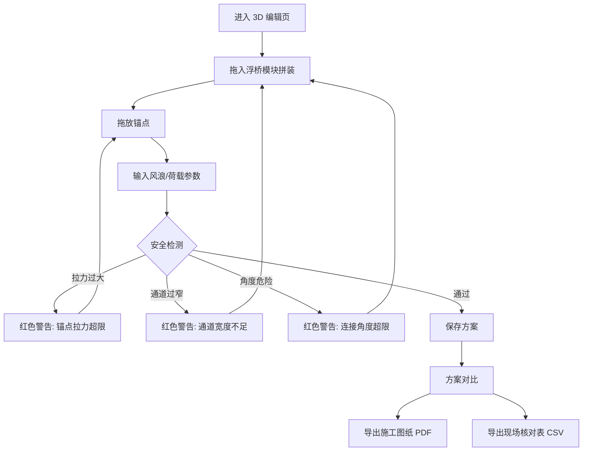

## 1. 产品概述

水上浮桥锚点模拟系统——面向水上乐园临时浮桥搭建的工程仿真工具。在 3D 水面场景中拼装浮桥模块、拖放锚点、输入风浪与荷载参数，实时检测拉力过大、通道过窄、连接角度危险等安全隐患，支持多方案保存对比，并可导出带锚点/模块编号/复核事项的施工图纸及按模块编号的现场核对表。

- 目标用户：水上乐园工程师、现场施工负责人
- 核心价值：将抽象结构计算可视化，让现场师傅直观看到"哪里会晃"，降低临时浮桥搭设风险

## 2. 核心功能

### 2.1 用户角色

| 角色 | 使用方式 | 核心权限 |
|------|----------|----------|
| 工程师 | 直接使用 | 设计方案、调整参数、导出图纸与核对表 |
| 施工负责人 | 查看导出物 | 按核对表领料、按图施工 |

### 2.2 功能模块

1. **3D 浮桥编辑页**：3D 水面场景、浮桥模块拖放拼装、锚点拖拽、风浪方向可视化、实时安全检测
2. **方案管理页**：保存/加载/对比多套方案（最多 3 套）
3. **导出页**：施工图纸 PDF 导出、现场核对表 CSV 导出

### 2.3 页面详情

| 页面名称 | 模块名称 | 功能描述 |
|----------|----------|----------|
| 3D 浮桥编辑页 | 3D 水面场景 | 波浪水面、天空盒、环境光照 |
| 3D 浮桥编辑页 | 浮桥模块面板 | 从侧边栏拖入不同规格模块（直段/弯段/平台），支持自定义长宽、承重参数 |
| 3D 浮桥编辑页 | 锚点管理 | 拖拽锚点位置、设置锚点类型（岸锚/水锚）、禁区标记 |
| 3D 浮桥编辑页 | 参数面板 | 输入风向角度与风速、浪高与浪向、游客人数、单模块承载上限 |
| 3D 浮桥编辑页 | 安全检测面板 | 实时显示拉力、通道宽度、连接角度；超标时红色警告+文字说明 |
| 3D 浮桥编辑页 | 单位切换 | 米/英尺一键切换，尺寸自动换算并标注 |
| 方案管理页 | 方案列表 | 显示已保存方案缩略图与关键参数 |
| 方案管理页 | 方案对比 | 2-3 套方案并排对比：锚点数、总拉力、通道宽度、安全评级 |
| 导出页 | 施工图纸导出 | 生成含锚点坐标、模块编号、复核事项的俯视图 PDF |
| 导出页 | 现场核对表导出 | 按模块编号生成领料/核对表 CSV |

## 3. 核心流程

工程师进入 3D 编辑页 → 从侧栏拖入浮桥模块拼装桥体 → 拖放锚点固定 → 输入风浪参数与游客荷载 → 系统实时计算拉力/宽度/角度 → 出现安全警告时调整方案 → 保存方案 → 可切换至方案对比页比较多套方案 → 最终导出施工图纸与核对表

## 4. 用户界面设计

### 4.1 设计风格

- 主色调：深海蓝 (#0A2540) + 水面青 (#00D4AA) + 警告橙 (#FF6B35)
- 辅助色：浅灰面板、白色文字
- 按钮风格：圆角 8px，悬停时微浮起 + 阴影
- 字体：标题用 "DM Sans" (粗体)、正文用 "DM Sans" (常规)、数据用 "JetBrains Mono"
- 布局：左侧 3D 画布（70%），右侧参数/检测面板（30%）
- 图标：lucide-react 线条图标

### 4.2 页面设计概览

| 页面名称 | 模块名称 | UI 元素 |
|----------|----------|----------|
| 3D 浮桥编辑页 | 3D 画布区 | 全景水面、波浪动画、天空渐变、模块与锚点 3D 模型、风浪方向箭头 |
| 3D 浮桥编辑页 | 侧栏模块库 | 卡片式模块列表，拖拽手柄，模块预览缩略图 |
| 3D 浮桥编辑页 | 参数面板 | 滑块+数字输入、风向罗盘组件、单位切换开关 |
| 3D 浮桥编辑页 | 安全面板 | 三色状态灯（绿/黄/红）、数值条、警告卡片 |
| 方案管理页 | 方案卡片 | 缩略图、关键指标网格、对比勾选框 |
| 方案管理页 | 对比视图 | 三列并排表格，差异项高亮 |
| 导出页 | 导出预览 | 图纸缩略预览、核对表预览表格、下载按钮 |

### 4.3 响应式

桌面优先设计，3D 画布需要较大视口；平板端面板折叠为底部抽屉；小屏暂不支持（3D 交互需求）。

### 4.4 3D 场景指引

- 环境：日落暖光 HDRI，水面反射，远处岸边树木剪影
- 光照：主方向光（模拟日光）+ 环境光 + 水面点光源
- 相机：透视相机，默认 45° 俯视，可 OrbitControls 自由旋转/缩放
- 交互：鼠标拖拽锚点、点击模块选中、悬停高亮
- 动画：水面波浪顶点着色器动画、风力影响模块微晃、锚绳张紧动画
- 后处理：轻微辉光（Bloom）增强水面质感

## 5. 安全检测规则

| 检测项 | 阈值 | 警告级别 | 说明文案 |
|--------|------|----------|----------|
| 锚点拉力 | > 模块承重 × 0.8 | 红色-危险 | "锚点 {id} 拉力 {value}N 超过安全限值 {limit}N" |
| 通道宽度 | < 1.2m | 红色-危险 | "模块 {id} 与 {id} 之间通道仅 {width}m，低于最低 1.2m" |
| 连接角度 | > 15° | 黄色-警告 | "模块 {id} 与 {id} 连接角 {angle}° 超过推荐 15°" |
| 锚点禁区 | 锚点落入禁区 | 红色-危险 | "锚点 {id} 位于禁区（{原因}），请移至安全区域" |
| 游客荷载 | 人数 × 75kg > 总承重 | 红色-危险 | "游客荷载 {load}kg 超过浮桥总承重 {capacity}kg" |
| 单位混用 | 输入值与当前单位不一致 | 黄色-警告 | "输入值为 {input_unit}，当前显示单位为 {display_unit}，已自动换算" |
