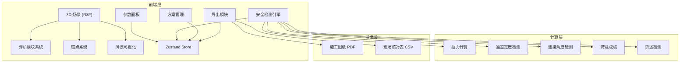

## 1. 架构设计



纯前端架构，无后端依赖。所有计算在浏览器端完成，方案数据存储在 localStorage。

## 2. 技术说明

- 前端：React@18 + TypeScript + Vite + Tailwind CSS@3
- 3D 渲染：three + @react-three/fiber + @react-three/drei + @react-three/postprocessing
- 状态管理：zustand
- 导出：jspdf（施工图纸 PDF）、papaparse（CSV 核对表）
- 单位换算：自定义工具函数（米/英尺互转）
- 初始化工具：vite-init（react-ts 模板）

## 3. 路由定义

| 路由 | 用途 |
|------|------|
| / | 3D 浮桥编辑页（主页面） |
| /schemes | 方案管理页（保存/加载/对比） |
| /export | 导出页（图纸与核对表） |

## 4. 数据模型

### 4.1 核心类型定义

```typescript
interface BridgeModule {
  id: string;
  type: "straight" | "curve" | "platform";
  length: number;
  width: number;
  loadCapacity: number;
  position: [number, number, number];
  rotation: number;
  unit: "m" | "ft";
}

interface AnchorPoint {
  id: string;
  type: "shore" | "water";
  position: [number, number, number];
  restrictedZone?: { center: [number, number]; radius: number; reason: string };
  ropeLength: number;
}

interface EnvironmentParams {
  windDirection: number;
  windSpeed: number;
  waveDirection: number;
  waveHeight: number;
  visitorCount: number;
  visitorWeight: number;
}

interface SafetyWarning {
  type: "tension" | "width" | "angle" | "restricted" | "overload" | "unit_mismatch";
  level: "danger" | "warning";
  message: string;
  relatedIds: string[];
}

interface Scheme {
  id: string;
  name: string;
  createdAt: string;
  modules: BridgeModule[];
  anchors: AnchorPoint[];
  envParams: EnvironmentParams;
  warnings: SafetyWarning[];
  thumbnail: string;
}
```

### 4.2 数据存储

使用 localStorage 以 `floating-bridge-schemes` 为 key 存储 Scheme 数组，最多保留 3 套方案。

## 5. 安全检测引擎

### 5.1 拉力计算

基于静力学简化模型：
- 每个锚点拉力 = Σ(相邻模块受风力 + 波浪力 + 游客荷载) / 锚点数
- 风力 = 0.5 × 空气密度 × 风速² × 迎风面积 × 风力系数
- 波浪力 = 简化莫里森方程：F = 0.5 × ρ × Cd × A × u²

### 5.2 通道宽度检测

遍历所有相邻模块对，计算边缘最小间距。

### 5.3 连接角度检测

计算相邻模块旋转角度差，超过 15° 标记警告。

### 5.4 禁区检测

锚点位置与预定义禁区圆做距离判定。

### 5.5 荷载校核

游客总重 = 人数 × 单人重量（默认 75kg），与浮桥总承重比较。

## 6. 模块文件结构

```
src/
├── components/
│   ├── canvas/          # 3D 场景组件
│   │   ├── WaterSurface.tsx
│   │   ├── BridgeModule3D.tsx
│   │   ├── AnchorPoint3D.tsx
│   │   ├── WindArrow.tsx
│   │   ├── WaveVisual.tsx
│   │   └── Scene.tsx
│   ├── panels/          # 右侧面板组件
│   │   ├── ModuleLibrary.tsx
│   │   ├── AnchorPanel.tsx
│   │   ├── EnvParamsPanel.tsx
│   │   ├── SafetyPanel.tsx
│   │   └── UnitToggle.tsx
│   ├── scheme/          # 方案管理组件
│   │   ├── SchemeCard.tsx
│   │   └── SchemeCompare.tsx
│   └── export/          # 导出组件
│       ├── DrawingPreview.tsx
│       └── ChecklistPreview.tsx
├── hooks/
│   ├── useBridgeSimulation.ts
│   ├── useSafetyCheck.ts
│   └── useUnitConverter.ts
├── pages/
│   ├── EditorPage.tsx
│   ├── SchemesPage.tsx
│   └── ExportPage.tsx
├── store/
│   └── useStore.ts
├── utils/
│   ├── physics.ts
│   ├── unitConverter.ts
│   ├── drawingExport.ts
│   └── checklistExport.ts
└── types/
    └── index.ts
```
