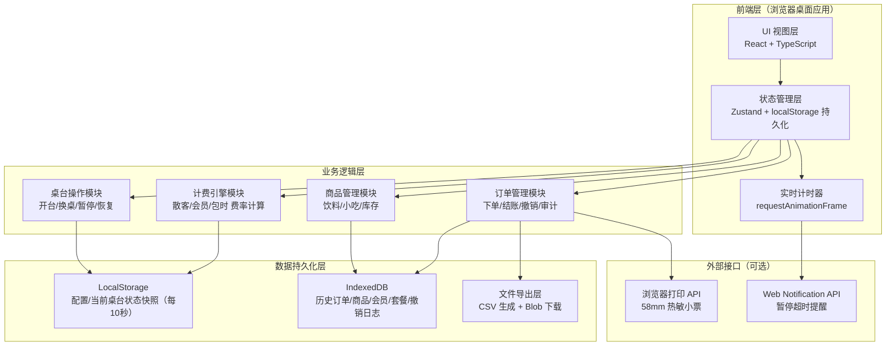

## 1. 架构设计



---

## 2. 技术描述

- **前端框架**：React@18 + TypeScript@5 + Vite@5
- **样式方案**：TailwindCSS@3（原子化CSS）+ CSS 变量（主题系统）
- **状态管理**：Zustand@4（轻量级 store，内置 persist 中间件）
- **图标**：Lucide React（线性图标库）
- **字体**：Google Fonts - Noto Serif SC（标题）+ Noto Sans SC（正文）
- **数据存储**：
  - `localStorage`：实时桌台状态（容量小，读写快，每 10 秒自动快照）
  - `IndexedDB`（通过 idb@7 封装）：历史订单、商品库、会员、套餐、撤销日志（大容量，结构化）
- **初始化工具**：pnpm create vite@latest
- **构建产物**：纯静态 HTML/CSS/JS，可双击打开或部署到任意静态服务器

---

## 3. 路由定义

| 路由路径 | 页面名称 | 用途说明 |
|----------|----------|----------|
| `/` | 桌台总览页 | 默认首页，桌台网格 + 快捷操作 |
| `/table/:id` | 桌台详情页 | 单桌完整操作：计时/暂停/换桌/加购/结账 |
| `/checkout/:orderId` | 结账收银页 | 消费确认 + 折扣 + 金额锁定 + 收款 |
| `/products` | 商品管理页 | 饮料小吃增删改查、价格库存设置 |
| `/members` | 会员套餐页 | 会员信息、充值、包时套餐配置 |
| `/query` | 查询中心页 | 未结查询、历史订单、撤销记录 |
| `/daily-report` | 日结报表页 | 当日汇总看板、CSV 导出 |
| `/settings` | 系统设置页 | 桌台数量、费率规则、超时提醒阈值、操作员密码 |

---

## 4. 数据模型

### 4.1 ER 图

```mermaid
erDiagram
    TABLE ||--o{ ORDER_SESSION : "承载"
    ORDER_SESSION ||--o{ ORDER_ITEM : "包含"
    ORDER_SESSION ||--o{ TABLE_TRANSFER : "发生"
    ORDER_SESSION ||--o{ PAUSE_RECORD : "触发"
    ORDER_SESSION ||--o| CHECKOUT : "完成"
    PRODUCT ||--o{ ORDER_ITEM : "作为"
    MEMBER ||--o{ ORDER_SESSION : "关联"
    PACKAGE ||--o{ ORDER_SESSION : "应用"
    CHECKOUT ||--o| REVOCATION_LOG : "可能被"
    OPERATOR ||--o{ ORDER_SESSION : "操作"
    OPERATOR ||--o{ REVOCATION_LOG : "撤销"

    TABLE {
        string id PK "桌台ID"
        int table_no "桌号（1,2,3...）"
        string name "名称（如VIP1）"
        string status "状态: idle/occupied/paused/maintenance"
        int hourly_rate "该桌每小时费率"
    }

    ORDER_SESSION {
        string id PK "会话ID"
        string table_id FK "当前桌台ID"
        string customer_type "散客/会员/包时"
        string member_id FK nullable "会员ID"
        string package_id FK nullable "套餐ID"
        datetime start_time "开台时间"
        int total_paused_seconds "累计暂停秒数"
        decimal table_fee_preview "实时预估桌费"
        datetime created_at
    }

    ORDER_ITEM {
        string id PK
        string session_id FK
        string product_id FK
        string table_id_at_add "加购时桌台ID（防送错）"
        string delivery_status "待配送/已送达/已取消"
        int quantity
        decimal unit_price
        decimal subtotal
        datetime created_at
    }

    TABLE_TRANSFER {
        string id PK
        string session_id FK
        string from_table_id FK
        string to_table_id FK
        datetime transfer_time
        string operator_note
    }

    PAUSE_RECORD {
        string id PK
        string session_id FK
        datetime pause_start
        datetime pause_end nullable
        string pause_reason
        bool reminded "是否已超时提醒"
    }

    PRODUCT {
        string id PK
        string name
        string category "饮料/小吃/其他"
        decimal price
        int stock
        bool active
    }

    MEMBER {
        string id PK
        string name
        string phone
        string level "银/金/钻石"
        decimal balance
        decimal discount_rate "会员折扣率(0-1)"
    }

    PACKAGE {
        string id PK
        string name "如3小时畅打"
        int duration_minutes
        decimal original_price
        decimal package_price
        string applicable_tables "适用桌台ID列表"
    }

    CHECKOUT {
        string id PK
        string session_id FK
        datetime checkout_time
        decimal table_fee "最终桌费"
        decimal product_total "商品总额"
        decimal subtotal
        decimal discount_amount "折扣金额"
        decimal discount_rate nullable "应用的折扣率"
        decimal final_total "应收"
        decimal received "实收"
        decimal change_amount "找零"
        string payment_method "现金/微信/支付宝/会员余额"
        string operator_id FK
    }

    REVOCATION_LOG {
        string id PK
        string checkout_id FK
        string operator_id FK
        datetime revocation_time
        string reason
        decimal original_amount
    }

    OPERATOR {
        string id PK
        string username
        string password_hash
        string role "cashier/admin"
        string display_name
    }
```

### 4.2 数据初始化 DDL（IndexedDB 对应对象仓库）

```typescript
// object store names
const STORES = {
  TABLES: 'tables',
  SESSIONS: 'order_sessions',
  ITEMS: 'order_items',
  TRANSFERS: 'table_transfers',
  PAUSES: 'pause_records',
  PRODUCTS: 'products',
  MEMBERS: 'members',
  PACKAGES: 'packages',
  CHECKOUTS: 'checkouts',
  REVOCATIONS: 'revocation_logs',
  OPERATORS: 'operators',
  SETTINGS: 'settings'
} as const;

// 初始种子数据（首次启动时写入）
const INITIAL_TABLES = [
  { id: 'tbl-001', table_no: 1, name: '普台1', status: 'idle', hourly_rate: 30 },
  { id: 'tbl-002', table_no: 2, name: '普台2', status: 'idle', hourly_rate: 30 },
  { id: 'tbl-003', table_no: 3, name: '普台3', status: 'idle', hourly_rate: 30 },
  { id: 'tbl-004', table_no: 4, name: '普台4', status: 'idle', hourly_rate: 30 },
  { id: 'tbl-005', table_no: 5, name: 'VIP1',  status: 'idle', hourly_rate: 50 },
  { id: 'tbl-006', table_no: 6, name: 'VIP2',  status: 'idle', hourly_rate: 50 },
  { id: 'tbl-007', table_no: 7, name: '比赛台', status: 'idle', hourly_rate: 80 },
  { id: 'tbl-008', table_no: 8, name: '普台8', status: 'idle', hourly_rate: 30 },
];

const INITIAL_PRODUCTS = [
  { id: 'p-cola',  name: '可口可乐', category: '饮料', price: 8,  stock: 100, active: true },
  { id: 'p-sprite',name: '雪碧',     category: '饮料', price: 8,  stock: 100, active: true },
  { id: 'p-beer',  name: '青岛啤酒', category: '饮料', price: 15, stock: 80,  active: true },
  { id: 'p-redbull',name:'红牛',     category: '饮料', price: 12, stock: 60,  active: true },
  { id: 'p-tea',   name: '菊花茶',   category: '饮料', price: 10, stock: 50,  active: true },
  { id: 'p-chips', name: '薯片',     category: '小吃', price: 12, stock: 40,  active: true },
  { id: 'p-peanut',name: '花生',     category: '小吃', price: 10, stock: 40,  active: true },
  { id: 'p-noodle',name: '方便面',   category: '小吃', price: 15, stock: 30,  active: true },
];

const INITIAL_PACKAGES = [
  { id: 'pkg-2h',  name: '2小时畅打', duration_minutes: 120, original_price: 60,  package_price: 50,  applicable_tables: ['tbl-001','tbl-002','tbl-003','tbl-004','tbl-008'] },
  { id: 'pkg-3h',  name: '3小时畅打', duration_minutes: 180, original_price: 90,  package_price: 72,  applicable_tables: ['tbl-001','tbl-002','tbl-003','tbl-004','tbl-008'] },
  { id: 'pkg-vip3',name: 'VIP3小时',  duration_minutes: 180, original_price: 150, package_price: 128, applicable_tables: ['tbl-005','tbl-006'] },
  { id: 'pkg-day', name: '全天畅打',  duration_minutes: 600, original_price: 300, package_price: 198, applicable_tables: ['tbl-001','tbl-002','tbl-003','tbl-004','tbl-008'] },
];

const INITIAL_MEMBERS = [
  { id: 'm-001', name: '张先生', phone: '13800138001', level: 'gold',   balance: 500, discount_rate: 0.85 },
  { id: 'm-002', name: '李女士', phone: '13900139002', level: 'silver', balance: 200, discount_rate: 0.9  },
  { id: 'm-003', name: '王总',   phone: '13700137003', level: 'diamond',balance: 2000,discount_rate: 0.75 },
];

const INITIAL_OPERATORS = [
  { id: 'op-001', username: 'cashier', password_hash: btoa('123456'), role: 'cashier', display_name: '前台小陈' },
  { id: 'op-002', username: 'admin',   password_hash: btoa('admin888'),role: 'admin',   display_name: '老板' },
];

const DEFAULT_SETTINGS = {
  pause_reminder_minutes: 30,
  default_hourly_rate: 30,
  round_minutes: 1,           // 计费最小单位（分钟）
  round_mode: 'up',           // up=向上取整 / nearest=四舍五入
  store_name: '精英台球俱乐部',
  print_footer: '感谢光临，欢迎下次再来！'
};
```

---

## 5. 计费引擎核心规则（TypeScript 伪代码）

```typescript
/**
 * 计算桌费（核心计费引擎）
 * @param session 订单会话
 * @param table   当前桌台
 * @param now     当前时间
 */
function calcTableFee(
  session: OrderSession,
  table: Table,
  now: Date = new Date()
): number {
  const { start_time, total_paused_seconds, customer_type, package_id, member_id } = session;
  
  // 1. 实际可用时长 = 当前时间 - 开台时间 - 累计暂停秒数
  const elapsedMs = now.getTime() - new Date(start_time).getTime() - total_paused_seconds * 1000;
  let elapsedMinutes = Math.max(0, elapsedMs / 60000);
  
  // 2. 按规则取整
  const { round_minutes, round_mode } = getSettings();
  if (round_mode === 'up') {
    elapsedMinutes = Math.ceil(elapsedMinutes / round_minutes) * round_minutes;
  } else {
    elapsedMinutes = Math.round(elapsedMinutes / round_minutes) * round_minutes;
  }
  
  let fee = 0;
  
  // 3. 分支：包时套餐 vs 按时计费
  if (customer_type === 'package' && package_id) {
    const pkg = getPackage(package_id);
    const pkgMinutes = pkg.duration_minutes;
    
    if (elapsedMinutes <= pkgMinutes) {
      // 未超套餐时长 = 套餐价
      fee = pkg.package_price;
    } else {
      // 超时长部分按该桌费率叠加
      const overMinutes = elapsedMinutes - pkgMinutes;
      fee = pkg.package_price + (overMinutes / 60) * table.hourly_rate;
    }
  } else {
    // 散客 / 会员：按时计费
    fee = (elapsedMinutes / 60) * table.hourly_rate;
  }
  
  // 4. 会员折扣（叠加在桌费上，不影响商品）
  if (customer_type === 'member' && member_id) {
    const m = getMember(member_id);
    fee = fee * m.discount_rate;
  }
  
  return Math.round(fee * 100) / 100;
}
```

---

## 6. 状态持久化策略

| 数据类型 | 存储介质 | 写入时机 | 备注 |
|----------|----------|----------|------|
| 当前桌台状态 + 活跃会话 | localStorage | 每次操作后 + 每 10s 定时器 | Key: `billiard:live-state`，确保断网关窗数据不丢 |
| 桌台/商品/会员/套餐配置 | IndexedDB | 增删改时 | 冷数据，启动时读入内存 |
| 历史会话+订单项+结账记录 | IndexedDB | 结账后立即写入 | 保留全部历史，支持日结查询 |
| 换桌/暂停/撤销日志 | IndexedDB | 事件发生时 | 审计追踪用，不可修改/删除 |
| 全局设置（桌数/费率/密码） | localStorage | 修改时 | Key: `billiard:settings` |

---

## 7. 防呆防错规则清单

1. **已占用桌开台拦截**：开台时校验 `table.status !== 'idle'`，弹窗提示"该桌已占用"
2. **换桌目标桌校验**：换桌目标必须是 `idle`，且二次确认弹窗显示"从 X 桌 → Y 桌"
3. **换桌继承校验**：迁移前校验会话、商品、暂停记录完整性，迁移完成后旧桌立即置 `idle`
4. **暂停超时提醒**：每 5 秒轮询，暂停时长 > 阈值触发 Notification + 弹窗
5. **金额锁定**：点击"锁定金额"后 `checkout.locked = true`，折扣输入框 `disabled`，若尝试修改提示"已锁定，如需调整请先解锁（需管理员）"
6. **结账撤销审批**：撤销必须输入管理员密码 + 原因，所有字段写入 `revocation_logs`
7. **日结完整性**：日结前查询 `sessions where checkout_id is null`，有记录则阻断并列表提示
8. **商品桌号联动**：`order_item` 始终存 `session_id` 而非桌号，显示时用 session 当前桌号解析，避免换桌后送错
