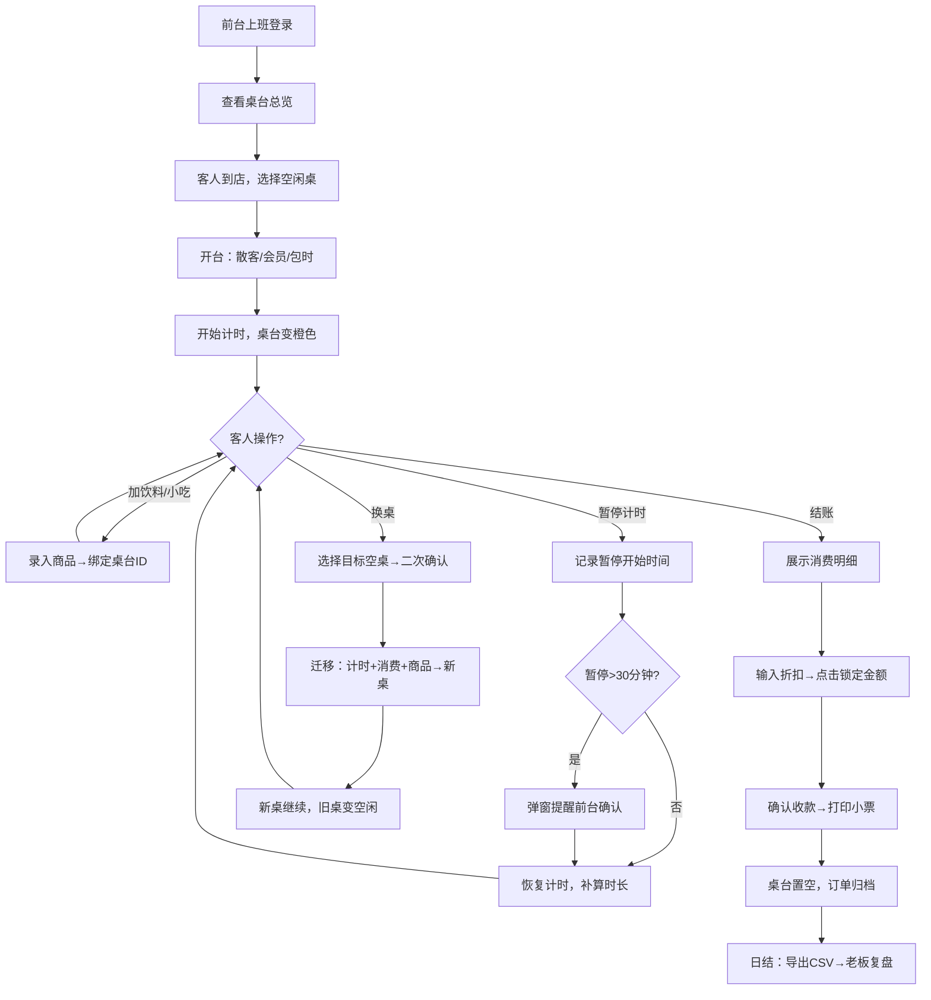

## 1. 产品概述

面向台球厅前台收银场景的桌面级计费管理系统，解决晚高峰期间开台换桌混乱、消费记录不清、老板复盘无据等核心痛点。系统支持开台、暂停计时、换桌继承、加购饮料、多种计费模式（散客/会员/包时）、金额锁定结账、日结导出等完整业务流程，确保断网关窗后数据不丢失。

- 核心用户：台球厅前台收银员、老板/经营者
- 核心价值：消费透明可追溯、操作防呆防错、经营数据日结清晰

---

## 2. 核心功能

### 2.1 用户角色

| 角色 | 登录方式 | 核心权限 |
|------|----------|----------|
| 前台收银员 | 本地密码登录 | 开台/暂停/换桌/点单/结账操作，查看未结消费 |
| 老板/经营者 | 管理员密码登录 | 收银员全部权限 + 日结导出、撤销记录查看、套餐/商品/会员设置 |

### 2.2 功能模块

1. **首页桌台总览**：桌台状态网格、实时计时显示、操作快捷入口
2. **开台与计费**：选择桌号、客人类别（散客/会员/包时）、套餐选择
3. **桌台操作面板**：暂停/恢复计时、换桌（继承消费）、加购饮料、查看详情
4. **结账收银台**：消费明细、折扣输入、金额锁定、多方式收款、打印小票
5. **商品管理**：饮料/小吃商品库、库存预警、价格设置
6. **会员与套餐**：会员信息、包时套餐（2小时/3小时/半天/整天）配置
7. **查询中心**：按桌号查未结、按日期查历史订单、撤销记录审计
8. **日结报表**：当日桌费/饮料/折扣/撤销汇总，CSV 导出

### 2.3 页面详情

| 页面名称 | 模块名称 | 功能描述 |
|----------|----------|----------|
| 首页桌台总览 | 桌台状态网格 | 绿色=空闲、橙色=占用、红色=超时暂停、灰色=维护；显示桌号+已用时长+累计金额 |
| 首页桌台总览 | 顶部操作栏 | 快速开台按钮、未结数量提醒、日结入口、设置入口 |
| 开台弹窗 | 开台表单 | 桌号（校验占用）、客人类型、套餐、备注，确认后写入状态 |
| 桌台详情 | 操作区 | 暂停/恢复（超规则时长弹窗提醒）、换桌（选目标空桌+二次确认）、加购商品 |
| 桌台详情 | 消费明细 | 桌费实时计算、商品逐条列出、换桌历史记录 |
| 结账页面 | 金额汇总区 | 桌费+商品合计、折扣金额、应收金额（锁定后禁止编辑）、实收/找零 |
| 结账页面 | 撤销操作 | 需要管理员密码+撤销原因，记录到撤销审计日志 |
| 商品管理 | 商品列表 | 增删改查饮料小吃，设置分类/价格/库存，启用/停用 |
| 会员套餐 | 会员列表 | 会员姓名/手机号/余额/会员等级，充值记录 |
| 会员套餐 | 套餐配置 | 包时套餐名称、时长、原价、优惠价、适用时段 |
| 查询中心 | 未结查询 | 输入桌号即时显示当前未结消费明细 |
| 查询中心 | 历史订单 | 按日期范围筛选，展示已结订单列表，点击看详情 |
| 查询中心 | 撤销记录 | 被撤销的订单、撤销人、撤销原因、撤销时间、原金额 |
| 日结报表 | 汇总看板 | 当日总营收、桌费小计、饮料小计、优惠抵扣、净营收 |
| 日结报表 | 导出区 | 一键导出 CSV（含桌号/开台时间/结账时间/桌费/饮料/折扣/收款方式） |

---

## 3. 核心流程

### 3.1 开台→消费→结账主流程
前台选择空闲桌号 → 选择客人类型（散客/会员/包时）→ 确认开台，开始计时 → 客人加购饮料时选桌号录入 → 暂停计时需填写原因，超过30分钟弹窗提醒 → 换桌时选择目标空桌，继承计时+消费明细 → 客人结账时展示完整消费 → 输入折扣后点击"锁定金额"→ 收款完成打印小票 → 桌台状态置空

### 3.2 换桌防送错饮料流程
服务员加购时选择桌号 → 系统记录该商品绑定的桌号ID（而非仅桌号字符串）→ 换桌时，桌号ID关联的商品列表同步迁移到新桌号 → 服务员查看"待配送列表"时显示最新桌号 → 送达后点击"已送达"标记

### 3.3 日结流程
老板点击日结 → 系统校验是否存在未结订单（有则提醒先处理）→ 汇总当日数据 → 生成日报预览 → 导出 CSV 文件到本地 → 标记日结完成日期

### 3.4 Mermaid 流程图

---

## 4. 用户界面设计

### 4.1 设计风格
- **主题色调**：深墨绿（#0D3B34）为主色，象征台球桌台呢；金色（#D4AF37）为点缀色，对应高端台球会所质感；暖米白（#F5F0E8）背景
- **按钮风格**：圆角矩形（8px），主按钮用深墨绿+金色描边，悬停有微浮起阴影；危险操作用暗红（#8B2635）
- **字体**：标题使用"Noto Serif SC"衬线体增加复古质感；正文使用"Noto Sans SC"保证清晰度
- **布局风格**：左侧固定导航（窄边，64px图标），右侧主内容区用卡片式栅格布局，桌台用大卡片网格展示
- **图标风格**：使用 Lucide 线性图标，结合台球、球杆、时钟、饮料等具象 emoji 增加辨识度

### 4.2 页面设计概览

| 页面名称 | 模块名称 | UI 元素设计 |
|----------|----------|-------------|
| 桌台总览 | 桌台卡片网格 | 卡片尺寸220×180px，4列栅格；状态色块左上圆角，桌号大号字体，底部显示实时计时+金额 |
| 桌台总览 | 顶部状态栏 | 深色条带，左侧Logo+店名，中间未结订单红色徽章，右侧操作员头像+日结按钮 |
| 开台弹窗 | 表单区 | 半透明深色遮罩，白色圆角卡片，客人类型用3列图标单选（散客/会员/包时各带彩色图标） |
| 桌台详情 | 操作按钮组 | 4个等宽大按钮（暂停/换桌/加购/结账），各带大图标+文字，活跃操作闪烁提示 |
| 桌台详情 | 消费明细 | 表格左侧商品图标，中间名称+数量，右侧单价×数量=小计；表格底部固定合计行 |
| 结账页 | 金额锁定区 | 锁定前金额可编辑黑字；锁定后金额灰底+金色锁图标+禁止编辑光标 |
| 日结报表 | 汇总卡片 | 4张横向卡片：桌费/饮料/折扣/净收入，各带上下趋势小箭头 |
| 全局 | 暂停超时弹窗 | 深红色边框警示，配闹钟图标，文字"该桌已暂停XX分钟，请确认客人是否还在" |

### 4.3 响应式
- **设计优先级**：Desktop-First，专为1366×768以上分辨率设计（前台台式机/触控一体机）
- **触控优化**：所有核心操作按钮≥48×48px，间距≥12px，适合触摸屏点击
- **自适应**：桌台网格列数随屏幕宽度自动调整（4列/3列/2列）
- **打印小票**：内置58mm热敏打印机专用样式，导出时自动调用打印样式表

### 4.4 数据状态提示
- 桌台状态变化有0.3s过渡动画
- 锁定金额有"咔哒"声音反馈（可选）
- 暂停超时弹窗出现时轻微摇晃2次
- 日结导出成功后绿色成功提示条从顶部滑入
