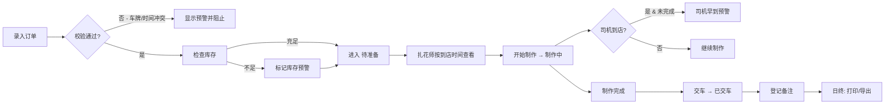

## 1. 产品概述
花店婚车扎花单管理系统，解决周末多组婚车订单混乱问题。系统帮助店员、扎花师、店长协同管理订单，实现从录入到交车的全流程可视化与预警。

- 解决问题：车型/车牌/花材信息混乱、库存不足、时间冲突、司机早到等导致的工作混乱
- 目标用户：花店店员（录入）、扎花师（制作）、店长（管理与打印）
- 核心价值：减少差错、提升协同效率、留痕异常与成本

## 2. 核心功能

### 2.1 用户角色

| 角色 | 核心职责与视图 |
|------|----------------|
| 店员 | 录入订单信息、更新订单状态、处理司机到店 |
| 扎花师 | 按到店顺序查看准备项、标记开始制作、完成制作 |
| 店长 | 查看全量订单、打印早班准备单、导出当天成本与异常、管理花材库存 |

### 2.2 功能模块

1. **订单录入模块**：新人信息、车型/车牌、花材清单、扎花师分配、到店时间、交接备注
2. **时间轴看板**：三列泳道（待准备 / 制作中 / 已交车），支持拖拽或按钮切换状态
3. **预警提示系统**：花材库存不足、扎花师时间重叠、司机提前到、车牌重复录入
4. **本地草稿持久化**：刷新页面不丢失录入内容和订单数据
5. **扎花师准备列表**：按车辆到店时间排序，快速查看需准备的花材与车辆
6. **早班准备单打印**：汇总当日订单，按到店时间排序，支持浏览器打印
7. **数据导出**：导出当天成本明细与异常记录（CSV 格式）
8. **花材库存管理**：录入/扣减库存，查看库存状态与不足预警

### 2.3 页面详情

| 页面名称 | 模块名称 | 功能描述 |
|---------|---------|----------|
| 主工作台 | 顶部导航栏 | 角色切换、日期选择、预警汇总徽章、打印/导出按钮、库存管理入口 |
| 主工作台 | 订单录入表单 | 新人、车型、车牌、花材多选+数量、扎花师、到店时间、交接备注、实时校验提示 |
| 主工作台 | 三列时间轴看板 | 待准备/制作中/已交车三泳道，卡片展示关键信息，支持状态变更按钮与拖拽 |
| 主工作台 | 扎花师视图 | 按到店时间排序的准备列表，每辆车主花/辅花清单、到店倒计时、快速状态切换 |
| 主工作台 | 预警中心浮层 | 汇总所有异常：库存不足、时间重叠、司机早到、车牌重复，点击跳转定位 |
| 库存管理 | 库存看板 | 花材列表、当前库存、安全库存、快速出入库调整 |
| 打印预览 | 早班准备单 | 日期、汇总信息、按到店时间排序的订单清单（适合A4打印） |
| 导出预览 | 成本与异常 | 成本明细（花材用量×单价）、异常记录（司机早到/超时/库存应急），一键下载CSV |

## 3. 核心流程

店长开启新的一天 → 店员录入婚车订单（系统校验车牌重复/扎花师冲突） → 系统检查库存并预警 → 订单进入「待准备」泳道 → 扎花师按到店时间排序准备 → 司机到店（若早于制作完成触发预警） → 扎花师开始制作 → 制作完成 → 交车并登记备注 → 店长打印准备单 / 日终导出成本与异常

## 4. 用户界面设计

### 4.1 设计风格

- **主色调**：温暖玫瑰粉 `#E8B4B8` 作为主色，奶油白 `#FAF5F1` 背景，深咖色 `#4A3728` 文字，金色点缀 `#C9A961`
- **辅色**：成功绿 `#6B9E7D`、警告橙 `#E8913A`、危险红 `#D96060`
- **按钮风格**：圆角 12px，微阴影，悬停时轻微上浮 + 阴影加深
- **字体**：标题用「思源宋体 / Noto Serif SC」带衬线优雅字体，正文用「思源黑体 / Noto Sans SC」
- **布局**：顶部固定导航 + 左（录入表单）中（时间轴）右（扎花师列表）三栏布局，卡片式卡片
- **图标风格**：线性图标（Lucide/Feather），花卉主题点缀
- **纹理细节**：纸张质感渐变背景，卡片边框用细腻金线条，打印视图模拟纸质效果

### 4.2 页面设计概述

| 页面名称 | 模块名称 | UI 元素描述 |
|---------|---------|------------|
| 主工作台 | 顶部导航栏 | 固定顶部，花店Logo+日期选择器+预警徽章（数字红标）+ 角色切换Tabs+打印/导出/库存管理按钮 |
| 主工作台 | 订单录入表单 | 左侧 1/4 宽固定面板，分组卡片：新人信息/车辆信息/花材选择/扎花师与时间/备注；实时校验红框提示 |
| 主工作台 | 三列时间轴看板 | 中间 2/4 宽，三列带顶部统计数字，卡片悬停放大，状态变更按钮在卡片底部，拖拽感 |
| 主工作台 | 扎花师准备列表 | 右侧 1/4 宽，到店时间轴，每一项带倒计时Chip，紧急项高亮红框 |
| 预警浮层 | 预警中心 | 右上角滑出抽屉，分四类列表项，点击对应卡片在看板中高亮闪烁 |
| 库存管理 | 库存表格 | 模态弹窗，花材名/当前库存/安全库存/状态色条，+/- 快速调整按钮 |
| 打印预览 | 打印样式 | `@media print` 专用样式，隐藏导航，黑白为主，清晰网格线，适合A4纵向打印 |

### 4.3 响应式

- 桌面端优先（>=1280px）三栏布局
- 平板（768-1279px）：左右两栏折叠为可抽屉展开，中间时间轴保留
- 移动端（<768px）：单栏Tab切换视图（录入/看板/扎花师列表），触控友好大按钮
- 打印视图：专用打印样式，忽略所有非打印区域

### 4.4 动效细节

- 页面加载：卡片依次淡入上浮（stagger 0.05s）
- 订单卡片：悬停阴影加深、轻微translateY(-2px)
- 状态变更：卡片飞出+飞入过渡动画
- 预警徽章：新预警触发时脉冲缩放动画
- 到店倒计时：剩余15分钟内数字闪烁+红色警示
- 表单提交：按钮loading旋转动效
