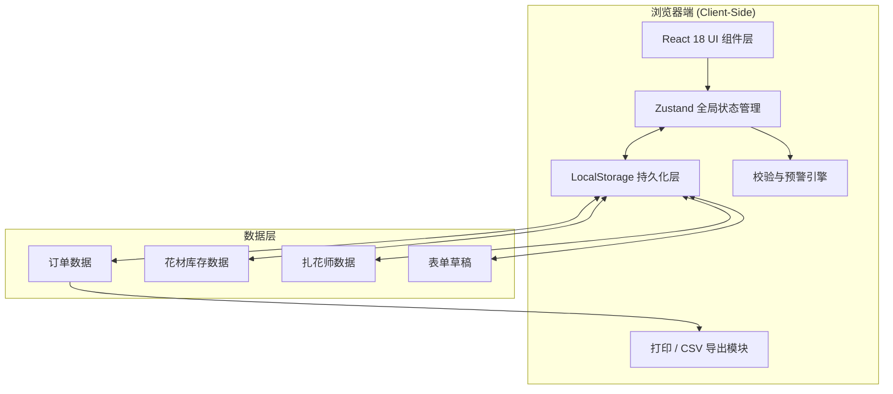

## 1. 架构设计



## 2. 技术描述

- **前端框架**：React@18 + TypeScript
- **构建工具**：Vite@5
- **样式方案**：TailwindCSS@3 + PostCSS（配合自定义主题色变量）
- **状态管理**：Zustand（轻量，支持持久化中间件）
- **图标库**：lucide-react（线性图标，符合设计风格）
- **拖拽**：@dnd-kit/core + @dnd-kit/sortable（看板泳道拖拽）
- **后端/数据库**：无后端，纯前端 + LocalStorage 持久化
- **Mock 数据**：首次加载时内置示例订单、花材、扎花师数据

## 3. 路由定义

| 路由 | 用途 | 说明 |
|------|------|------|
| `/` | 主工作台 | 三栏布局：录入表单 + 时间轴看板 + 扎花师列表 |
| `/print` | 打印准备单预览 | 专用打印样式，支持 `window.print()` |
| `/export` | 导出预览 | 当日成本与异常列表，可下载 CSV |

> 采用 React Router v6 进行 SPA 路由。

## 4. 数据模型与状态

### 4.1 核心数据结构

```typescript
// 订单状态
type OrderStatus = 'pending' | 'in_progress' | 'delivered';

// 花材项
interface FlowerItem {
  id: string;
  name: string;
  unit: string;        // 扎/束/枝
  price: number;       // 单价（元）
  stock: number;       // 当前库存
  safeStock: number;   // 安全库存
  category: '主花' | '辅花' | '叶材' | '配饰';
}

// 扎花师
interface Florist {
  id: string;
  name: string;
  phone?: string;
}

// 订单花材明细
interface OrderFlower {
  flowerId: string;
  quantity: number;
}

// 预警类型
type AlertType = 'low_stock' | 'time_conflict' | 'driver_early' | 'plate_duplicate';

interface Alert {
  id: string;
  type: AlertType;
  orderId?: string;
  message: string;
  timestamp: number;
  resolved: boolean;
}

// 订单
interface WeddingCarOrder {
  id: string;
  date: string;                 // YYYY-MM-DD
  coupleName: string;           // 新人姓名
  carModel: string;             // 车型
  plateNumber: string;          // 车牌号
  flowers: OrderFlower[];       // 花材清单
  floristId: string | null;     // 扎花师
  arrivalTime: string;          // 到店时间 HH:mm
  driverArrivedTime?: string;   // 司机实际到店时间
  handoverNote: string;         // 交接备注
  status: OrderStatus;          // 状态
  startedAt?: string;           // 开始制作时间
  finishedAt?: string;          // 制作完成时间
  deliveredAt?: string;         // 交车时间
  costTotal: number;            // 总成本
  anomalies: string[];          // 异常记录
  createdAt: number;
  updatedAt: number;
}
```

### 4.2 Store 设计（Zustand）

```typescript
interface AppState {
  // 数据
  orders: WeddingCarOrder[];
  flowers: FlowerItem[];
  florists: Florist[];
  formDraft: Partial<WeddingCarOrder>;
  alerts: Alert[];
  selectedDate: string;
  currentRole: 'clerk' | 'florist' | 'manager';

  // 订单操作
  addOrder: (o: Omit<WeddingCarOrder, 'id' | 'createdAt' | 'updatedAt'>) => void;
  updateOrder: (id: string, patch: Partial<WeddingCarOrder>) => void;
  updateOrderStatus: (id: string, status: OrderStatus) => void;
  deleteOrder: (id: string) => void;

  // 库存操作
  updateStock: (flowerId: string, delta: number) => void;
  addFlower: (f: Omit<FlowerItem, 'id'>) => void;
  updateFlower: (id: string, patch: Partial<FlowerItem>) => void;

  // 草稿
  saveDraft: (draft: Partial<WeddingCarOrder>) => void;
  clearDraft: () => void;

  // 预警
  refreshAlerts: () => void;
  resolveAlert: (alertId: string) => void;

  // 工具
  setSelectedDate: (date: string) => void;
  setRole: (role: AppState['currentRole']) => void;
}
```

## 5. 核心模块划分

```
src/
├── components/
│   ├── layout/              # 布局组件
│   │   ├── AppHeader.tsx    # 顶部导航栏
│   │   └── ThreeColumnLayout.tsx
│   ├── order/
│   │   ├── OrderForm.tsx        # 订单录入表单
│   │   ├── OrderCard.tsx        # 订单卡片
│   │   └── OrderKanban.tsx      # 三列时间轴看板
│   ├── florist/
│   │   └── FloristPrepList.tsx  # 扎花师准备列表
│   ├── alerts/
│   │   └── AlertCenter.tsx      # 预警中心抽屉
│   ├── inventory/
│   │   └── InventoryModal.tsx   # 库存管理弹窗
│   ├── print/
│   │   └── PrintPreview.tsx     # 打印预览
│   └── common/
│       └── ui/              # Button, Input, Tag 等基础组件
├── store/
│   └── useAppStore.ts       # Zustand store
├── utils/
│   ├── validators.ts        # 校验逻辑：车牌/库存/时间
│   ├── csvExporter.ts       # CSV 导出
│   └── dateUtils.ts
├── data/
│   └── seedData.ts          # 初始 mock 数据
├── types/
│   └── index.ts
├── pages/
│   ├── Workbench.tsx
│   ├── PrintPage.tsx
│   └── ExportPage.tsx
├── App.tsx
├── main.tsx
└── index.css
```

## 6. 预警引擎设计

每次订单变化、库存变化、时间戳更新时调用 `refreshAlerts()`：

| 预警类型 | 检测逻辑 | 级别 |
|---------|---------|------|
| `plate_duplicate` | 同日内存在相同 `plateNumber` 的订单 | 错误（阻止保存） |
| `time_conflict` | 同一 `floristId` 当日订单 `arrivalTime` 间隔 < 60 分钟 | 警告 |
| `low_stock` | 订单 `flowers.quantity` 汇总后 > `flowers.stock` | 警告 |
| `driver_early` | `driverArrivedTime` 已设置且订单状态 != `delivered` | 严重警告 |

## 7. 打印与导出

- **打印**：`/print` 页面 + `@media print` CSS，调用 `window.print()`
- **CSV 导出**：构建成本明细 `[花材, 用量, 单价, 小计]` + 异常记录 `[订单, 车牌, 异常, 备注]`，UTF-8 BOM 防止中文乱码

## 8. 初始 Mock 数据

首次加载时若 LocalStorage 为空则注入：
- 12 种常见花材（红玫瑰、白百合、满天星、洋桔梗、尤加利叶、丝带等）
- 3 名扎花师
- 3-5 条示例当日订单（覆盖不同状态）
