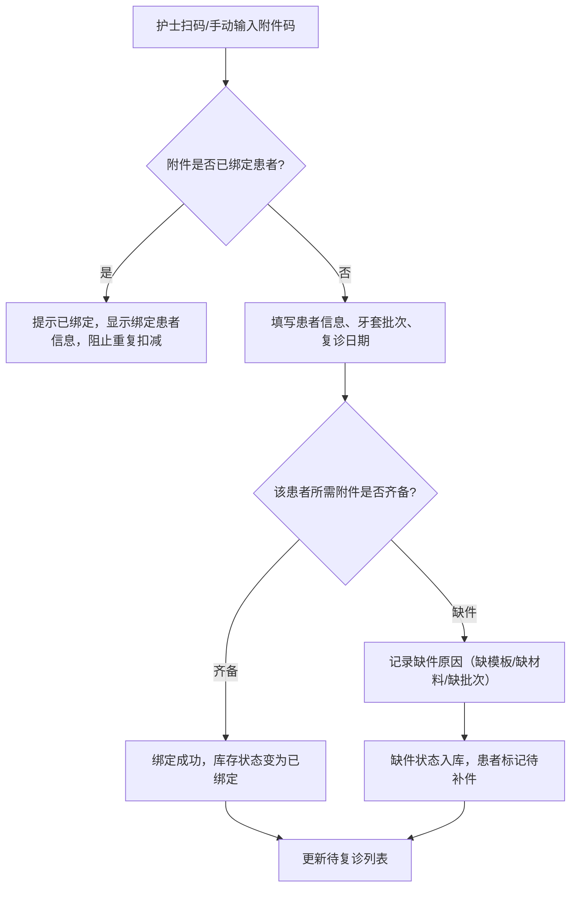
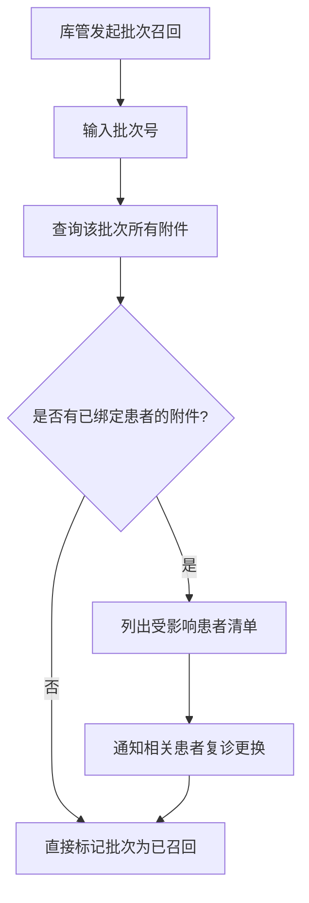
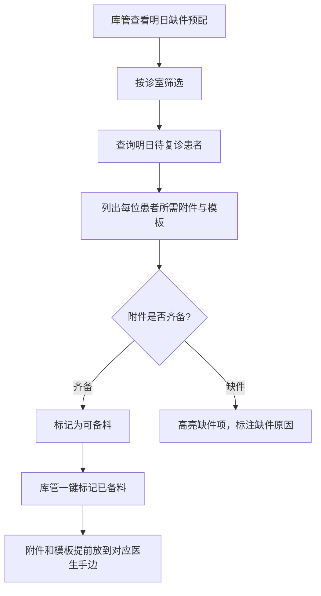

## 1. 产品概述

口腔附件库存台——正畸诊所专用的附件（模板、附件材料、牙套批次）库存管理系统。解决护士找材料时遗漏小袋导致患者白跑的问题，实现患者-附件绑定、防重复扫码扣减、批次召回追溯、多角色视图和明日缺件预配等核心能力。

- **目标用户**：正畸诊所前台、护士、医生、库管
- **核心价值**：零缺件漏配、患者不白跑、库存可追溯、明日提前备料

## 2. 核心功能

### 2.1 用户角色

| 角色 | 注册方式 | 核心权限 |
|------|----------|----------|
| 前台/护士 | 管理员创建 | 登记/扫码附件、查看待复诊列表 |
| 医生 | 管理员创建 | 查看患者详情与附件绑定情况 |
| 库管 | 管理员创建 | 库存入库/调整、导出报表、查看明日缺件、批次召回 |
| 管理员 | 系统内置 | 全部权限 + 用户管理 |

### 2.2 功能模块

1. **库存总览页**：库存概览、缺件告警、近效期提醒
2. **附件登记页**：扫码/手动登记患者、牙套批次、附件型号、库存位置、复诊日期、缺件原因
3. **患者详情页**：患者绑定的附件列表、复诊记录、附件使用状态
4. **库存管理页**：入库、调整、批次管理、位置管理
5. **导出与报表页**：缺件导出、近效期导出、手工调整记录导出
6. **明日缺件预配页**：按诊室查看明日待复诊缺件、提前备料

### 2.3 页面详情

| 页面名称 | 模块名称 | 功能描述 |
|----------|----------|----------|
| 库存总览页 | 统计卡片 | 总库存数、已绑定数、缺件数、近效期数 |
| 库存总览页 | 缺件告警列表 | 缺件原因分类统计，点击跳转详情 |
| 库存总览页 | 近效期提醒 | 30天内到期附件列表 |
| 附件登记页 | 扫码登记 | 扫码自动识别附件，绑定患者信息 |
| 附件登记页 | 手动登记 | 手动填写患者、批次、型号、位置、复诊日期 |
| 附件登记页 | 缺件登记 | 记录缺件原因（缺模板/缺材料/缺批次） |
| 附件登记页 | 防重复校验 | 同一附件码重复扫码提示已绑定，阻止多扣 |
| 患者详情页 | 患者信息 | 姓名、联系方式、诊疗方案概要 |
| 患者详情页 | 绑定附件列表 | 该患者绑定的所有附件及状态 |
| 患者详情页 | 复诊记录 | 历史复诊时间与附件使用记录 |
| 库存管理页 | 入库操作 | 新批次附件入库，填写型号、数量、位置、效期 |
| 库存管理页 | 库存调整 | 手工增减库存，记录调整原因 |
| 库存管理页 | 批次管理 | 批次列表、召回操作、查看影响患者 |
| 库存管理页 | 位置管理 | 诊室/货架/格子三级位置管理 |
| 导出与报表页 | 缺件报表 | 按日期范围导出缺件明细 CSV |
| 导出与报表页 | 近效期报表 | 导出即将到期附件清单 |
| 导出与报表页 | 调整记录 | 导出手工调整库存的历史记录 |
| 明日缺件预配页 | 诊室筛选 | 按诊室查看明日待复诊患者及所需附件 |
| 明日缺件预配页 | 预配清单 | 每个患者所需附件和模板，标注是否齐备 |
| 明日缺件预配页 | 快速备料 | 一键标记已备料状态 |

## 3. 核心流程

### 3.1 附件登记与患者绑定流程

护士在前台为患者准备附件时，扫码或手动登记。系统检查附件是否已被其他患者绑定，若未绑定则完成绑定并扣减可用库存；若已绑定则阻止并提示。同一附件码重复扫码时，系统识别为已绑定状态，不会重复扣减。

### 3.2 批次召回流程

### 3.3 明日缺件预配流程

## 4. 用户界面设计

### 4.1 设计风格

- **主色调**：医疗白 (#FAFBFC) + 信任蓝 (#2563EB) + 警示橙 (#F59E0B) + 危险红 (#EF4444)
- **辅助色**：薄荷绿 (#10B981) 用于成功/齐备状态，浅灰 (#F1F5F9) 用于背景
- **按钮风格**：圆角 8px，主按钮实色填充，次按钮描边
- **字体**：思源黑体（Noto Sans SC）作为界面字体，数字使用等宽字体 JetBrains Mono
- **布局**：左侧导航栏 + 顶部筛选条 + 右侧内容区，卡片式布局
- **图标**：Lucide 图标库，线性风格

### 4.2 页面设计概览

| 页面名称 | 模块名称 | UI 元素 |
|----------|----------|---------|
| 库存总览页 | 统计卡片 | 四宫格卡片，图标+数字+趋势箭头，白色卡片+微妙阴影 |
| 库存总览页 | 缺件告警 | 橙色边框卡片列表，缺件原因标签，点击展开详情 |
| 库存总览页 | 近效期提醒 | 黄色渐变背景条目，倒计时天数，点击查看批次详情 |
| 附件登记页 | 扫码区 | 居中大号扫码输入框，回车提交，扫码成功绿色闪烁反馈 |
| 附件登记页 | 绑定表单 | 分步表单：附件信息 → 患者信息 → 复诊安排 |
| 附件登记页 | 防重复提示 | 红色弹窗，显示已绑定患者姓名和日期，确认按钮 |
| 患者详情页 | 患者卡片 | 左侧头像+基本信息，右侧标签组（诊疗阶段/复诊倒计时） |
| 患者详情页 | 附件时间线 | 垂直时间线，每条为一次复诊的附件使用记录 |
| 库存管理页 | 入库表单 | 弹窗表单，型号下拉+数量+效期日期选择器 |
| 库存管理页 | 批次列表 | 表格布局，批次号可点击，召回按钮红色确认弹窗 |
| 导出与报表页 | 报表卡片 | 三列卡片，每卡片含导出按钮+最近导出时间 |
| 导出与报表页 | 导出预览 | 表格预览+CSV下载按钮 |
| 明日缺件预配页 | 诊室选项卡 | 顶部选项卡切换诊室 |
| 明日缺件预配页 | 患者清单 | 按医生分组，每位患者卡片含所需附件清单 |
| 明日缺件预配页 | 备料状态 | 绿色勾/红色叉图标，一键切换备料状态 |

### 4.3 响应式

- 桌面优先（1440px+），适配 1280px 和 1024px
- 侧边栏在 1024px 以下可折叠
- 表格在窄屏下切换为卡片视图
- 移动端仅支持查看待复诊列表和扫码登记

### 4.4 3D 场景指引

不适用
