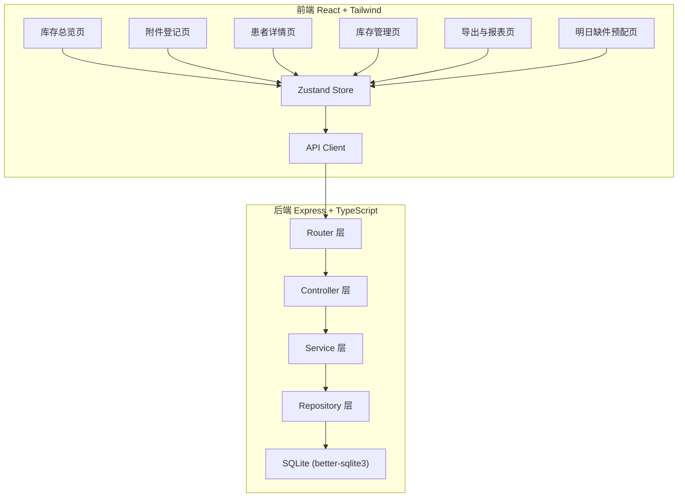
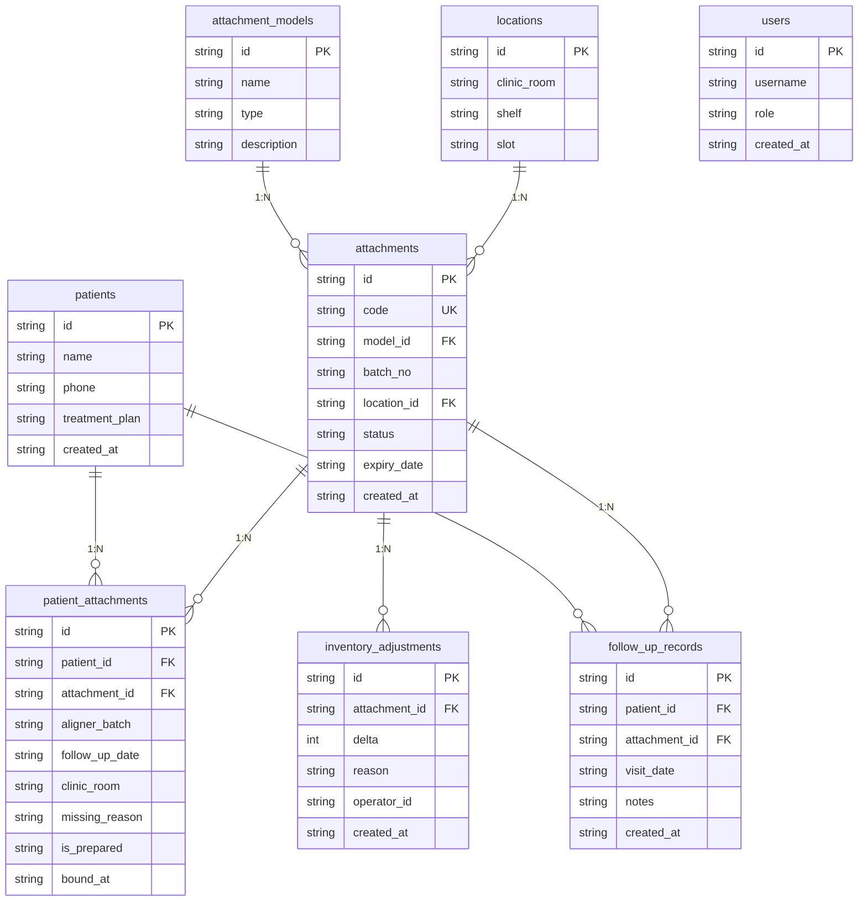

## 1. 架构设计



## 2. 技术说明

- **前端**：React@18 + TailwindCSS@3 + Vite + Zustand + React Router DOM
- **初始化工具**：vite-init (react-express-ts 模板)
- **后端**：Express@4 + TypeScript (ESM)
- **数据库**：SQLite (better-sqlite3)，文件存储，无需外部数据库服务
- **图标**：lucide-react
- **日期处理**：date-fns

## 3. 路由定义

| 路由 | 用途 |
|------|------|
| `/` | 库存总览页，统计卡片+缺件告警+近效期提醒 |
| `/register` | 附件登记页，扫码/手动登记+防重复校验 |
| `/patient/:id` | 患者详情页，绑定附件列表+复诊记录 |
| `/inventory` | 库存管理页，入库/调整/批次/位置管理 |
| `/reports` | 导出与报表页，缺件/近效期/调整记录导出 |
| `/tomorrow` | 明日缺件预配页，按诊室查看+备料状态 |

## 4. API 定义

### 4.1 附件相关

```typescript
// POST /api/attachments/scan
// 扫码登记，返回附件信息及绑定状态
interface ScanRequest {
  code: string;
}
interface ScanResponse {
  attachment: Attachment;
  boundPatient: Patient | null;
  isDuplicate: boolean;
}

// POST /api/attachments/bind
// 绑定患者与附件，含防重复校验
interface BindRequest {
  attachmentId: string;
  patientId: string;
  alignerBatch: string;
  followUpDate: string;
  clinicRoom: string;
}
interface BindResponse {
  success: boolean;
  message: string;
  binding: PatientAttachment;
}

// GET /api/attachments?status=available|bound|recalled
// 查询附件列表
```

### 4.2 患者相关

```typescript
// GET /api/patients/:id
// 患者详情，含绑定附件和复诊记录
interface PatientDetail {
  patient: Patient;
  bindings: PatientAttachment[];
  followUps: FollowUpRecord[];
}

// GET /api/patients/tomorrow?clinicRoom=A
// 明日待复诊患者，按诊室筛选
interface TomorrowPatient {
  patient: Patient;
  doctor: string;
  clinicRoom: string;
  requiredAttachments: Attachment[];
  isPrepared: boolean;
}

// PUT /api/patients/:id/prepare
// 标记备料状态
interface PrepareRequest {
  isPrepared: boolean;
}
```

### 4.3 库存相关

```typescript
// POST /api/inventory/inbound
// 入库操作
interface InboundRequest {
  attachmentModelId: string;
  batchNo: string;
  quantity: number;
  locationId: string;
  expiryDate: string;
}

// POST /api/inventory/adjust
// 库存调整（手工增减），记录原因
interface AdjustRequest {
  attachmentId: string;
  delta: number;
  reason: string;
}

// GET /api/inventory/missing
// 缺件列表

// GET /api/inventory/near-expiry?days=30
// 近效期列表

// GET /api/inventory/adjustments
// 手工调整记录
```

### 4.4 批次相关

```typescript
// GET /api/batches
// 批次列表

// POST /api/batches/:batchNo/recall
// 批次召回，返回受影响患者
interface RecallResponse {
  batchNo: string;
  affectedAttachments: Attachment[];
  affectedPatients: Patient[];
}
```

### 4.5 导出相关

```typescript
// GET /api/reports/missing?from=&to=
// 缺件报表 CSV

// GET /api/reports/near-expiry?days=30
// 近效期报表 CSV

// GET /api/reports/adjustments?from=&to=
// 调整记录报表 CSV
```

### 4.6 统计相关

```typescript
// GET /api/stats/overview
// 库存总览统计
interface StatsOverview {
  totalStock: number;
  boundCount: number;
  missingCount: number;
  nearExpiryCount: number;
}
```

## 5. 服务端架构图


## 6. 数据模型

### 6.1 数据模型定义



### 6.2 数据定义语言

```sql
CREATE TABLE users (
  id TEXT PRIMARY KEY,
  username TEXT NOT NULL UNIQUE,
  role TEXT NOT NULL CHECK(role IN ('admin', 'nurse', 'doctor', 'warehouse')),
  created_at TEXT NOT NULL DEFAULT (datetime('now'))
);

CREATE TABLE patients (
  id TEXT PRIMARY KEY,
  name TEXT NOT NULL,
  phone TEXT,
  treatment_plan TEXT,
  created_at TEXT NOT NULL DEFAULT (datetime('now'))
);

CREATE TABLE attachment_models (
  id TEXT PRIMARY KEY,
  name TEXT NOT NULL,
  type TEXT NOT NULL CHECK(type IN ('template', 'material', 'aligner_batch')),
  description TEXT
);

CREATE TABLE locations (
  id TEXT PRIMARY KEY,
  clinic_room TEXT NOT NULL,
  shelf TEXT NOT NULL,
  slot TEXT NOT NULL
);

CREATE TABLE attachments (
  id TEXT PRIMARY KEY,
  code TEXT NOT NULL UNIQUE,
  model_id TEXT NOT NULL REFERENCES attachment_models(id),
  batch_no TEXT NOT NULL,
  location_id TEXT REFERENCES locations(id),
  status TEXT NOT NULL DEFAULT 'available' CHECK(status IN ('available', 'bound', 'recalled', 'expired')),
  expiry_date TEXT,
  created_at TEXT NOT NULL DEFAULT (datetime('now'))
);

CREATE TABLE patient_attachments (
  id TEXT PRIMARY KEY,
  patient_id TEXT NOT NULL REFERENCES patients(id),
  attachment_id TEXT NOT NULL REFERENCES attachments(id),
  aligner_batch TEXT NOT NULL,
  follow_up_date TEXT NOT NULL,
  clinic_room TEXT NOT NULL,
  missing_reason TEXT,
  is_prepared INTEGER NOT NULL DEFAULT 0,
  bound_at TEXT NOT NULL DEFAULT (datetime('now')),
  UNIQUE(attachment_id)
);

CREATE TABLE inventory_adjustments (
  id TEXT PRIMARY KEY,
  attachment_id TEXT NOT NULL REFERENCES attachments(id),
  delta INTEGER NOT NULL,
  reason TEXT NOT NULL,
  operator_id TEXT NOT NULL REFERENCES users(id),
  created_at TEXT NOT NULL DEFAULT (datetime('now'))
);

CREATE TABLE follow_up_records (
  id TEXT PRIMARY KEY,
  patient_id TEXT NOT NULL REFERENCES patients(id),
  attachment_id TEXT NOT NULL REFERENCES attachments(id),
  visit_date TEXT NOT NULL,
  notes TEXT,
  created_at TEXT NOT NULL DEFAULT (datetime('now'))
);

CREATE INDEX idx_attachments_status ON attachments(status);
CREATE INDEX idx_attachments_batch ON attachments(batch_no);
CREATE INDEX idx_attachments_expiry ON attachments(expiry_date);
CREATE INDEX idx_patient_attachments_patient ON patient_attachments(patient_id);
CREATE INDEX idx_patient_attachments_follow_up ON patient_attachments(follow_up_date);
CREATE INDEX idx_patient_attachments_clinic_room ON patient_attachments(clinic_room);
CREATE INDEX idx_patient_attachments_prepared ON patient_attachments(is_prepared);
CREATE INDEX idx_inventory_adjustments_created ON inventory_adjustments(created_at);

-- 初始数据：管理员用户
INSERT INTO users (id, username, role) VALUES ('u_admin', 'admin', 'admin');

-- 初始数据：示例附件型号
INSERT INTO attachment_models (id, name, type) VALUES ('am_001', '附件模板 A1', 'template');
INSERT INTO attachment_models (id, name, type) VALUES ('am_002', '附件模板 A2', 'template');
INSERT INTO attachment_models (id, name, type) VALUES ('am_003', '附件材料 M1', 'material');
INSERT INTO attachment_models (id, name, type) VALUES ('am_004', '附件材料 M2', 'material');
INSERT INTO attachment_models (id, name, type) VALUES ('am_005', '牙套批次 B1', 'aligner_batch');

-- 初始数据：示例诊室位置
INSERT INTO locations (id, clinic_room, shelf, slot) VALUES ('loc_001', 'A诊室', '1号架', 'A1');
INSERT INTO locations (id, clinic_room, shelf, slot) VALUES ('loc_002', 'A诊室', '1号架', 'A2');
INSERT INTO locations (id, clinic_room, shelf, slot) VALUES ('loc_003', 'A诊室', '2号架', 'B1');
INSERT INTO locations (id, clinic_room, shelf, slot) VALUES ('loc_004', 'B诊室', '1号架', 'A1');
INSERT INTO locations (id, clinic_room, shelf, slot) VALUES ('loc_005', 'B诊室', '1号架', 'A2');
INSERT INTO locations (id, clinic_room, shelf, slot) VALUES ('loc_006', 'C诊室', '1号架', 'A1');
```
