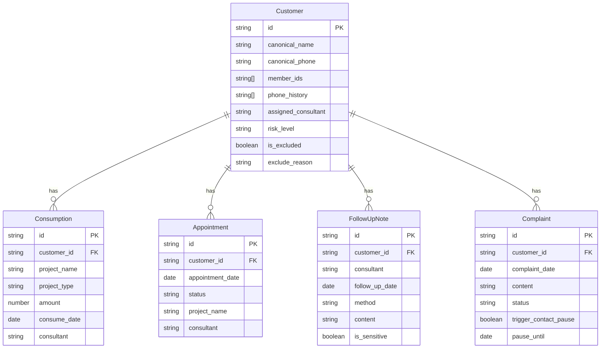

## 1. 架构设计

```mermaid
graph TB
    subgraph "前端层"
        "React SPA" --> "Zustand 状态管理"
        "Zustand 状态管理" --> "分析引擎 Worker"
    end
    subgraph "数据层"
        "CSV 文件上传" --> "解析器"
        "解析器" --> "身份合并引擎"
        "身份合并引擎" --> "统一客户模型"
    end
    subgraph "分析层"
        "统一客户模型" --> "流失风险计算"
        "统一客户模型" --> "复购率计算"
        "统一客户模型" --> "到店间隔计算"
        "投诉记录" --> "暂缓标记引擎"
    end
    subgraph "展示层"
        "流失风险计算" --> "图表看板"
        "复购率计算" --> "图表看板"
        "到店间隔计算" --> "图表看板"
        "流失风险计算" --> "流失名单"
        "暂缓标记引擎" --> "排除管理"
    end
```

## 2. 技术说明

- **前端**：React@18 + TypeScript + Tailwind CSS@3 + Vite
- **初始化工具**：vite-init（react-ts 模板）
- **图表库**：Recharts（轻量、React原生支持）
- **状态管理**：Zustand
- **路由**：react-router-dom@6
- **后端**：无（纯前端，数据在浏览器本地处理）
- **数据持久化**：localStorage + IndexedDB（存储导入数据和计算结果）
- **CSV解析**：PapaParse

## 3. 路由定义

| 路由 | 用途 |
|------|------|
| `/` | 重定向到 /dashboard |
| `/import` | 数据导入页：四表上传、字段映射、身份合并 |
| `/dashboard` | 图表看板页：顾问对比、项目流失、到店间隔、风险热力图 |
| `/churn-list` | 流失名单页：客户清单、回访分配、排除管理 |

## 4. 数据模型

### 4.1 数据模型定义



### 4.2 核心类型定义

```typescript
interface Customer {
  id: string
  canonicalName: string
  canonicalPhone: string
  memberIds: string[]
  phoneHistory: string[]
  assignedConsultant: string
  riskLevel: 'high' | 'medium' | 'low' | 'safe'
  isExcluded: boolean
  excludeReason?: string
  excludeDate?: string
}

interface Consumption {
  id: string
  customerId: string
  projectName: string
  projectType: 'trial' | 'regular' | 'package'
  amount: number
  consumeDate: string
  consultant: string
}

interface Appointment {
  id: string
  customerId: string
  appointmentDate: string
  status: 'completed' | 'no_show' | 'cancelled'
  projectName: string
  consultant: string
}

interface FollowUpNote {
  id: string
  customerId: string
  consultant: string
  followUpDate: string
  method: 'phone' | 'wechat' | 'in_person' | 'other'
  content: string
  isSensitive: boolean
}

interface Complaint {
  id: string
  customerId: string
  complaintDate: string
  content: string
  status: 'pending' | 'processing' | 'resolved'
  triggerContactPause: boolean
  pauseUntil?: string
}

interface ChurnAnalysis {
  customerId: string
  lastVisitDate: string
  avgVisitInterval: number
  currentInterval: number
  intervalDeviation: number
  repurchaseRate: number
  trialRepurchaseRate: number
  regularRepurchaseRate: number
  noShowRate: number
  followUpFrequency: number
  hasActiveComplaint: boolean
  riskScore: number
  riskLevel: 'high' | 'medium' | 'low' | 'safe'
}
```

## 5. 分析引擎核心算法

### 5.1 流失风险评分

- **到店间隔偏离度**（权重40%）：当前间隔 / 历史平均间隔，比值越大风险越高
- **复购率衰减**（权重25%）：近3个月复购率 vs 历史复购率，衰减幅度映射到分数
- **爽约率**（权重15%）：近6个月爽约次数占比
- **跟进频率**（权重10%）：顾问跟进间隔是否超过7天未联系
- **投诉状态**（权重10%）：未处理投诉直接加20分

### 5.2 身份合并规则

1. 手机号完全匹配 → 自动合并
2. 手机号变更：旧号出现在备注中且姓名一致 → 标记待确认
3. 同姓名+同手机号前8位 → 标记待确认
4. 多会员号：同一手机号关联多个会员号 → 自动合并
5. 手动合并：用户可手动选择多条记录合并

### 5.3 项目类型识别

- 关键词匹配：含"体验""试用""新客"→ 体验卡
- 金额阈值：低于设定金额 → 疑似体验卡，标记待确认
- 用户自定义：手动标记项目类型
- 复购率计算时体验卡权重0.5、正价权重1.0
