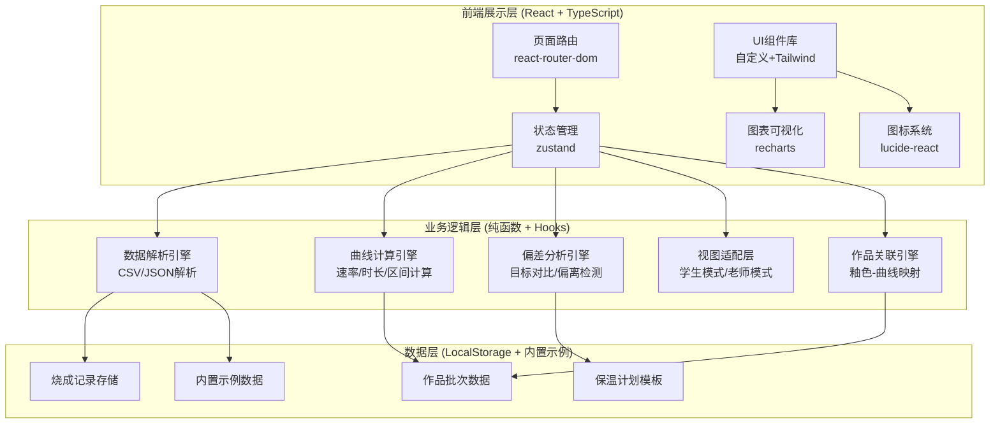
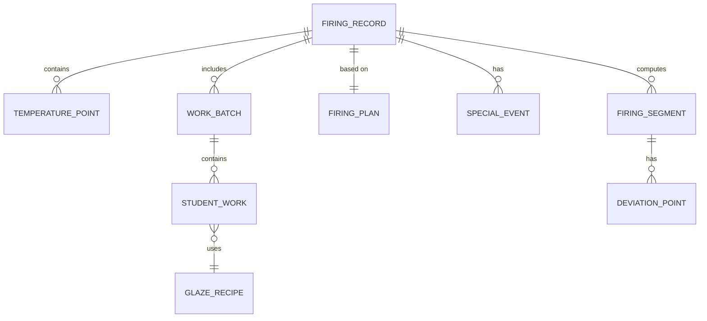

## 1. 架构设计



## 2. 技术说明

- **前端框架**：React@18 + TypeScript@5
- **构建工具**：Vite@5（使用vite-init初始化）
- **样式方案**：TailwindCSS@3（JIT模式）+ 自定义CSS变量
- **状态管理**：Zustand@4（轻量级，分模块存储）
- **路由管理**：React Router DOM@6
- **图表可视化**：Recharts@2（React生态，功能全面，支持自定义形状）
- **图标库**：Lucide React@0.344
- **数据持久化**：LocalStorage（无后端，纯前端应用）
- **文件解析**：浏览器原生FileReader API（CSV解析用papaparse，JSON原生解析）
- **无后端服务**：所有逻辑在前端完成，便于离线使用和快速演示

## 3. 路由定义

| 路由路径 | 页面名称 | 主要功能 |
|----------|----------|----------|
| `/` | 首页仪表盘 | 烧成概览、最近批次、快捷操作入口 |
| `/import` | 数据导入中心 | 窑炉日志上传、保温计划配置、作品批次录入 |
| `/analysis/:id` | 曲线分析看板 | 主曲线图、分段分析、偏离检测、事件标注 |
| `/report/:id` | 复盘报告页 | 学生/老师双视图切换、偏差总结 |
| `/works/:id` | 作品关联页 | 批次作品列表、釉色关联、教学讲评工具 |

## 4. 数据模型定义

### 4.1 ER图



### 4.2 核心类型定义

```typescript
// 温度单位
type TemperatureUnit = 'C' | 'F';

// 单个温度数据点
interface TemperaturePoint {
  timestamp: number;      // Unix毫秒时间戳
  temperature: number;    // 温度值
  unit: TemperatureUnit;
  isValid: boolean;       // 是否有效（检测断点）
  interpolated?: boolean; // 是否为插值补点
}

// 烧成记录（核心实体）
interface FiringRecord {
  id: string;
  name: string;                    // 烧成名称，如"2026-06-12 釉烧第3窑"
  startAt: number;                 // 开始时间戳
  endAt: number;                   // 结束时间戳
  durationHours: number;           // 总时长（小时）
  unit: TemperatureUnit;
  logPoints: TemperaturePoint[];   // 原始温度日志
  plan: FiringPlan;                // 保温计划
  segments: FiringSegment[];       // 计算出的分段
  events: SpecialEvent[];          // 特殊事件
  batches: WorkBatch[];            // 作品批次
  maxDeviation: DeviationPoint[];  // 最大偏离点
  createdAt: number;
  updatedAt: number;
}

// 保温计划（目标曲线）
interface FiringPlan {
  id: string;
  name: string;                    // 如"标准中温釉烧曲线"
  unit: TemperatureUnit;
  segments: PlanSegment[];
}

interface PlanSegment {
  id: string;
  type: 'heating' | 'holding' | 'cooling';
  startTime: number;               // 相对开始时间（小时）
  startTemp: number;
  endTime: number;
  endTemp: number;
  // heating: 目标升温速率 ℃/小时
  // holding: 保温温度 ±容差
  // cooling: 目标降温速率
  rate?: number;
  tolerance?: number;
}

// 实际烧成段（计算结果）
interface FiringSegment {
  id: string;
  type: 'heating' | 'holding' | 'cooling';
  index: number;
  startIndex: number;              // 在logPoints中的起始索引
  endIndex: number;
  startTime: number;
  endTime: number;
  startTemp: number;
  endTemp: number;
  durationHours: number;
  tempChange: number;
  rate: number;                    // 平均速率 ℃/小时（加热正，降温负）
  deviations: DeviationPoint[];    // 此段内的偏离点
  maxDeviationValue: number;
  maxDeviationTime: number;
}

// 偏离点
interface DeviationPoint {
  timestamp: number;
  actualTemp: number;
  targetTemp: number;
  difference: number;              // 实际-目标，正为偏高，负为偏低
  percentage: number;              // 偏差百分比
  severity: 'low' | 'medium' | 'high';
}

// 特殊事件
interface SpecialEvent {
  id: string;
  timestamp: number;
  type: 'log_gap' | 'overnight' | 'lid_open' | 'manual_adjust' | 'power_loss' | 'other';
  title: string;
  description: string;
  durationMinutes?: number;        // 事件持续时间
  params?: Record<string, any>;    // 额外参数（如开盖度数）
}

// 作品批次
interface WorkBatch {
  id: string;
  name: string;                    // 如"A层前排"
  shelfPosition: string;           // 窑位
  works: StudentWork[];
}

// 学生作品
interface StudentWork {
  id: string;
  studentName: string;
  workName: string;
  glaze: GLAZE_RECIPE;
  expectedColor: string;           // 预期釉色描述
  actualColor: string;             // 实际釉色描述
  colorDeviation: 'excellent' | 'good' | 'slight' | 'significant' | 'failed';
  notes: string;                   // 老师备注
  relatedSegmentIds: string[];     // 关联的烧成段ID
  relatedEventIds: string[];       // 关联的特殊事件ID
  impactExplanation: string;       // 影响解释文字
  beforePhotoUrl?: string;
  afterPhotoUrl?: string;
}

// 釉料配方
interface GLAZE_RECIPE {
  id: string;
  name: string;                    // 如"天青釉 #3"
  ingredients: { name: string; percentage: number }[];
  firingTemp: number;              // 推荐烧成温度
  notes: string;
}
```

## 5. 核心算法说明

### 5.1 数据解析与预处理
- **CSV解析**：识别表头（时间戳/时间字符串、温度列），自动匹配`temp/temperature/温度/℃/℉`等关键字
- **单位检测**：根据温度值范围自动识别（>200通常为℃，>392为℉），或从表头显式读取
- **断点检测**：相邻数据点时间差 > 采样间隔×5 判定为日志断点，生成`log_gap`事件
- **跨夜检测**：检测日期变化（timestamp跨过00:00）生成`overnight`事件，并标注时长
- **插值补点**：断点时间较短（<10分钟）时线性插值补点，标记`interpolated=true`

### 5.2 烧成段识别算法
1. **计算斜率**：滑动窗口（5个点）计算温度-时间斜率（dT/dt）
2. **分类规则**：
   - 斜率 > 阈值（如10℃/h）→ heating段
   - 斜率绝对值 < 阈值（如5℃/h）且温度 > 最低保温温度 → holding段
   - 斜率 < -阈值 → cooling段
3. **合并小片段**：持续时间<10分钟的段合并到相邻同类段
4. **平滑处理**：使用Savitzky-Golay滤波减少噪声干扰

### 5.3 目标曲线生成与对比
- **插值法**：根据FiringPlan的控制点，使用线性插值生成逐点目标温度
- **动态时间规整（DTW）简化版**：允许时间轴局部偏移±5%匹配目标与实际
- **偏差计算**：每个实际点对应最近的目标点，计算差值与百分比
- **偏离分级**：偏差<5%→low，5-15%→medium，>15%→high
- **最大偏离时段**：滑动窗口计算平均偏差，找出持续>5分钟的Top3偏离窗口

### 5.4 学生视图通俗化算法
- 模板化语言："升温像开车，第3小时开到了超速（实际300℃/h > 计划200℃/h）"
- 分级评级：每段给出A/B/C/D评级，使用emoji图标强化记忆
- 三段总结：做得好✅ / 可以改进⚠️ / 下次建议💡
