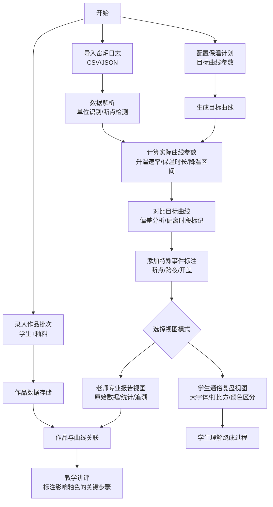

## 1. 产品概述

陶瓷窑温烧成曲线分析系统是一款面向陶艺工作室的专业工具，帮助老师和学生分析窑炉烧成过程，通过导入窑炉温度日志、保温计划和作品批次数据，自动计算升温速率、保温时长和降温区间，对比目标曲线找出偏差，并将烧成曲线与学生作品釉色效果关联，实现科学复盘与教学讲评。

- **解决问题**：传统开窑后只能凭经验判断"升温太快"或"保温不够"，缺乏数据支撑，难以准确归因釉色偏差
- **目标用户**：陶艺工作室老师（专业分析与教学）、陶艺学生（学习复盘）
- **核心价值**：将抽象的烧成过程量化为可追踪的数据曲线，建立"操作步骤→曲线变化→釉色结果"的完整因果链

## 2. 核心功能

### 2.1 用户角色

| 角色 | 权限说明 | 核心需求 |
|------|----------|----------|
| 老师 | 全部功能，含专业报告视图 | 精确定位偏差时段、关联作品批次、导出教学报告 |
| 学生 | 通俗复盘视图 | 理解自己作品在烧成中的位置、学习如何调整 |

### 2.2 功能模块

1. **仪表盘首页**：烧成记录概览、最近批次卡片、统计摘要
2. **数据导入中心**：窑炉日志（CSV/JSON）、保温计划、作品批次导入
3. **曲线分析看板**：实时/原始温度曲线 + 目标曲线叠加、偏离标注、速率热力图
4. **双视图模式**：学生通俗复盘视图 / 老师专业报告视图切换
5. **作品批次管理**：学生作品列表、釉料配方记录、釉色效果评分与曲线关联
6. **特殊事件标注**：日志断点、跨夜烧成、手动开盖、窑门开度等说明
7. **教学讲评工具**：时间轴标注、关键节点高亮、偏差影响解释

### 2.3 页面详情

| 页面名称 | 模块名称 | 功能描述 |
|----------|----------|----------|
| 首页仪表盘 | 烧成概览 | 显示总烧成次数、平均偏差率、近期烧成状态统计 |
| 首页仪表盘 | 最近批次卡片 | 快速浏览最近5个批次，点击进入详情 |
| 首页仪表盘 | 快捷操作 | 导入数据、新建批次、查看报告 |
| 数据导入页 | 窑炉日志上传 | 支持CSV/JSON格式，解析时间戳和温度，自动识别温度单位（℃/℉） |
| 数据导入页 | 保温计划配置 | 设置目标升温段、保温平台、降温速率参数 |
| 数据导入页 | 作品批次录入 | 录入学生姓名、作品名称、釉料配方、预期釉色 |
| 曲线分析页 | 主曲线图 | 原始曲线/目标曲线叠加，缩放平移交互 |
| 曲线分析页 | 分段分析面板 | 升温段/保温段/降温段拆分显示，计算各段参数 |
| 曲线分析页 | 偏离检测 | 自动标记与目标偏差最大的时间段，显示偏差值 |
| 曲线分析页 | 特殊事件标记 | 在曲线上标注断点、开盖、跨夜等事件，悬停显示详情 |
| 复盘报告页 | 学生通俗视图 | 大字体、颜色区分、打比方解释："第3小时升温像爬坡太快了" |
| 复盘报告页 | 老师专业视图 | 原始数据表、偏差统计、曲线导数、时间戳追溯 |
| 作品关联页 | 批次作品列表 | 学生作品卡片，显示釉料、预期/实际釉色对比 |
| 作品关联页 | 影响分析 | 将特定作品与烧成曲线上关键节点关联，解释釉色偏差原因 |
| 作品关联页 | 讲评笔记 | 老师添加教学备注，形成可复用的讲评素材 |

## 3. 核心流程

用户首先导入窑炉日志数据（包含时间戳和温度序列），同时配置保温计划（目标温度曲线参数）和录入作品批次信息。系统自动解析数据，识别温度单位，检测日志断点并标记跨夜烧成时段。然后计算实际曲线的升温速率、保温时长、降温区间，与目标曲线对比，找出偏离最大的时间段。最后生成双视图报告：学生看到用通俗语言解释的复盘结论，老师可以查看专业数据报告并追溯原始曲线数据。老师可进一步将学生作品与曲线上的关键节点关联，标注出哪一步操作影响了最终釉色，用于课堂讲评。

## 4. 用户界面设计

### 4.1 设计风格

- **主色调**：窑炉橙红渐变（#C1440E → #8B2500）+ 温暖陶土米白（#F5F0E8）背景，呼应陶瓷烧制的火与土
- **辅助色**：温度指示渐变色带（深蓝低温→橙红中温→亮白高温），偏差标注使用信号红（#DC2626）与安全绿（#16A34A）
- **字体**：标题使用思源宋体（衬线体，传达传统工艺质感），正文使用思源黑体（清晰易读），数据数字使用等宽字体JetBrains Mono
- **布局风格**：卡片式模块化布局，侧边导航 + 主内容区，主曲线图占屏幕核心区域
- **图标风格**：线性图标配合陶瓷主题（窑炉、陶轮、釉料桶、温度计），使用Lucide图标库
- **质感细节**：陶土纹理背景、暖橙色毛玻璃卡片、轻微阴影模拟窑火光影

### 4.2 页面设计概览

| 页面名称 | 模块名称 | UI元素设计 |
|----------|----------|------------|
| 首页仪表盘 | 烧成概览 | 大数字统计卡片 + 渐变进度环，背景微陶土纹理 |
| 首页仪表盘 | 最近批次卡片 | 横向滚动卡片，缩略曲线图 + 批次号 + 釉色效果小标签 |
| 曲线分析页 | 主曲线图 | 占屏60%的大图，双Y轴（温度/速率），可缩放拖拽，偏离区红色半透明蒙版 |
| 曲线分析页 | 分段分析面板 | 手风琴折叠面板，每段独立卡片：升温段橙标/保温段金标/降温段蓝标 |
| 曲线分析页 | 特殊事件标记 | 曲线上方小图标 + 虚线引线，悬停弹出浮层显示事件详情 |
| 复盘报告页 | 学生通俗视图 | 大号18px字体，emoji点缀，三段式总结："做得好的/可以改进的/下次建议" |
| 复盘报告页 | 老师专业视图 | 表格数据 + 导出按钮 + 偏差时间戳列表，可点击定位到曲线对应位置 |
| 作品关联页 | 作品卡片 | 3列网格，卡片含作品缩略图、学生姓名、釉料标签、釉色偏差评级 |
| 作品关联页 | 影响分析 | 时间轴垂直布局，每个节点对应曲线时段 + 作品照片 + 影响解释文字 |

### 4.3 响应式设计

- **桌面优先**：核心分析页以1440px宽度为基准设计，主曲线图自适应容器宽度
- **平板适配**：1024px以下侧边导航折叠为图标模式，分段面板改为纵向排列
- **手机适配**：768px以下改为单栏布局，曲线图支持双指缩放，数据表格改为卡片列表
- **触摸优化**：所有可交互元素最小44px高度，曲线图增加触摸手势（滑动平移、捏合缩放）

### 4.4 可视化细节

- 温度曲线使用渐变描边：温度越高颜色越亮（暗蓝→橙→黄白）
- 偏离区域填充半透明红色蒙版，偏离程度越深透明度越高
- 升温/保温/降温三段背景使用不同色带区分
- 特殊事件点使用脉冲动画引起注意
- 页面加载时曲线从左到右动态绘制，模拟烧成过程
