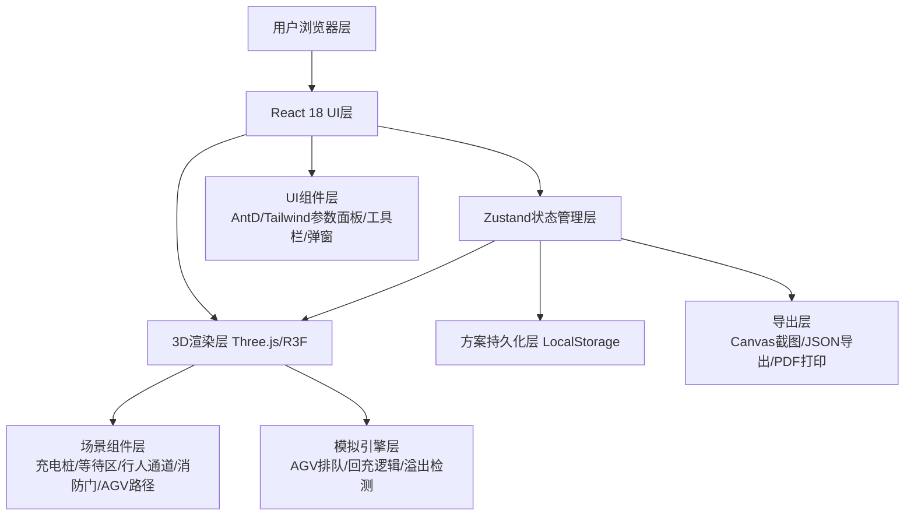

## 1. 架构设计



## 2. 技术描述

- **前端框架**: React@18 + TypeScript@5 + Vite@5
- **状态管理**: Zustand@4（场景布局、模拟状态、方案管理）
- **3D渲染**: Three@0.160 + @react-three/fiber@8 + @react-three/drei@9 + @react-three/postprocessing@2
- **样式方案**: TailwindCSS@3 + CSS Variables
- **UI组件**: Lucide React 图标 + 自定义工业风组件
- **数据持久化**: LocalStorage (方案/设置)
- **导出方案**: html2canvas（截图） + print-js（打印）

## 3. 核心页面与路由

| 路由 | 页面 | 核心功能 |
|------|------|---------|
| `/` | 主工作台 Layout | 3D画布 + 参数面板 + 工具栏 + 模拟控制 |

## 4. 核心数据模型

### 4.1 场景布局数据模型

```typescript
// 基础实体类型
type LayoutEntityType = 'charger' | 'waitZone' | 'pedestrian' | 'fireDoor' | 'agvPath' | 'forbidden'

interface BaseEntity {
  id: string
  type: LayoutEntityType
  name: string
  position: { x: number; z: number }
  rotation: number
  visible: boolean
  locked: boolean
}

// 充电桩
interface ChargerEntity extends BaseEntity {
  type: 'charger'
  powerKw: number
  chargeMinutes: number
  occupied: boolean
}

// 等待区
interface WaitZoneEntity extends BaseEntity {
  type: 'waitZone'
  width: number
  depth: number
  capacity: number
}

// 行人通道
interface PedestrianEntity extends BaseEntity {
  type: 'pedestrian'
  width: number
  length: number
}

// 消防门
interface FireDoorEntity extends BaseEntity {
  type: 'fireDoor'
  width: number
  clearanceRadius: number
}

// AGV路径
interface AgvPathEntity extends BaseEntity {
  type: 'agvPath'
  points: { x: number; z: number }[]
  width: number
}

// 禁区
interface ForbiddenEntity extends BaseEntity {
  type: 'forbidden'
  width: number
  depth: number
  reason: string
}

// AGV车辆参数
interface AgvParams {
  lengthMeters: number
  widthMeters: number
  turningRadius: number
  chargeMinutes: number
  lowBatteryThreshold: number
  peakCount: number
  offPeakCount: number
}

// 通道参数
interface CorridorParams {
  mainCorridorWidth: number
  forkliftWidth: number
  fireClearance: number
}

// 模拟状态
interface SimulationState {
  running: boolean
  speed: number
  time: number
  scenario: 'peak' | 'offPeak'
  agvList: AgvVehicle[]
  overflowWarnings: OverflowWarning[]
}

// AGV车辆实例
interface AgvVehicle {
  id: string
  battery: number
  state: 'working' | 'returning' | 'queuing' | 'charging' | 'done'
  position: { x: number; z: number }
  pathIndex: number
  queuePosition: number
}

// 溢出警告
interface OverflowWarning {
  id: string
  entityId: string
  entityName: string
  type: 'fireDoor' | 'pedestrian' | 'forklift' | 'forbidden'
  severity: 'warning' | 'danger'
  message: string
}

// 方案
interface LayoutScheme {
  id: string
  name: string
  createdAt: number
  updatedAt: number
  scenarioType: 'peak' | 'offPeak' | 'general'
  entities: BaseEntity[]
  agvParams: AgvParams
  corridorParams: CorridorParams
  metrics: {
    landUsage: number
    chargerCount: number
    waitCapacity: number
    riskScore: number
    maxQueueLength: number
  }
  notes: string
}
```

## 5. 状态管理切片（Zustand）

```typescript
interface AppStore {
  // 场景
  entities: BaseEntity[]
  selectedEntityId: string | null
  
  // 参数
  agvParams: AgvParams
  corridorParams: CorridorParams
  validationErrors: Record<string, string>
  
  // 模拟
  sim: SimulationState
  
  // 方案
  schemes: LayoutScheme[]
  activeSchemeId: string | null
  
  // UI
  toolMode: 'select' | 'add-charger' | 'add-wait' | 'add-ped' | 'add-door' | 'add-path' | 'add-forbidden'
  showComparison: boolean
  showExport: boolean
  comparisonIds: [string, string] | null
  
  // Actions
  addEntity: (e: BaseEntity) => void
  updateEntity: (id: string, patch: Partial<BaseEntity>) => void
  removeEntity: (id: string) => void
  setAgvParams: (p: Partial<AgvParams>) => void
  setCorridorParams: (p: Partial<CorridorParams>) => void
  validateParams: () => void
  startSim: () => void
  pauseSim: () => void
  tickSim: (dt: number) => void
  saveScheme: (name: string, type: LayoutScheme['scenarioType']) => void
  loadScheme: (id: string) => void
  deleteScheme: (id: string) => void
  setComparison: (ids: [string, string] | null) => void
  exportReport: () => void
}
```

## 6. 核心组件目录结构

```
src/
├── components/
│   ├── three/                    # 3D场景组件
│   │   ├── FactoryScene.tsx       # 主场景容器
│   │   ├── FactoryFloor.tsx       # 地面网格
│   │   ├── Charger.tsx            # 充电桩
│   │   ├── WaitZone.tsx           # 等待区
│   │   ├── PedestrianLane.tsx     # 行人通道
│   │   ├── FireDoor.tsx           # 消防门
│   │   ├── AgvPathLine.tsx        # AGV路径线
│   │   ├── AgvVehicleMesh.tsx     # AGV车辆
│   │   ├── ForbiddenZone.tsx      # 禁区+溢出标红
│   │   └── OverlayLabels.tsx      # 悬浮标签
│   ├── panels/
│   │   ├── ParamsPanel.tsx        # 左侧参数面板
│   │   ├── Toolbar.tsx            # 右侧工具栏
│   │   └── SimulationBar.tsx      # 底部模拟控制条
│   ├── modals/
│   │   ├── SchemeManagerModal.tsx # 方案管理
│   │   ├── CompareModal.tsx       # 方案对比
│   │   └── ExportReportModal.tsx  # 报告导出
│   └── ui/                        # 基础UI组件
│       ├── Card.tsx
│       ├── InputWithValidation.tsx
│       ├── SegmentedTabs.tsx
│       └── RiskBadge.tsx
├── store/
│   ├── useLayoutStore.ts          # Zustand store
│   └── validators.ts              # 参数验证规则
├── engine/
│   ├── simulationEngine.ts        # 排队模拟引擎
│   └── overflowDetector.ts        # 溢出检测算法
├── utils/
│   ├── geometry.ts                # 几何计算(碰撞/距离)
│   ├── id.ts                      # ID生成
│   └── export.ts                  # 导出工具
├── pages/
│   └── Workbench.tsx              # 主工作台
└── App.tsx
```
