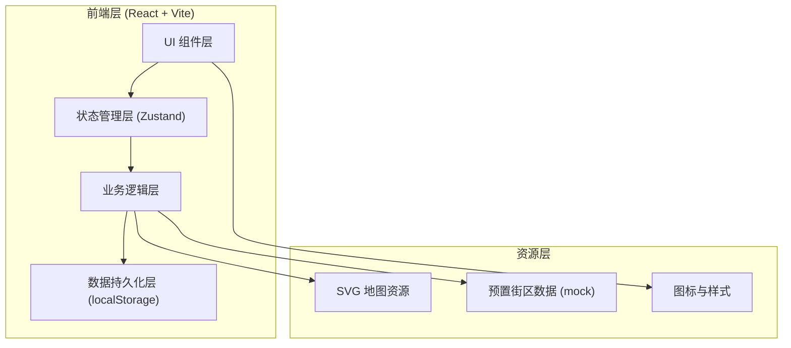
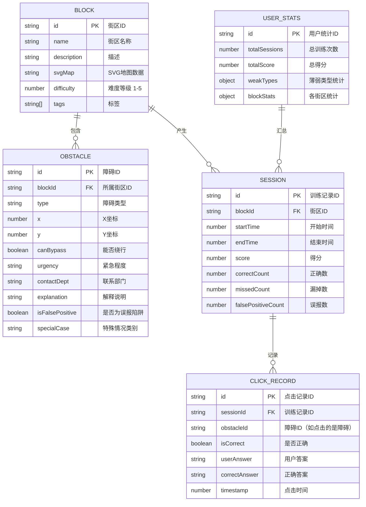

## 1. 架构设计

本项目为纯前端单页应用，无后端依赖，数据通过 localStorage 持久化存储。地图采用 SVG 技术绘制，保证交互流畅和可缩放性。



## 2. 技术描述

- **前端框架**：React@18 + TypeScript
- **构建工具**：Vite@5
- **样式方案**：TailwindCSS@3 + CSS Variables
- **状态管理**：Zustand（轻量级状态管理）
- **路由**：React Router@6
- **地图渲染**：原生 SVG + 自定义交互
- **数据持久化**：localStorage（封装存储工具类）
- **图表**：Recharts（轻量级 React 图表库）
- **动画**：Framer Motion（页面过渡、微交互）
- **图标**：Lucide React（线性图标库）

**技术选型理由**：
- 纯前端架构，无需后端部署，降低使用门槛
- SVG 地图保证清晰度和交互性，适合街区级别展示
- Zustand 轻量简单，适合中等复杂度应用
- localStorage 满足单设备训练进度保存需求
- Recharts 体积小、API 简洁，满足基础统计图表需求

## 3. 路由定义

| 路由路径 | 页面 | 说明 |
|---------|------|------|
| `/` | 首页 / 街区列表 | 展示所有可训练街区和个人进度概览 |
| `/game/:blockId` | 巡查游戏页 | 核心游戏界面，进行障碍识别训练 |
| `/result/:sessionId` | 结算页 | 展示本次训练结果、漏掉和误报点 |
| `/progress` | 个人进度页 | 历史成绩、薄弱类型分析 |
| `/teacher/blocks` | 街区配置页（老师） | 管理街区和障碍配置 |
| `/teacher/stats` | 统计分析页（老师） | 街区错漏统计、薄弱路段分析 |
| `*` | 404 页 | 未找到页面时的兜底 |

## 4. 数据模型

### 4.1 数据模型定义



### 4.2 数据结构定义

```typescript
// 街区
interface Block {
  id: string;
  name: string;
  description: string;
  svgMap: string;
  difficulty: 1 | 2 | 3 | 4 | 5;
  tags: string[];
  obstacles: Obstacle[];
  createdAt: number;
  updatedAt: number;
}

// 障碍类型
type ObstacleType = 
  | 'shared_bike'      // 共享单车
  | 'low_signboard'    // 低矮招牌
  | 'construction'     // 施工围挡
  | 'crossing_gap'     // 路口断点
  | 'parked_car'       // 违停车辆
  | 'utility_pole'     // 电线杆
  | 'manhole_cover'    // 井盖缺失
  | 'side_object'      // 旁侧物体（不影响通行）
  | 'temp_construction'// 临时施工（有警示）
  | 'low_visibility'   // 夜间可见性差的标记物

// 紧急程度
type UrgencyLevel = 'low' | 'medium' | 'high' | 'emergency';

// 联系部门
type ContactDepartment = 
  | 'traffic_police'   // 交警
  | 'city_management'  // 城管
  | 'construction_dept'// 住建部门
  | 'transportation'   // 交通部门
  | 'utility_company'  // 公用事业单位
  | 'community'        // 社区居委会

// 障碍
interface Obstacle {
  id: string;
  blockId: string;
  type: ObstacleType;
  x: number;
  y: number;
  canBypass: boolean;
  urgency: UrgencyLevel;
  contactDept: ContactDepartment;
  explanation: string;
  isFalsePositive: boolean;  // true = 这是一个误报陷阱，不是真的障碍
  specialCase?: 'side_object' | 'temp_construction_with_warning' | 'night_visibility';
  specialExplanation?: string; // 特殊情况的解释
}

// 训练记录
interface GameSession {
  id: string;
  blockId: string;
  startTime: number;
  endTime: number;
  score: number;
  correctCount: number;
  missedCount: number;
  falsePositiveCount: number;
  clickRecords: ClickRecord[];
}

// 点击记录
interface ClickRecord {
  id: string;
  sessionId: string;
  obstacleId: string | null;  // 如果是误报点则为 null
  clickX: number;
  clickY: number;
  isCorrect: boolean;
  userAnswer: UserAnswer;
  correctAnswer?: CorrectAnswer;
  timestamp: number;
}

// 用户答案
interface UserAnswer {
  canBypass: boolean | null;
  urgency: UrgencyLevel | null;
  contactDept: ContactDepartment | null;
}

// 正确答案
interface CorrectAnswer {
  canBypass: boolean;
  urgency: UrgencyLevel;
  contactDept: ContactDepartment;
}

// 用户统计
interface UserStats {
  totalSessions: number;
  totalScore: number;
  averageAccuracy: number;
  weakTypes: Record<ObstacleType, { correct: number; total: number }>;
  blockStats: Record<string, BlockStat>;
  lastPlayedAt: number;
}

// 街区统计
interface BlockStat {
  blockId: string;
  bestScore: number;
  bestAccuracy: number;
  playCount: number;
  weakSegments: SegmentStat[];  // 薄弱路段
}

// 路段统计
interface SegmentStat {
  segmentId: string;
  name: string;
  errorCount: number;
  totalCount: number;
}
```

### 4.3 存储键名定义

```
localStorage 键名：
- blind_go_blocks: 所有街区配置
- blind_go_sessions: 所有训练记录
- blind_go_stats: 用户统计数据
- blind_go_role: 当前角色（volunteer/teacher）
```

## 5. 核心模块划分

### 5.1 目录结构

```
src/
├── components/          # 通用组件
│   ├── Layout/          # 布局组件
│   ├── Map/             # 地图相关组件
│   ├── Obstacle/        # 障碍相关组件
│   └── ui/              # UI 基础组件（按钮、卡片等）
├── pages/               # 页面组件
│   ├── Home/            # 首页
│   ├── Game/            # 游戏页
│   ├── Result/          # 结算页
│   ├── Progress/        # 进度页
│   └── Teacher/         # 老师端页面
├── store/               # 状态管理
│   ├── gameStore.ts     # 游戏状态
│   ├── blockStore.ts    # 街区数据
│   └── statsStore.ts    # 统计数据
├── utils/               # 工具函数
│   ├── storage.ts       # 本地存储封装
│   ├── score.ts         # 计分规则
│   └── svgUtils.ts      # SVG 工具
├── data/                # 预置数据
│   └── mockBlocks.ts    # 预置街区数据
├── types/               # TypeScript 类型定义
│   └── index.ts
├── hooks/               # 自定义 Hooks
│   ├── useTimer.ts      # 计时器
│   └── useGameLogic.ts  # 游戏逻辑
└── App.tsx              # 应用入口
```

### 5.2 核心状态管理

- **gameStore**：当前游戏状态（当前街区、已发现障碍、计时器、得分）
- **blockStore**：所有街区配置数据，CRUD 操作
- **statsStore**：用户统计数据、历史记录、薄弱类型分析

## 6. 计分规则

- 每个障碍基础分：100 分
- 判定三要素：绕行可能性、紧急程度、联系部门
  - 全部正确：+100 分
  - 对 2 项：+60 分
  - 对 1 项：+20 分
  - 全错：0 分
- 漏掉障碍：-30 分/个
- 误报（点了不是障碍的地方）：-20 分/个
- 时间奖励：剩余时间 × 2 分（最多 200 分）
- 特殊情况识别正确额外 +30 分

评级标准：
- S 级：90% 以上正确率
- A 级：80-89%
- B 级：70-79%
- C 级：60-69%
- D 级：60% 以下
