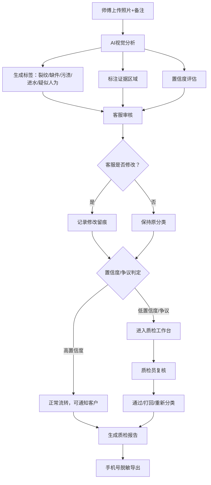

## 1. 产品概述

家电售后维修照片缺陷初筛系统，旨在解决客服人工逐一判断维修照片效率低、标准不统一的问题。通过 AI 视觉模型对维修照片进行自动标签分类和证据区域标注，辅助客服快速判断缺陷类型（运输损坏、安装问题、客户使用痕迹等），同时为质检员提供低置信度案例集中复核功能，保障争议件不直接流向客户。

### 目标用户
- **客服人员**：每日处理大量维修工单，需快速判断缺陷类型
- **质检人员**：复核模型低置信度案例，把控争议件质量
- **系统管理员**：配置标签体系、导出质检报告

### 产品价值
- 提升客服判单效率 3-5 倍
- 统一缺陷分类标准，减少人工判断偏差
- 建立争议件拦截机制，降低客诉风险
- 支持操作留痕，满足质检追溯需求

---

## 2. 核心功能

### 2.1 用户角色

| 角色 | 登录方式 | 核心权限 |
|------|----------|----------|
| 客服 | 账号密码 | 照片上传、AI初筛查看、标签修改、工单提交 |
| 质检员 | 账号密码 | 低置信度复核、争议件处理、质检报告导出 |
| 管理员 | 账号密码 | 标签配置、数据统计、用户管理 |

### 2.2 功能模块

1. **工单列表页**：工单概览、筛选搜索、状态流转
2. **照片初筛页**：照片上传、AI标签展示、证据区域标注、置信度说明
3. **客服审核页**：标签修改、备注补充、提交流转、操作留痕
4. **质检工作台**：低置信度集中展示、争议件拦截、批量复核
5. **报告导出页**：质检报告生成、手机号脱敏、多格式导出

### 2.3 页面详情

| 页面名称 | 模块名称 | 功能描述 |
|----------|----------|----------|
| 工单列表 | 顶部筛选栏 | 按状态/日期/缺陷类型/置信度筛选工单 |
| 工单列表 | 工单卡片 | 展示缩略图、工单号、缺陷标签、置信度、状态 |
| 工单列表 | 批量操作 | 批量提交质检、批量导出 |
| 照片初筛 | 照片上传区 | 拖拽上传、多图上传、备注文本输入 |
| 照片初筛 | 照片详情区 | 大图展示、证据区域框选、标签切换 |
| 照片初筛 | AI分析结果 | 缺陷标签列表、置信度评分、降低把握的原因说明 |
| 客服审核 | 标签编辑 | 增删改标签、手动调整缺陷分类 |
| 客服审核 | 审核留痕 | 展示修改历史、操作人、时间戳 |
| 客服审核 | 工单流转 | 提交质检、退回重拍、直接结案 |
| 质检工作台 | 待复核列表 | 低置信度工单集中展示，按把握度排序 |
| 质检工作台 | 争议件池 | 标记为争议的工单暂存，不流向客户 |
| 质检工作台 | 批量复核 | 一键通过、批量打回、标注复核意见 |
| 报告导出 | 报告生成 | 按时间范围生成质检报告 |
| 报告导出 | 脱敏处理 | 客户手机号自动脱敏（中间四位****） |
| 报告导出 | 格式选择 | 支持 Excel / PDF 导出 |

---

## 3. 核心流程

### 3.1 主流程描述

师傅上传维修照片和备注 → 系统自动进行 AI 初筛 → 生成缺陷标签和证据区域 → 客服查看并可修改分类 → 系统记录操作留痕 → 低置信度/争议件进入质检工作台 → 质检员复核 → 报告导出（脱敏）

### 3.2 流程图

---

## 4. 用户界面设计

### 4.1 设计风格

**整体风格**：专业、高效、工业感，契合家电售后场景

- **主色调**：深海蓝 `#1e3a5f` — 专业可信
- **辅助色**：警示橙 `#f59e0b` — 低置信度/待处理
- **强调色**：信号绿 `#10b981` — 已通过 / 确认
- **危险色**：警示红 `#ef4444` — 争议件/高风险
- **中性色**：冷灰系列 `#f1f5f9 / #64748b / #1e293b`
- **字体**：标题使用 "Noto Sans SC"，正文使用系统无衬线字体
- **按钮风格**：直角微圆角（4px），扁平化设计，悬停有轻微上浮阴影
- **布局风格**：左侧导航 + 顶部操作栏 + 主体内容区，卡片式布局
- **图标风格**：线性图标（lucide-react），统一 20px 尺寸

### 4.2 页面设计概览

| 页面名称 | 模块名称 | UI 元素 |
|----------|----------|---------|
| 工单列表 | 顶部栏 | 深色顶栏 + 搜索框 + 筛选下拉 + 新建工单按钮 |
| 工单列表 | 卡片网格 | 响应式卡片网格，缩略图左上角状态角标，右下角置信度标签 |
| 照片初筛 | 双栏布局 | 左图右文，左侧大图带证据框叠加层，右侧标签和置信度面板 |
| 照片初筛 | 证据标注 | 彩色半透明矩形框，对应不同缺陷类型，悬停显示标签详情 |
| 客服审核 | 时间线 | 右侧操作留痕时间线，展示修改记录 |
| 质检工作台 | 分栏布局 | 左侧低置信度列表，右侧争议件池，中间为详情预览 |
| 报告导出 | 表单风格 | 清晰的导出配置表单，预览脱敏效果 |

### 4.3 响应式设计

- **桌面端优先**：以 1440px 宽度为设计基准
- **平板适配**：两列卡片布局，导航可折叠
- **手机端**：单列卡片，底部导航，照片全屏查看
- **触摸优化**：按钮最小 44px 触控区域，证据框支持双指缩放

---

## 5. 特殊业务规则

### 5.1 置信度降低规则

系统检测到以下情况时，自动降低整体置信度评分：

| 触发条件 | 置信度影响 | 说明 |
|----------|-----------|------|
| 照片模糊 | -20% | 通过图像清晰度检测 |
| 同一设备多角度照片不足 | -15% | 少于 3 个角度 |
| 备注文本与图片分析冲突 | -25% | 文字描述与识别结果不匹配 |
| 存在旧维修痕迹 | -20% | 检测到历史维修记录叠加 |
| 光线不足/反光严重 | -15% | 图像曝光分析 |

### 5.2 争议件判定标准

满足以下任一条件，自动标记为"争议件"，拦截不流向客户：
- 整体置信度 < 50%
- 同时存在"运输损坏"和"人为损坏"标签且置信度均 > 60%
- 客服标记为"需质检确认"
- 同一工单被修改标签 ≥ 3 次

### 5.3 数据脱敏规则

- 手机号：中间 4 位替换为 `****`（如 138****1234）
- 客户姓名：保留姓氏，名字用 `*` 代替
- 地址：保留到区县级，详细地址脱敏
