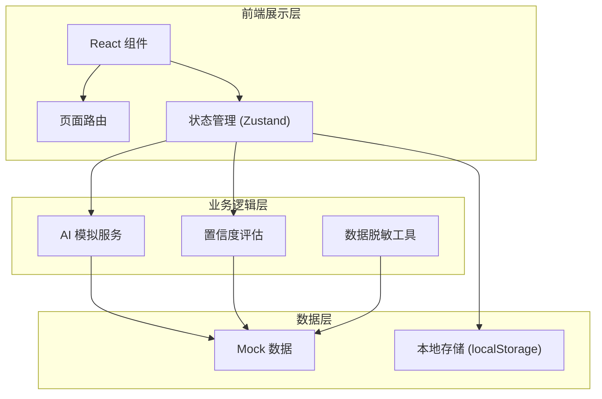
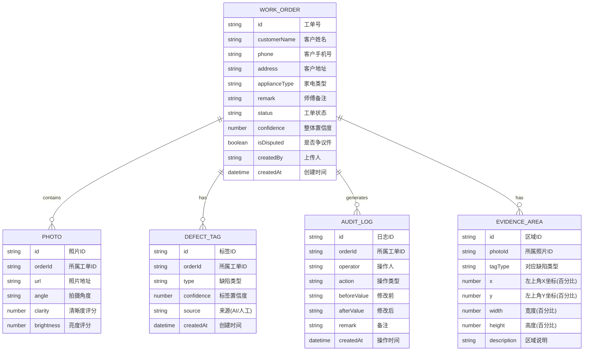

## 1. 架构设计

本系统为纯前端演示项目，使用 Mock 数据模拟后端 API 和 AI 模型输出。整体采用分层架构，前端负责展示与交互逻辑，数据层模拟真实业务数据。



---

## 2. 技术描述

### 2.1 技术栈
- **前端框架**：React 18 + TypeScript
- **构建工具**：Vite 5
- **样式方案**：Tailwind CSS 3
- **状态管理**：Zustand
- **路由方案**：React Router v6
- **图标库**：Lucide React
- **图表/可视化**：原生 Canvas 实现证据区域标注

### 2.2 初始化方式
使用 `vite-init` 脚手架创建项目，选择 `react-ts` 模板。

---

## 3. 路由定义

| 路由路径 | 页面名称 | 用途说明 |
|----------|----------|----------|
| `/` | 工单列表 | 展示所有维修工单，支持筛选和搜索 |
| `/screening/:id` | 照片初筛 | 单张工单的 AI 初筛详情，含证据标注 |
| `/review/:id` | 客服审核 | 客服修改标签、补充备注、提交流转 |
| `/quality` | 质检工作台 | 低置信度集中复核、争议件处理 |
| `/report` | 报告导出 | 生成并导出质检报告（脱敏） |

---

## 4. 数据模型

### 4.1 实体关系图



### 4.2 缺陷类型定义

| 类型编码 | 类型名称 | 颜色标识 | 说明 |
|----------|----------|----------|------|
| `crack` | 裂纹 | #ef4444 红 | 外壳、面板等出现裂纹 |
| `missing_part` | 缺件 | #f59e0b 橙 | 零配件缺失、不完整 |
| `stain` | 污渍 | #8b5cf6 紫 | 表面污渍、污垢 |
| `water_damage` | 进水 | #3b82f6 蓝 | 水渍、进水痕迹 |
| `human_damage` | 疑似人为损坏 | #ec4899 粉 | 人为使用不当造成的损坏 |
| `old_repair` | 旧维修痕迹 | #6b7280 灰 | 历史维修留下的痕迹 |

### 4.3 工单状态流转

| 状态值 | 状态名称 | 描述 |
|--------|----------|------|
| `pending` | 待初筛 | 刚上传，AI 尚未分析 |
| `screened` | 已初筛 | AI 分析完成，待客服审核 |
| `customer_reviewed` | 客服已审核 | 客服确认/修改后 |
| `quality_check` | 待质检 | 进入质检复核队列 |
| `quality_passed` | 质检通过 | 质检员确认通过 |
| `disputed` | 争议件 | 标记为争议，暂存 |
| `closed` | 已结案 | 工单处理完成 |

---

## 5. 核心模块设计

### 5.1 AI 模拟服务模块
- 输入：照片 + 备注文本
- 输出：缺陷标签列表 + 证据区域坐标 + 各标签置信度
- 模拟逻辑：基于预设规则随机生成，确保演示数据的多样性

### 5.2 置信度评估模块
- 输入：照片质量指标 + 标签数量 + 备注文本匹配度
- 输出：整体置信度评分 + 降低原因列表
- 算法：加权评分模型，各降低因素按权重扣减

### 5.3 数据脱敏工具模块
- 手机号脱敏：保留前 3 后 4，中间 4 位用 `****` 替换
- 姓名脱敏：保留姓氏，名字用 `*` 替换
- 地址脱敏：保留到区县级，详细地址用 `***` 替换

### 5.4 证据区域标注组件
- 基于 Canvas 或 CSS 定位实现
- 支持不同类型对应不同颜色边框
- 支持悬停显示详情标签
- 支持缩放适配

---

## 6. 目录结构

```
src/
├── components/           # 公共组件
│   ├── Layout/           # 布局组件
│   ├── PhotoViewer/      # 照片查看器（含证据标注）
│   ├── TagBadge/         # 缺陷标签徽章
│   ├── ConfidenceBar/    # 置信度进度条
│   ├── AuditTimeline/    # 审核留痕时间线
│   └── StatusBadge/      # 状态徽章
├── pages/                # 页面组件
│   ├── OrderList/        # 工单列表页
│   ├── PhotoScreening/   # 照片初筛页
│   ├── CustomerReview/   # 客服审核页
│   ├── QualityDesk/      # 质检工作台
│   └── ReportExport/     # 报告导出页
├── store/                # 状态管理
│   └── useOrderStore.ts
├── utils/                # 工具函数
│   ├── mockData.ts       # Mock 数据生成
│   ├── aiSimulator.ts    # AI 模拟服务
│   ├── confidence.ts     # 置信度评估
│   ├── desensitize.ts    # 数据脱敏
│   └── constants.ts      # 常量定义
├── types/                # TypeScript 类型定义
│   └── index.ts
├── App.tsx               # 根组件（路由配置）
├── main.tsx              # 入口文件
└── index.css             # 全局样式
```
