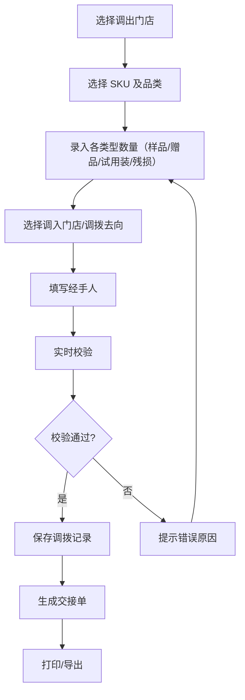
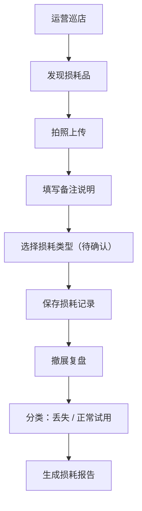

## 1. 产品概述

快闪店库存调拨管理系统，服务于品牌快闪活动期间的多门店库存协同。解决三店联动场景下的试用装短缺、赠品剩余、残损品统计等运营痛点，实现调拨全流程可追溯，支撑撤展复盘与损耗核算。

- **目标用户**：门店店员、运营人员、总部管理人员
- **核心价值**：调拨效率提升、损耗透明可查、责任追溯清晰

## 2. 核心特性

### 2.1 用户角色

| 角色 | 使用场景 | 核心权限 |
|------|----------|----------|
| 门店店员 | 日常调拨录入、交接单打印 | 录入调拨记录、打印交接单、查看本店库存 |
| 运营人员 | 活动统筹、损耗管理、数据导出 | 全量数据查看、损耗拍照备注、导出报表、复盘分析 |
| 总部管理 | 稽核审计、责任追溯 | 经手人核对、全链路数据追溯 |

### 2.2 功能模块

1. **库存调拨录入**：门店、SKU、样品/赠品/试用装/残损数量、调拨去向、经手人
2. **智能校验提示**：库存不足预警、重复调拨拦截、残损误入可售提醒、日期异常校验
3. **多维筛选**：按门店、品类、调拨状态、时间范围筛选
4. **草稿自动保存**：localStorage 持久化，刷新不丢失
5. **交接单打印**：标准格式打印，双方签字确认
6. **数据导出**：活动结束后余量与损耗报表导出（CSV）
7. **损耗管理**：拍照上传、备注说明、丢失/正常试用分类
8. **撤展复盘**：损耗分类统计、差异分析
9. **经手人追溯**：每条记录的最后操作人留痕

### 2.3 页面详情

| 页面名称 | 模块名称 | 功能描述 |
|----------|----------|----------|
| 库存调拨主页 | 顶部导航 | 角色切换、活动名称、当前门店 |
| 库存调拨主页 | 筛选区域 | 门店筛选、品类筛选、状态筛选、日期范围 |
| 库存调拨主页 | 调拨列表 | 调拨记录卡片、数量标签、状态标识 |
| 库存调拨主页 | 快速录入面板 | 新建调拨单、实时校验、草稿保存 |
| 损耗管理面板 | 损耗列表 | 损耗记录、图片预览、分类标签 |
| 损耗管理面板 | 拍照上传 | 本地图片上传、备注填写 |
| 报表导出面板 | 数据概览 | 各门店余量统计、损耗汇总 |
| 报表导出面板 | 导出操作 | CSV 导出、打印预览 |
| 复盘分析面板 | 分类统计 | 丢失 vs 正常试用对比 |
| 复盘分析面板 | 经手人追溯 | 操作日志、最后经手人查询 |

## 3. 核心流程

### 3.1 调拨录入流程

店员在快闪活动中需要从兄弟店调货时，通过系统录入调拨单，系统实时校验库存是否充足、是否存在重复调拨风险，确认后生成调拨记录并可打印交接单。

### 3.2 损耗管理流程

运营人员巡店时对损耗品拍照备注，撤展时统一复盘，区分丢失与正常试用，生成损耗报告。

## 4. 用户界面设计

### 4.1 设计风格

- **设计调性**：工业风 + 实用主义，强调数据清晰度和操作效率
- **主色调**：深靛蓝 (#1e3a5f) 作为主色，搭配暖橙 (#f97316) 作为警示强调色
- **辅助色**：翠绿 (#10b981) 表示正常、琥珀 (#f59e0b) 表示警告、玫红 (#ef4444) 表示错误
- **字体**：标题使用 DM Sans，正文使用 Inter，数字使用等宽字体 JetBrains Mono
- **布局风格**：卡片式布局 + 左侧边栏导航，信息密度适中偏紧凑
- **图标风格**：Lucide 线性图标，16px 基准尺寸

### 4.2 页面设计概览

| 页面名称 | 模块名称 | UI 元素 |
|----------|----------|---------|
| 调拨主页 | 顶部状态栏 | 活动名称标签、当前时间、门店切换下拉 |
| 调拨主页 | 筛选栏 | 胶囊式筛选按钮组、日期选择器、搜索框 |
| 调拨主页 | 调拨记录列表 | 卡片网格布局，SKU 名称为主标题，数量标签用彩色小圆角标识 |
| 调拨主页 | 录入侧滑面板 | 从右侧滑出，表单分组清晰，底部固定操作栏 |
| 损耗管理 | 图片网格 | 瀑布流布局，图片带分类标签角标 |
| 损耗管理 | 备注卡片 | 时间线式布局，经手人头像 + 备注内容 |
| 报表导出 | 数据看板 | 大数字展示 + 趋势迷你图 |
| 报表导出 | 操作区 | 主按钮组，悬停有微抬升动效 |

### 4.3 响应式

- **桌面优先**，1280px 以上为最佳体验
- **平板适配**：1024px 时侧栏收起为图标导航
- **手机适配**：768px 以下底部 Tab 导航，列表改为单列
- **打印优化**：专用打印样式，隐藏导航和操作按钮

### 4.4 动效与交互

- 侧滑面板使用 300ms cubic-bezier(0.4, 0, 0.2, 1) 缓动
- 卡片悬停有 2px 上移 + 阴影加深效果
- 校验错误使用抖动动画 + 红色边框高亮
- 数字变化有 500ms 的平滑过渡
- 保存成功有绿色对勾的缩放确认动效
