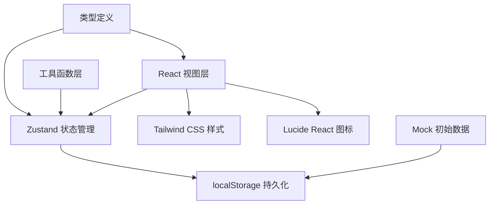
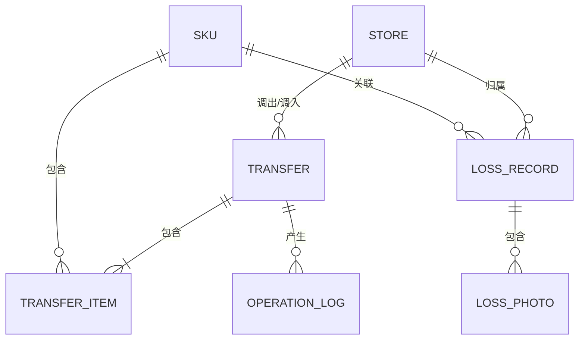

## 1. 架构设计

纯前端单页应用，数据通过 localStorage 持久化存储，无需后端服务。采用 React 组件化架构，Zustand 管理全局状态，Tailwind CSS 处理样式。



## 2. 技术说明

- **前端框架**：React@18 + TypeScript
- **构建工具**：Vite@5
- **样式方案**：Tailwind CSS@3
- **状态管理**：Zustand@4
- **路由**：React Router DOM@6
- **图标库**：lucide-react
- **数据持久化**：localStorage
- **导出格式**：CSV

## 3. 路由定义

| 路由 | 页面 | 说明 |
|------|------|------|
| / | 库存调拨主页 | 调拨记录列表 + 筛选 + 快速录入入口 |
| /transfer/new | 新建调拨单 | 完整调拨录入表单 |
| /transfer/:id | 调拨详情 | 单条调拨记录详情 + 交接单打印 |
| /loss | 损耗管理 | 损耗记录列表 + 拍照上传 |
| /report | 报表导出 | 余量与损耗报表 + 导出操作 |
| /review | 撤展复盘 | 损耗分类统计 + 经手人追溯 |

## 4. 数据模型

### 4.1 实体关系



### 4.2 类型定义

```typescript
// 门店
interface Store {
  id: string;
  name: string;
  code: string;
  address: string;
  manager: string;
}

// SKU
interface SKU {
  id: string;
  name: string;
  code: string;
  category: string;
  unit: string;
}

// 库存数量
interface InventoryQty {
  sample: number;      // 样品
  gift: number;        // 赠品
  trial: number;       // 试用装
  damaged: number;     // 残损
}

// 门店库存
interface StoreInventory {
  storeId: string;
  skuId: string;
  quantities: InventoryQty;
  lastUpdated: string;
  lastOperator: string;
}

// 调拨单
interface TransferOrder {
  id: string;
  orderNo: string;
  fromStoreId: string;
  toStoreId: string;
  status: 'draft' | 'pending' | 'completed' | 'cancelled';
  items: TransferItem[];
  operator: string;
  receiver: string;
  remark: string;
  createdAt: string;
  updatedAt: string;
  completedAt?: string;
}

// 调拨明细
interface TransferItem {
  id: string;
  skuId: string;
  quantities: InventoryQty;
  remark?: string;
}

// 损耗记录
interface LossRecord {
  id: string;
  storeId: string;
  skuId: string;
  quantity: number;
  type: 'unknown' | 'lost' | 'normal_trial';  // 待确认/丢失/正常试用
  photos: LossPhoto[];
  remark: string;
  reporter: string;
  reportedAt: string;
  reviewer?: string;
  reviewedAt?: string;
}

// 损耗照片
interface LossPhoto {
  id: string;
  url: string;   // base64 data URL
  name: string;
  uploadedAt: string;
}

// 操作日志
interface OperationLog {
  id: string;
  orderId?: string;
  lossId?: string;
  action: string;
  operator: string;
  timestamp: string;
  detail: string;
}
```

## 5. 状态管理设计

使用 Zustand 管理全局状态，通过中间件实现 localStorage 持久化。

```typescript
interface AppState {
  // 基础数据
  stores: Store[];
  skus: SKU[];
  inventories: StoreInventory[];
  
  // 调拨单
  transfers: TransferOrder[];
  currentDraft: TransferOrder | null;
  
  // 损耗记录
  lossRecords: LossRecord[];
  
  // 操作日志
  operationLogs: OperationLog[];
  
  // 当前用户
  currentUser: string;
  currentStoreId: string;
  
  // 筛选条件
  filters: {
    storeId: string;
    category: string;
    status: string;
    dateRange: [string, string] | null;
  };
  
  // 操作方法
  addTransfer: (order: TransferOrder) => void;
  updateTransfer: (id: string, data: Partial<TransferOrder>) => void;
  saveDraft: (order: TransferOrder) => void;
  clearDraft: () => void;
  
  addLossRecord: (record: LossRecord) => void;
  updateLossRecord: (id: string, data: Partial<LossRecord>) => void;
  
  validateTransfer: (order: TransferOrder) => ValidationError[];
  setFilters: (filters: Partial<AppState['filters']>) => void;
  
  exportReport: (type: 'balance' | 'loss') => string;
}
```

## 6. 校验规则

| 校验项 | 规则 | 提示级别 |
|--------|------|----------|
| 库存不足 | 调出数量 > 门店可用库存 | 错误 |
| 重复调拨 | 同一 SKU 同一批次 24h 内多次调出 | 警告 |
| 残损误入可售 | 残损品调入后标记为可售 | 错误 |
| 日期异常 | 撤展日期早于调拨日期 | 错误 |
| 数量为零 | 所有数量均为 0 | 警告 |
| 经手人缺失 | 未填写调出/调入经手人 | 错误 |

## 7. 项目结构

```
src/
├── components/          # 通用组件
│   ├── Layout/          # 布局组件
│   ├── TransferForm/    # 调拨表单
│   ├── TransferCard/    # 调拨卡片
│   ├── LossPhoto/       # 损耗照片
│   ├── FilterBar/       # 筛选栏
│   └── DataTable/       # 数据表格
├── pages/               # 页面组件
│   ├── TransferList.tsx
│   ├── TransferDetail.tsx
│   ├── LossManagement.tsx
│   ├── ReportExport.tsx
│   └── ReviewAnalysis.tsx
├── store/               # Zustand 状态
│   └── useAppStore.ts
├── types/               # TypeScript 类型
│   └── index.ts
├── utils/               # 工具函数
│   ├── validation.ts    # 校验逻辑
│   ├── export.ts        # 导出功能
│   ├── format.ts        # 格式化
│   └── mockData.ts      # 模拟数据
├── hooks/               # 自定义 Hooks
│   └── useDraft.ts
├── App.tsx
├── main.tsx
└── index.css
```
