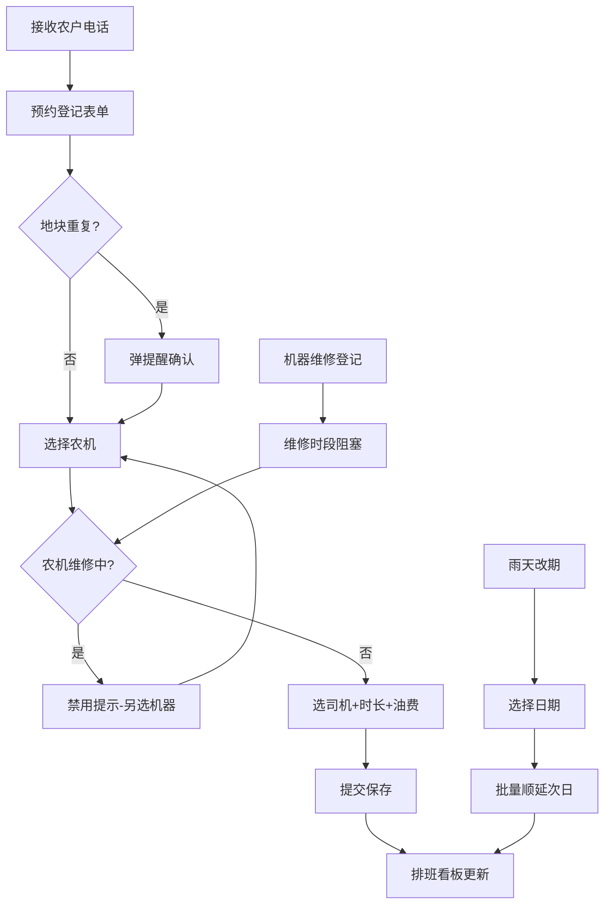

## 1. 产品概述
乡镇合作社春耕期间的农机资源调度与预约管理系统，解决拖拉机、插秧机等农机争抢、调度混乱、油费结算不清等问题。
- 面向合作社主任、调度员、财务、司机四类角色，统一管理农户预约、机器排班、维修阻塞、改期取消、费用结算全流程
- 核心价值：减少农机闲置与冲突、降低电话沟通成本、规范费用结算、雨天批量改期效率提升

## 2. 核心特性

### 2.1 用户角色
| 角色 | 登记方式 | 核心权限 |
|------|---------|---------|
| 合作社主任/调度员 | 系统使用人员 | 登记预约、改期取消、维修登记、查看排班、导出明日作业单、雨天批量改期 |
| 财务人员 | 系统使用人员 | 导出油费/工时汇总、查看已取消预约记录 |
| 司机 | 系统使用人员 | 查看当日作业地块顺序、农户联系人电话 |

### 2.2 功能模块
1. **预约登记页面**：农户信息、地块信息、作业类型、农机选择、司机选择、预计时长、油费预填
2. **排班看板页面**：按日期/农机/司机维度展示时间轴，状态颜色区分（正常/维修/完成/取消）
3. **维修管理**：机器维修登记与解除，维修期间自动阻塞预约
4. **改期与取消**：单个改期取消、司机改派（必填原因）、雨天批量改期
5. **数据导出**：明日作业单导出、油费工时与取消汇总导出、司机作业单导出
6. **司机视图**：按司机查看当日作业顺序与联系人

### 2.3 页面详情
| 页面名称 | 模块名称 | 功能描述 |
|---------|---------|--------|
| 预约登记 | 农户信息输入 | 姓名、电话、住址（下拉记忆） |
| 预约登记 | 地块信息输入 | 地块名称/编号、亩数、同一地块重复校验提醒 |
| 预约登记 | 作业类型选择 | 犁地/耙地/插秧/收割/其他 |
| 预约登记 | 农机选择 | 拖拉机/插秧机等，维修中机器禁用并标注 |
| 预约登记 | 司机选择 | 可选司机列表，与机器关联推荐 |
| 预约登记 | 时长与油费 | 预计作业时长（小时）、预计油费（元） |
| 排班看板 | 日期切换 | 按日期查看当日排班，回到今日按钮 |
| 排班看板 | 时间轴卡片 | 显示预约详情、操作按钮（改期/取消/完成/改派司机） |
| 排班看板 | 状态筛选 | 按状态筛选、按农机/司机筛选 |
| 维修管理 | 维修登记 | 机器+起止时间+备注，维修期间不可预约 |
| 维修管理 | 维修解除 | 提前结束维修需确认 |
| 改期取消 | 单个改期 | 修改日期/时段，填写原因 |
| 改期取消 | 单个取消 | 取消原因必填 |
| 改期取消 | 司机改派 | 原司机→新司机，改派原因必填 |
| 改期取消 | 雨天批量改期 | 选择日期一键全部顺延至次日，批量通知 |
| 数据导出 | 明日作业单 | 合作社主任导出：日期、农户、地块、作业、农机、司机、时长、联系人 |
| 数据导出 | 费用汇总 | 财务导出：时段内油费、工时、已取消预约明细 |
| 数据导出 | 司机作业单 | 按司机导出：出发顺序、地块、联系人电话 |

## 3. 核心流程

### 3.1 预约登记流程
合作社调度员接到农户电话 → 在预约登记页填入农户与地块信息 → 系统自动校验同一地块是否已有预约（有则弹提醒） → 选择农机（维修中的机器置灰不可选） → 选择司机与预计时长/油费 → 提交保存 → 排班看板实时刷新

### 3.2 雨天改期流程
遇雨通知 → 调度员点击"雨天批量改期" → 选择需改期的日期 → 确认将当日所有未完成预约顺延至次日 → 系统自动更新排班并保留改期记录 → 打印或导出司机新的作业顺序

### 3.3 维修阻塞流程
司机报修 → 登记机器维修（机器、开始时间、预计结束、备注）→ 该机器在维修时段内所有预约自动标红提醒 → 新建预约时该机器不可选 → 维修完成解除阻塞

## 4. 用户界面设计

### 4.1 设计风格
- **主色调**：农田绿（#2D6A4F）作为主色，麦穗金（#D4A373）作为辅助色，大地棕（#6C584C）作为文字强调色，体现农业合作社调性
- **按钮风格**：圆润方形（圆角8px），主按钮实色填充带微妙阴影，次按钮描边风格
- **字体**：标题使用思源宋体（有质感，与农业匹配），正文使用思源黑体清晰易读
- **布局风格**：顶部全局导航 + 左侧筛选面板 + 主内容卡片式布局，时间轴排班横向展开
- **图标风格**：emoji 农业相关图标（🚜🌾👨‍🌾📋💰）配合线条图标

### 4.2 页面设计概览
| 页面名称 | 模块名称 | UI元素 |
|---------|---------|--------|
| 预约登记 | 表单区 | 大卡片分栏布局，绿金配色，必填项红星标注，下拉选择带搜索 |
| 排班看板 | 时间轴 | 横向24小时时间轴，机器/司机分行，预约卡片色块叠加，悬浮展开详情 |
| 排班看板 | 卡片状态 | 正常（绿色）、维修中（红色条纹背景）、已完成（灰色划线）、已取消（删除线+灰） |
| 数据导出 | 按钮组 | 顶部浮动操作栏，三个导出按钮带图标，下拉选择导出日期范围 |

### 4.3 响应式
- 桌面端优先（合作社办公室场景），最小支持宽度1280px
- 排班看板横向可滚动，适配多机器多司机场景
- 司机视图适配手机查看，字体与按钮放大触控优化
