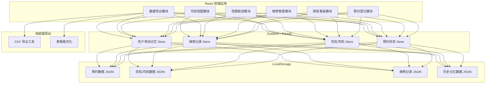
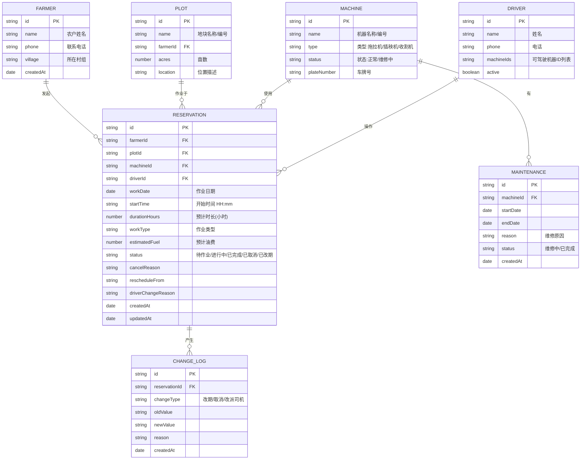

## 1. 架构设计



## 2. 技术选型说明
- **前端框架**：React@18 + TypeScript + Vite（构建快、TS 类型安全）
- **样式方案**：TailwindCSS@3（原子化CSS，快速构建UI）
- **状态管理**：Zustand + persist 中间件（轻量、简单，自动持久化到LocalStorage）
- **UI组件**：HeadlessUI（无样式组件，配合Tailwind自定义）+ Lucide React图标
- **日期处理**：date-fns（轻量日期库，处理排班/改期计算）
- **导出**：自定义CSV导出工具（纯前端，无后端依赖）
- **无后端**：全部数据保存在浏览器 LocalStorage，合作社内网单电脑使用场景，无需部署服务器

## 3. 路由定义
| 路由路径 | 页面用途 |
|---------|---------|
| / | 首页 - 今日排班看板概览 + 快捷操作入口 |
| /reservation | 预约登记页面 - 完整预约表单 |
| /schedule | 排班看板 - 时间轴全览 + 筛选 + 操作 |
| /maintenance | 维修管理 - 维修登记/解除列表 |
| /driver | 司机视图 - 按司机查看当日作业 |
| /export | 导出中心 - 三种导出功能入口 |

## 4. 数据模型

### 4.1 实体关系图



### 4.2 初始Mock数据（示例）

```typescript
// 农机示例
const initialMachines = [
  { id: 'm1', name: '东方红-001', type: '拖拉机', status: '正常', plateNumber: '豫A·12345' },
  { id: 'm2', name: '东方红-002', type: '拖拉机', status: '正常', plateNumber: '豫A·12346' },
  { id: 'm3', name: '久保田-001', type: '插秧机', status: '正常', plateNumber: '豫A·12347' },
  { id: 'm4', name: '久保田-002', type: '插秧机', status: '维修中', plateNumber: '豫A·12348' },
  { id: 'm5', name: '雷沃-001', type: '收割机', status: '正常', plateNumber: '豫A·12349' },
];

// 司机示例
const initialDrivers = [
  { id: 'd1', name: '张师傅', phone: '138****1001', machineIds: ['m1', 'm2'], active: true },
  { id: 'd2', name: '李师傅', phone: '138****1002', machineIds: ['m3', 'm4'], active: true },
  { id: 'd3', name: '王师傅', phone: '138****1003', machineIds: ['m1', 'm5'], active: true },
  { id: 'd4', name: '赵师傅', phone: '138****1004', machineIds: ['m2', 'm3'], active: true },
];

// 农户与地块示例
const initialFarmers = [
  { id: 'f1', name: '王大柱', phone: '139****2001', village: '东河村一组' },
  { id: 'f2', name: '刘二强', phone: '139****2002', village: '东河村二组' },
  { id: 'f3', name: '陈三贵', phone: '139****2003', village: '西坡村一组' },
];
```

## 5. 业务规则校验逻辑

### 5.1 同一地块重复预约检测
```typescript
function checkDuplicatePlot(plotId: string, workDate: string): Reservation[] {
  // 查找同一地块同一日期的所有有效预约（排除已取消）
  return reservations.filter(r => 
    r.plotId === plotId && 
    r.workDate === workDate && 
    r.status !== '已取消'
  );
}
```

### 5.2 机器维修中校验
```typescript
function isMachineUnderMaintenance(machineId: string, date: string): boolean {
  return maintenances.some(m => 
    m.machineId === machineId &&
    m.status === '维修中' &&
    date >= m.startDate && 
    date <= m.endDate
  );
}
```

### 5.3 司机时间冲突校验
```typescript
function checkDriverConflict(driverId: string, date: string, startTime: string, duration: number): Reservation | null {
  // 计算新预约的时间区间，检查司机是否有重叠预约
  return reservations.find(r => 
    r.driverId === driverId &&
    r.workDate === date &&
    r.status !== '已取消' &&
    hasTimeOverlap(r.startTime, r.durationHours, startTime, duration)
  );
}
```

## 6. 导出功能定义

### 6.1 明日作业单导出（合作社主任）
CSV列：序号 | 作业日期 | 农户姓名 | 联系电话 | 村组 | 地块名称 | 亩数 | 作业类型 | 农机编号 | 司机姓名 | 开始时间 | 预计时长 | 预计油费

### 6.2 油费工时与取消汇总导出（财务）
Sheet1-油费工时：日期 | 农机编号 | 司机 | 作业次数 | 总工时 | 总油费  
Sheet2-已取消预约：取消日期 | 原作业日期 | 农户 | 地块 | 取消原因 | 操作人

### 6.3 司机作业单导出
按司机分组，按开始时间排序：序号 | 作业日期 | 顺序 | 地块名称 | 位置描述 | 农户姓名 | 联系电话 | 作业类型 | 农机 | 预计时长
