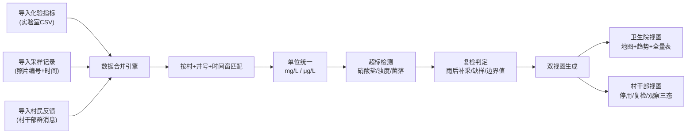

## 1. 产品概述

乡村井水化验图是面向乡镇卫生院和村干部的雨季水井水质监测管理系统，解决多源化验数据（实验室指标、采样记录、村民反馈）的合并分析与分级发布问题，通过超标自动标记和双视图发布，帮助卫生员高效管控水质风险、村干部清晰传达用水建议。

- **核心问题**：三源数据分散、单位不统一、超目标记不清、报告语言易引起村民恐慌
- **目标用户**：乡镇卫生员（数据导入、全面分析）、村干部（查看本村井况、转发建议）
- **产品价值**：一次合并、双端输出，消除数据割裂，降低沟通误解成本

## 2. 核心功能

### 2.1 用户角色

| 角色 | 入口方式 | 核心权限 |
|------|---------|---------|
| 乡镇卫生员 | 系统主入口 | 三源数据导入、井名映射配置、卫生院全量视图查看、复检建议编辑 |
| 村干部 | 报告视图链接 | 仅查看本村井的三态分类（停用/复检/观察）、查看可转发的通俗建议 |

### 2.2 功能模块

1. **数据导入页**：化验表上传、采样记录上传、村民反馈上传、井名俗称映射维护
2. **合并数据总览页（卫生院视图）**：村级地图分布、超标指标图例、按村/井筛选、时间轴、趋势图
3. **村级报告页（村干部视图）**：本村井的三态卡片列表、通俗复检建议、一键复制话术
4. **单井详情页**：该井全部历史记录、趋势曲线、照片编号展示、反馈时间线

### 2.3 页面详情

| 页面名称 | 模块名称 | 功能描述 |
|---------|---------|---------|
| 数据导入页 | 三源上传区 | CSV/Excel拖拽上传，实时预览解析行，高亮异常格式行 |
| 数据导入页 | 井名映射表 | 井号到俗称的绑定编辑，支持批量导入，未匹配井号红色提醒 |
| 数据导入页 | 合并进度区 | 合并匹配率统计，雨后补采/缺样/异味标记统计，一键执行合并 |
| 卫生院总览 | 村级分布图 | SVG示意地图，各村按风险等级上色，悬停显示本村超标数量 |
| 卫生院总览 | 超标统计图 | 硝酸盐/浊度/菌落三类超标饼图 + 近30天趋势折线 |
| 卫生院总览 | 井况数据表格 | 按村/时间排序，多条件筛选，直接跳转单井详情 |
| 卫生院总览 | 复检建议编辑器 | 预设模板，可按超标类型自定义建议文案，实时预览村干部端展示 |
| 村级报告页 | 三态分类卡片 | 需停用（红）、需复检（橙）、安全观察（绿）三大分区 |
| 村级报告页 | 建议话术区 | 每类附带通俗说明，一键复制，避免专业术语引起恐慌 |
| 单井详情页 | 指标趋势图 | 硝酸盐/浊度/菌落三项历史曲线，超标点标红 |
| 单井详情页 | 记录时间线 | 采样照片编号→化验结果→村民反馈串联展示 |

## 3. 核心流程

卫生员依次导入三份数据→系统按村+井号+时间窗口自动匹配合并→自动判定超标与复检需求→卫生员调整复检建议→生成双视图：卫生院查看地图趋势+村干部查看三态报告。

## 4. 用户界面设计

### 4.1 设计风格

- **主色**：深青蓝 #1E4E5F（信任、水质），辅助色 #4CAF82（安全）、#F4A259（复检）、#E8505B（停用）
- **布局**：顶部导航 + 左侧筛选面板 + 右侧主内容区（卫生院）；卡片式分区（村干部报告）
- **字体**：标题用思源宋体SC（稳重可信），正文用思源黑体（清晰易读）
- **图标**：线性图标，水井💧、烧杯🧪、地图🗺️、警告⚠️、安全✅ 与色板对应
- **整体调性**：政府公文质感的"稳重实用风"，卫生院端偏专业严谨，村干部端偏朴素清晰

### 4.2 页面设计概述

| 页面名称 | 模块名称 | UI 元素 |
|---------|---------|---------|
| 数据导入页 | 三源上传区 | 三张等高卡片，悬浮阴影上传区，解析后表格预览，异常行浅红背景 |
| 卫生院总览 | 村级分布图 | 圆角方形色块代表各村，颜色深浅代表风险等级，点击下钻本村 |
| 卫生院总览 | 三指标趋势图 | 双线混合图，柱状+折线，超标阈值虚线标红 |
| 村级报告页 | 三态卡片 | 红/橙/绿三色带，大号状态图标，下方列表只列井俗称+一句话建议 |
| 单井详情页 | 时间线 | 左竖线+节点圆点，按时间串起采样、化验、反馈，节点颜色代表风险 |

### 4.3 响应式

- Desktop-first（1440px基准），卫生院视图最小支持1280px
- 村干部报告页移动端优先优化，单列卡片布局，按钮加大适合微信内点击
- 表格支持横向滚动，趋势图自动响应容器宽度
