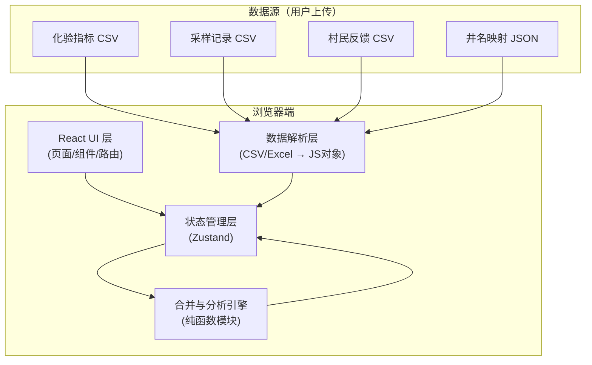
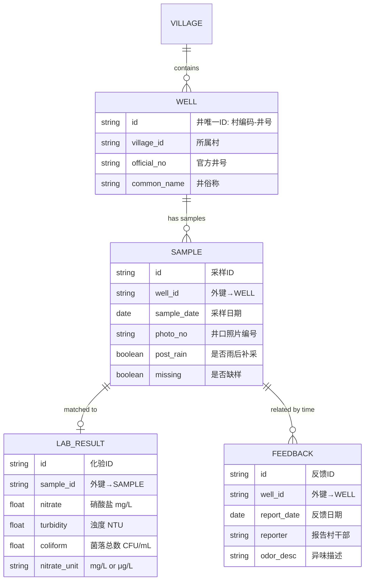

## 1. 架构设计

本系统为纯前端单页应用（SPA），数据在浏览器端完成合并、分析、渲染，无需后端服务，数据文件直接由 CSV/Excel 导入后处理。



## 2. 技术描述

- **前端框架**：React 18 + TypeScript
- **构建工具**：Vite 5
- **样式方案**：Tailwind CSS 3 + CSS 变量（主题色）
- **状态管理**：Zustand 4（轻量，无 Provider 嵌套）
- **路由**：React Router 6
- **图表库**：Recharts 2（React 原生，组合图灵活）
- **文件解析**：PapaParse（CSV）、SheetJS/xlsx（Excel 兼容）
- **数据导出**：浏览器原生 Blob 下载 + Clipboard API（一键复制话术）
- **图标**：Lucide React（线性图标库）
- **Mock 数据**：内置示例数据集，支持一键加载演示

## 3. 路由定义

| 路由 | 用途 |
|------|------|
| `/` | 数据导入页（默认首页，卫生员入口） |
| `/overview` | 卫生院总览：地图+趋势+全量数据表 |
| `/village/:villageId` | 村级报告页（村干部视图，三态卡片） |
| `/well/:wellId` | 单井详情页：历史趋势+时间线 |
| `/mapping` | 井名俗称映射管理页（可从导入页直达） |

## 4. 数据模型

### 4.1 实体关系



### 4.2 超标阈值（国标参考）

| 指标 | 单位 | 限值（超标阈值） | 复检触发 |
|------|------|-----------------|---------|
| 硝酸盐（以 N 计） | mg/L | ≤ 20 mg/L | ≥18 mg/L 边界值触发复检 |
| 浊度 | NTU | ≤ 3 NTU | ≥2.5 NTU 或雨后采样触发复检 |
| 菌落总数 | CFU/mL | ≤ 100 CFU/mL | ≥80 CFU/mL 或有异味反馈触发复检 |

### 4.3 单位转换规则

```
硝酸盐: μg/L → mg/L  ÷ 1000
例如：5000 μg/L = 5 mg/L
```

### 4.4 合并匹配规则

- **主键匹配**：村编码 + 井号 + 时间窗（±1天）
- **时间窗逻辑**：采样记录为锚点，化验结果 ±3天内匹配；村民反馈 ±7天内关联到最近一次采样
- **未匹配处理**：化验无采样记为"缺采样"，采样无化验记为"缺化验"并进入复检队列

## 5. 状态管理切片

```typescript
// Zustand store 核心结构
interface WellStore {
  villages: Village[];
  wells: Well[];
  samples: Sample[];
  labResults: LabResult[];
  feedbacks: Feedback[];
  mergedRecords: MergedRecord[]; // 合并后主表
  thresholds: ThresholdConfig;    // 可微调阈值
  adviceTemplates: AdviceTemplate[]; // 复检建议模板
  // actions
  importLab: (rows: any[]) => void;
  importSamples: (rows: any[]) => void;
  importFeedbacks: (rows: any[]) => void;
  runMerge: () => void;
  runAnalysis: () => void;
  updateAdvice: (wellId: string, text: string) => void;
}
```

## 6. 核心算法说明

### 6.1 合并引擎（合并步骤）

1. **Step 1 标准化**：将三源数据的村名/井号统一映射为内部 ID
2. **Step 2 索引建立**：为采样记录按 `well_id + 日期` 建哈希索引
3. **Step 3 化验挂靠**：遍历化验结果，找到最近 ±3 天的采样记录
4. **Step 4 反馈关联**：遍历反馈，按 well_id 匹配最近一次 ±7 天内采样
5. **Step 5 孤儿记录标记**：未匹配的单独列出，不丢弃

### 6.2 超标检测 + 风险分级（输出三态）

```typescript
type RiskLevel = 'STOP' | 'RETEST' | 'OBSERVE';

// 判定顺序（高优先级覆盖低）
STOP  条件：任一指标 ≥ 限值 × 1.2
     或：硝酸盐≥24 或 浊度≥3.6 或 菌落≥120
     或：有异味反馈 + 任意指标超过限值
     
RETEST 条件：任一指标 ≥ 限值 × 0.9 且未达 STOP
     或：雨后采样 + 浊度≥2
     或：有异味反馈 但指标正常
     或：缺样 / 缺化验
     
OBSERVE：其余全部
```

### 6.3 建议话术生成（防误会原则）

- 避免"有毒""污染""致癌"等情绪化词
- 统一使用"建议暂停饮用""建议煮沸后饮用""请等候复查结果"
- 村干部转发话术模板示例：
  > 【村用水提醒】经卫生院检测，[俗称井名]目前建议[暂停饮用/等候复查/可正常饮用]。有疑问请联系村卫生室。请勿转发非官方信息。
