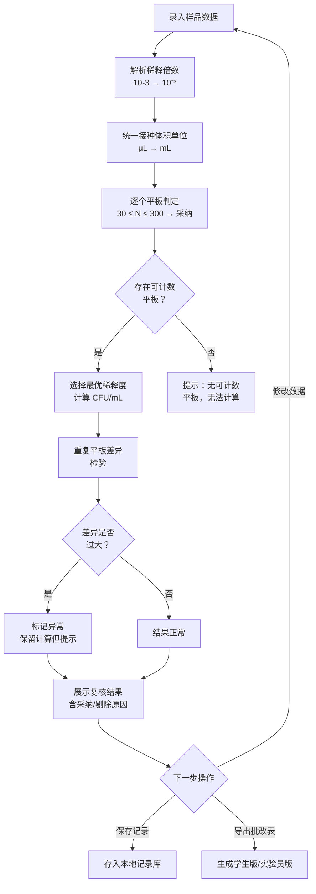

## 1. 产品概述

菌落稀释计数复核系统，面向微生物实验课教师和实验员，用于快速复核学生提交的平板计数表。系统自动解析稀释倍数、统一单位换算、按可计数区间（30–300 CFU）筛选平板、计算 CFU，并对 TNTC、空白污染、重复样差异过大等异常情况给出明确提示和剔除依据。

- 解决学生书写不规范（如"10-3"代表10⁻³）、单位混用（mL/μL）、计数区间判断主观等痛点
- 为教师提供学生能看懂的批改表，为实验员留一份可复算记录，教师追问成绩时有据可查

## 2. 核心功能

### 2.1 用户角色

| 角色 | 核心权限 |
|------|----------|
| 教师 | 录入/批量粘贴数据、查看复核结果、导出批改表 |
| 实验员 | 录入数据、查看/管理历史记录、查看剔除依据、导出复算记录 |

### 2.2 功能模块

1. **数据录入页**：录入样品信息、稀释倍数、接种体积、各平板菌落数；支持批量粘贴；自动解析不规范写法
2. **复核结果页**：展示 CFU 计算过程、平板采纳/剔除状态及原因、异常标记
3. **记录管理页**：历史记录列表、筛选/搜索、查看剔除依据详情、导出功能

### 2.3 页面详情

| 页面名称 | 模块名称 | 功能描述 |
|----------|----------|----------|
| 数据录入页 | 样品信息区 | 输入样品名称、实验日期、班级/组号 |
| 数据录入页 | 稀释倍数输入区 | 支持 10⁻³ / 10-3 / 0.001 等多种写法，自动解析为科学计数法 |
| 数据录入页 | 接种体积输入区 | 下拉选择 mL/μL，自动换算统一为 mL |
| 数据录入页 | 平板菌落数输入区 | 每个稀释度 2 个重复平板；支持输入数字、TNTC、空白/污染标记 |
| 数据录入页 | 批量粘贴区 | 支持从 Excel 粘贴表格数据 |
| 复核结果页 | CFU 计算结果区 | 展示最终 CFU/mL 及计算过程 |
| 复核结果页 | 平板判定区 | 每个平板标注"采纳✓"或"剔除✗"及具体原因 |
| 复核结果页 | 异常提示区 | TNTC、空白污染、重复差异过大的醒目提示 |
| 记录管理页 | 记录列表区 | 按日期/班级/样品筛选历史记录 |
| 记录管理页 | 记录详情区 | 查看完整计算过程和剔除依据 |
| 记录管理页 | 导出区 | 导出学生版批改表（简洁）和实验员版复算记录（详尽） |

## 3. 核心流程

用户在数据录入页输入样品信息、稀释倍数（支持多种写法自动解析）、接种体积（自动统一单位）和各平板菌落数后，点击"开始复核"。系统自动执行：①稀释倍数解析与标准化；②单位统一换算；③逐个平板判定（可计数区间30–300采纳，区间外剔除并标注原因）；④重复平板差异检验；⑤选择合适稀释度计算CFU；⑥汇总异常情况。复核结果页展示完整计算过程和判定依据。用户可将结果保存为记录，或导出批改表/复算记录。

## 4. 用户界面设计

### 4.1 设计风格

- **主色调**：深青绿 (#0D7377) 代表科学/实验室，搭配暖白底 (#FAFAF5) 和琥珀色强调 (#D97706)
- **辅助色**：采纳状态用青绿，剔除状态用朱红 (#DC2626)，异常警告用琥珀
- **按钮风格**：圆角 (8px)，主按钮实色填充，次按钮描边
- **字体**：标题使用 Noto Serif SC（学术感），正文使用 Noto Sans SC，数据/数字使用 JetBrains Mono
- **布局风格**：左侧导航栏 + 右侧主内容区，卡片式模块分隔
- **图标风格**：线性图标 (Lucide)，简洁专业

### 4.2 页面设计概览

| 页面名称 | 模块名称 | UI 元素 |
|----------|----------|----------|
| 数据录入页 | 样品信息区 | 卡片容器，输入框带标签和占位提示，日期选择器 |
| 数据录入页 | 稀释倍数输入区 | 文本输入框 + 实时预览解析结果（如"解析为 10⁻³ = 0.001"），支持上标显示 |
| 数据录入页 | 接种体积输入区 | 数字输入框 + 单位下拉（mL/μL），右侧实时换算提示 |
| 数据录入页 | 平板菌落数输入区 | 表格布局，每行一个稀释度，2列重复平板，单元格支持数字/TNTC/空白下拉标记 |
| 复核结果页 | CFU 结果区 | 大号数字显示 CFU/mL，下方展示计算公式代入过程 |
| 复核结果页 | 平板判定区 | 表格，每行标注✓/✗状态徽章和原因标签 |
| 复核结果页 | 异常提示区 | 黄色/红色警告卡片，图标+文字说明 |
| 记录管理页 | 记录列表区 | 表格行可点击展开详情，搜索栏+日期筛选器 |
| 记录管理页 | 导出区 | 两个导出按钮，学生版（绿色）和实验员版（青色） |

### 4.3 响应式设计

- 桌面优先设计，平板菌落数输入表格在窄屏下横向可滚动
- 关键操作按钮在移动端固定底部
- 记录详情在移动端使用抽屉式弹出

### 4.4 设计特色

- 稀释倍数输入时实时预览解析结果（如输入"10-3"下方立即显示"→ 10⁻³ = 1×10⁻³"），减少录入错误
- 复核结果页的平板判定使用颜色编码一目了然（绿色采纳、红色剔除、黄色警告）
- 计算过程可展开查看每一步代入，方便教师讲解和学生理解
