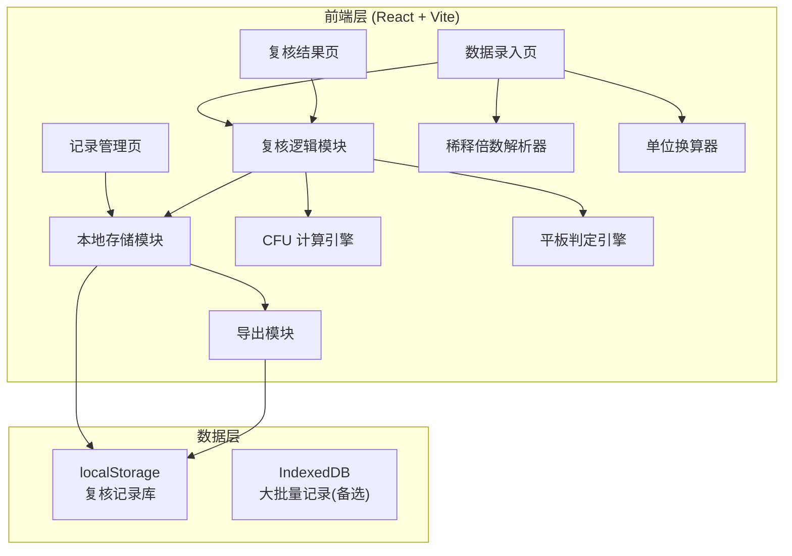
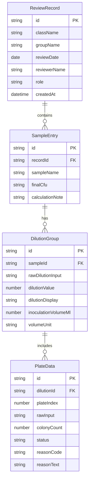

## 1. 架构设计



## 2. 技术说明

- **前端框架**：React@18 + TypeScript + Vite
- **样式方案**：Tailwind CSS@3
- **状态管理**：Zustand
- **路由**：React Router DOM v6
- **图标库**：Lucide React
- **导出功能**：前端生成 CSV（学生版批改表）和 JSON（实验员版完整记录）
- **数据持久化**：localStorage（无需后端，纯前端应用）
- **初始化工具**：vite-init，模板 react-ts

## 3. 路由定义

| 路由 | 用途 |
|------|------|
| `/` | 数据录入页，输入样品信息和菌落数据 |
| `/review` | 复核结果页，展示 CFU 计算和判定结果 |
| `/records` | 记录管理页，查看历史记录和导出 |

## 4. 核心算法设计

### 4.1 稀释倍数解析

支持的输入格式及解析规则：
- `10-3` / `10^-3` / `10e-3` → 解析为 10⁻³ = 0.001
- `10-6` / `10^-6` → 解析为 10⁻⁶ = 0.000001
- `0.001` → 直接作为稀释倍数
- `1e-3` → 科学计数法解析
- `10的-3次方` → 中文写法解析

### 4.2 CFU 计算规则

1. 优先选取菌落数在 30–300 之间的平板
2. 若同一稀释度有 2 个可计数平板，取平均值
3. 若有多个稀释度均有可计数平板，优先选择菌落数更接近 300 的稀释度（GB 4789.2 标准）
4. CFU/mL = (平均菌落数 × 稀释倍数倒数) / 接种体积(mL)
5. 重复平板差异检验：|N₁ - N₂| / ((N₁ + N₂)/2) > 0.5 时标记差异过大

### 4.3 平板判定逻辑

| 条件 | 判定 | 原因代码 |
|------|------|----------|
| 30 ≤ N ≤ 300 | 采纳 | — |
| N < 30 | 剔除 | BELOW_RANGE |
| N > 300 | 剔除 | ABOVE_RANGE |
| N = TNTC | 剔除 | TNTC |
| 空白污染 | 剔除 | BLANK_CONTAMINATED |
| 重复差异过大 | 采纳但标记 | DUPLICATE_VARIANCE |
| 平板无数据 | 跳过 | NO_DATA |

## 5. 数据模型

### 5.1 数据模型定义



### 5.2 TypeScript 类型定义

```typescript
interface ReviewRecord {
  id: string
  className: string
  groupName: string
  reviewDate: string
  reviewerName: string
  role: 'teacher' | 'technician'
  samples: SampleEntry[]
  createdAt: number
}

interface SampleEntry {
  id: string
  sampleName: string
  dilutions: DilutionGroup[]
  finalCfu: number | null
  calculationNote: string
}

interface DilutionGroup {
  id: string
  rawDilutionInput: string
  dilutionValue: number
  dilutionDisplay: string
  inoculationVolumeMl: number
  volumeUnit: 'mL' | 'μL'
  plates: PlateData[]
}

interface PlateData {
  id: string
  plateIndex: number
  rawInput: string
  colonyCount: number | null
  status: 'adopted' | 'rejected' | 'warning' | 'no_data'
  reasonCode: string
  reasonText: string
}
```
