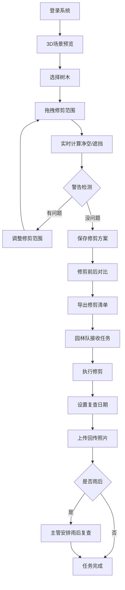

## 1. 产品概述

园区树木修剪预览系统，解决夏季树木生长遮挡路灯和指示牌的问题，在3D场景中可视化修剪效果，平衡功能需求与景观美观，避免园林队过度修剪引发业主投诉。

- 核心问题：树木遮挡路灯/指示牌与修剪美观度的矛盾；修剪缺乏科学规划和可视化预览
- 目标用户：物业管理人员、园林施工队、主管人员
- 市场价值：提升园区管理效率，减少业主投诉，降低安全隐患

## 2. 核心功能

### 2.1 用户角色

| 角色 | 注册方式 | 核心权限 |
|------|----------|----------|
| 物业管理员 | 系统账号登录 | 3D场景预览、修剪方案制定、保存对比、导出清单 |
| 园林施工队 | 系统账号登录 | 查看修剪清单、记录复查日期、上传回传照片 |
| 主管 | 系统账号登录 | 安排雨后复查、审核方案、查看进度 |

### 2.2 功能模块

1. **3D场景预览页**：园区3D模型展示、树木/道路/路灯/标识牌/座椅可视化、修剪范围拖拽
2. **修剪方案管理页**：修剪前后对比、方案保存、清单导出
3. **任务执行页**：园林队查看任务、记录复查日期、上传照片
4. **复查安排页**：雨后复查计划、任务分配、进度跟踪

### 2.3 页面详情

| 页面名称 | 模块名称 | 功能描述 |
|----------|----------|----------|
| 3D场景预览页 | 场景渲染 | 加载园区3D模型，展示树冠、道路、路灯、标识牌、座椅等元素 |
| 3D场景预览页 | 修剪交互 | 拖拽调整修剪范围，实时显示行人净空、照明遮挡、景观变化 |
| 3D场景预览页 | 警告提示 | 树冠高度估算不完整、修剪范围碰到电线、路灯盲区仍存在时弹出警告 |
| 修剪方案管理页 | 对比功能 | 左右分屏展示修剪前后效果对比 |
| 修剪方案管理页 | 清单导出 | 导出Excel/PDF清单，包含树木编号、修剪方位、复查照片要求 |
| 任务执行页 | 任务列表 | 园林队查看待修剪树木清单和要求 |
| 任务执行页 | 复查记录 | 为每棵树设置复查日期，修剪完成后上传回传照片 |
| 复查安排页 | 雨后计划 | 主管根据天气情况安排雨后复查任务 |

## 3. 核心流程

用户登录系统后进入3D场景预览页，选择目标树木并拖拽修剪范围，系统实时计算并显示行人净空、照明遮挡情况，同时检测潜在问题并给出警告。用户确认方案后保存，可查看修剪前后对比效果，导出修剪清单给园林队。园林队接收任务后，按清单执行修剪，设置每棵树的复查日期，完成后上传回传照片。主管可根据天气情况安排雨后复查，确保修剪效果符合要求。

## 4. 用户界面设计

### 4.1 设计风格

- **主色调**：深绿色(#1B4D3E)代表园林，辅以天蓝色(#3A86FF)代表科技感，警告色采用橙色(#FF9F1C)和红色(#E63946)
- **按钮风格**：圆角矩形按钮，带有微妙的阴影和悬停动效，主按钮采用渐变填充
- **字体**：标题使用"Noto Sans SC"粗体，正文使用"PingFang SC"常规字重，数字使用等宽字体
- **布局风格**：左侧3D场景区域占70%，右侧控制面板占30%，采用卡片式信息展示
- **图标风格**：线性图标搭配色彩点缀，使用树叶、路灯、剪刀等园林相关元素

### 4.2 页面设计概述

| 页面名称 | 模块名称 | UI元素 |
|----------|----------|--------|
| 3D场景预览页 | 顶部导航 | Logo、用户信息、角色切换、通知铃铛 |
| 3D场景预览页 | 3D画布 | 轨道控制器、场景缩放、视角切换按钮 |
| 3D场景预览页 | 右侧面板 | 树木信息卡、修剪参数滑块、警告提示区、操作按钮 |
| 3D场景预览页 | 底部状态栏 | 行人净空数值、照明覆盖率、景观评分 |
| 修剪方案管理页 | 对比区域 | 左右分屏，滑块可拖动对比修剪前后 |
| 修剪方案管理页 | 方案列表 | 历史方案卡片，包含缩略图和保存时间 |
| 修剪方案管理页 | 导出区域 | 格式选择按钮、导出预览、下载按钮 |
| 任务执行页 | 任务列表 | 树木卡片，显示编号、位置、修剪要求、状态标签 |
| 任务执行页 | 照片上传 | 拖拽上传区域、照片预览、删除按钮 |
| 复查安排页 | 日历视图 | 月度日历，标注复查日期、天气图标 |
| 复查安排页 | 任务分配 | 人员选择下拉框、任务优先级设置 |

### 4.3 响应性

- Desktop-first设计，主界面适配1920x1080及以上分辨率
- 平板设备自动调整右侧面板宽度为40%，按钮尺寸适当放大
- 移动端提供简化视图，优先展示任务列表和照片上传功能
- 3D场景支持触摸手势操作（双指缩放、单指旋转）

### 4.4 3D场景指引

- **环境与氛围**：采用白天日光HDRI环境，柔和的阴影，清晰的材质表现
- **光照设置**：方向光模拟太阳光，强度1.2，色温6500K；路灯使用点光源，夜间模式可切换
- **相机设置**：透视相机，初始位置高度15米，俯视角45度；支持环绕、平移、缩放操作
- **构图与焦点**：树木为视觉焦点，采用半透明高亮显示选中树木；修剪范围使用橙色半透明立方体标识
- **交互与动画**：拖拽修剪范围时实时更新树冠模型，带有平滑过渡动画；警告出现时元素闪烁提示
- **后期处理**：轻微的泛光效果增强路灯发光感，环境光遮蔽提升立体感
- **资产来源与性能**：使用程序化生成树冠模型，控制单场景树木数量≤50棵，帧率维持在60fps以上

### 4.5 数据展示

- **行人净空**：使用进度条可视化，绿色表示达标(≥2.5米)，黄色表示警告(2.0-2.5米)，红色表示不达标(<2.0米)
- **照明遮挡**：热力图显示地面照明强度，蓝色为强光区，红色为盲区
- **景观评分**：1-10分制，结合树冠形态、遮挡比例、与周边协调度综合计算
- **警告信息**：图标+文字形式，按严重程度排序展示
