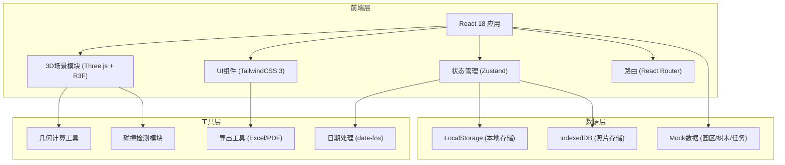
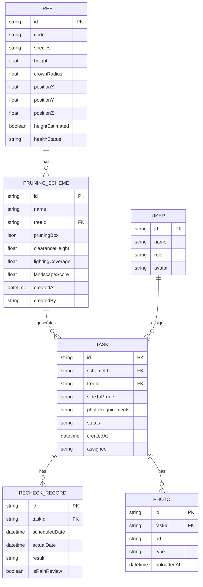

## 1. 架构设计



## 2. 技术描述

- **前端框架**: React@18.2.0 + TypeScript
- **构建工具**: Vite@5.0.0
- **样式方案**: TailwindCSS@3.4.0 + CSS Variables
- **3D引擎**: three@0.160.0 + @react-three/fiber@8.15.0 + @react-three/drei@9.92.0
- **状态管理**: zustand@4.4.0
- **路由**: react-router-dom@6.21.0
- **日期处理**: date-fns@3.0.0
- **导出功能**: xlsx@0.18.5 (Excel) + jspdf@2.5.1 (PDF)
- **图标**: lucide-react@0.309.0
- **后端**: 无，使用本地存储模拟数据持久化

## 3. 路由定义

| 路由 | 页面 | 权限要求 |
|------|------|----------|
| / | 登录页 | 公开 |
| /preview | 3D场景预览页 | 物业管理员/主管 |
| /schemes | 修剪方案管理页 | 物业管理员/主管 |
| /tasks | 任务执行页 | 园林施工队 |
| /review | 复查安排页 | 主管 |
| /profile | 个人设置 | 所有登录用户 |

## 4. 核心模块设计

### 4.1 3D场景模块

**目录结构**:
```
src/components/three/
├── Scene.tsx           # 主场景组件
├── Tree.tsx            # 树木组件（程序化生成）
├── Road.tsx            # 道路组件
├── StreetLamp.tsx      # 路灯组件
├── Sign.tsx            # 标识牌组件
├── Bench.tsx           # 座椅组件
├── PowerLine.tsx       # 电线组件
├── PruningBox.tsx      # 修剪范围框组件
├── LightHeatmap.tsx    # 照明热力图
└── ClearanceLine.tsx   # 净空线组件
```

**核心功能**:
- 程序化生成不同形态的树冠模型
- 修剪范围框的拖拽、缩放、旋转交互
- 实时碰撞检测（修剪框 vs 电线）
- 照明遮挡计算（光线投射）
- 行人净空检测（距离测量）

### 4.2 状态管理模块

**Store 定义**:
```typescript
// src/store/useAppStore.ts
interface AppState {
  // 用户状态
  user: User | null;
  role: 'admin' | 'gardener' | 'supervisor' | null;
  
  // 3D场景状态
  trees: Tree[];
  selectedTreeId: string | null;
  pruningBox: PruningBoxState;
  warnings: Warning[];
  
  // 方案管理
  schemes: PruningScheme[];
  currentScheme: PruningScheme | null;
  
  // 任务管理
  tasks: Task[];
  recheckDates: Record<string, Date>;
  
  // 操作方法
  selectTree: (id: string) => void;
  updatePruningBox: (box: Partial<PruningBoxState>) => void;
  saveScheme: () => void;
  addTask: (task: Task) => void;
  setRecheckDate: (treeId: string, date: Date) => void;
  uploadPhoto: (treeId: string, photo: Blob) => void;
  scheduleRainReview: (date: Date, treeIds: string[]) => void;
}
```

### 4.3 碰撞检测与警告系统

**警告类型定义**:
```typescript
interface Warning {
  id: string;
  type: 'height_incomplete' | 'power_line' | 'blind_spot';
  severity: 'warning' | 'error';
  message: string;
  treeId?: string;
  position?: [number, number, number];
}
```

**检测逻辑**:
1. **高度估算不完整**: 检查树木是否有完整的高度测量数据，若缺失则标记
2. **电线碰撞**: 使用OBB碰撞检测，判断修剪范围框与电线是否相交
3. **路灯盲区**: 光线投射算法，计算修剪后路灯照射范围内是否仍有遮挡

## 5. 数据模型

### 5.1 实体关系图



### 5.2 Mock数据定义

```typescript
// src/data/mockData.ts
export const mockTrees: Tree[] = [
  {
    id: 'tree-001',
    code: 'T-A-001',
    species: '樟树',
    height: 8.5,
    crownRadius: 3.2,
    positionX: 10,
    positionY: 0,
    positionZ: 5,
    heightEstimated: false,
    healthStatus: 'good'
  },
  // 更多树木数据...
];

export const mockStreetLamps = [
  { id: 'lamp-001', position: [5, 4, 8], intensity: 1.5, radius: 12 },
  // 更多路灯...
];

export const mockPowerLines = [
  { id: 'line-001', start: [0, 6, 0], end: [20, 6, 20], height: 6 },
  // 更多电线...
];
```

## 6. 性能优化策略

1. **3D渲染优化**:
   - 使用InstancedMesh渲染多棵树木
   - 树冠使用LOD(Level of Detail)技术
   - 碰撞检测使用空间分区加速
   - 计算密集型任务移至Web Worker

2. **状态更新优化**:
   - Zustand选择器避免不必要重渲染
   - 3D场景使用useFrame节流更新
   - 大列表使用虚拟滚动

3. **数据存储优化**:
   - 照片使用IndexedDB分块存储
   - 方案数据使用压缩存储
   - 定期清理过期缓存

## 7. 核心算法

### 7.1 照明遮挡计算

```typescript
// src/utils/lightingCalculator.ts
export function calculateLightingCoverage(
  trees: Tree[],
  lamps: StreetLamp[],
  pruningBoxes: Map<string, PruningBoxState>
): number {
  const raycaster = new THREE.Raycaster();
  let coveredPoints = 0;
  const totalPoints = 1000;
  
  for (let i = 0; i < totalPoints; i++) {
    const point = getRandomGroundPoint();
    let isLit = false;
    
    for (const lamp of lamps) {
      raycaster.set(lamp.position, point.clone().sub(lamp.position).normalize());
      const distance = lamp.position.distanceTo(point);
      
      const intersects = raycaster.intersectObjects(
        getTreeMeshes(trees, pruningBoxes)
      );
      
      if (intersects.length === 0 || intersects[0].distance > distance) {
        isLit = true;
        break;
      }
    }
    
    if (isLit) coveredPoints++;
  }
  
  return coveredPoints / totalPoints;
}
```

### 7.2 景观评分算法

```typescript
// src/utils/landscapeScorer.ts
export function calculateLandscapeScore(
  originalTree: Tree,
  prunedTree: Tree,
  surroundings: SurroundingElement[]
): number {
  // 树冠形态完整度 (40%)
  const shapeScore = calculateShapeScore(originalTree, prunedTree) * 0.4;
  
  // 遮挡比例 (30%)
  const obstructionScore = calculateObstructionScore(prunedTree, surroundings) * 0.3;
  
  // 与周边协调度 (30%)
  const harmonyScore = calculateHarmonyScore(prunedTree, surroundings) * 0.3;
  
  return Math.round((shapeScore + obstructionScore + harmonyScore) * 10) / 10;
}
```

## 8. 项目目录结构

```
/
├── .trae/documents/
│   ├── prd-园区树木修剪预览.md
│   └── tech-园区树木修剪预览.md
├── public/
│   └── favicon.ico
├── src/
│   ├── components/
│   │   ├── three/          # 3D组件
│   │   ├── ui/             # UI组件
│   │   ├── layout/         # 布局组件
│   │   └── features/       # 业务组件
│   ├── pages/              # 页面组件
│   ├── store/              # 状态管理
│   ├── utils/              # 工具函数
│   ├── data/               # Mock数据
│   ├── types/              # TypeScript类型
│   ├── hooks/              # 自定义Hooks
│   ├── App.tsx
│   ├── main.tsx
│   └── index.css
├── index.html
├── package.json
├── tsconfig.json
├── vite.config.ts
└── tailwind.config.js
```
