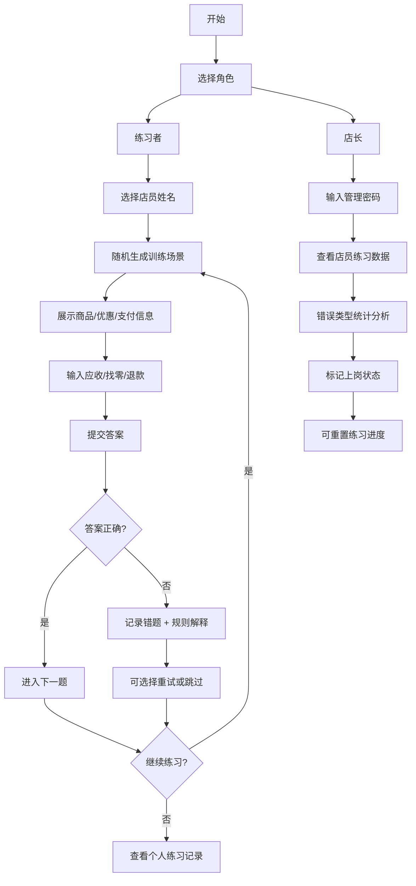

## 1. 产品概述

甜品店新店员收银培训游戏，通过随机生成各种收银场景（蛋糕、饮料、折扣券、会员积分、现金支付等），让新人在无风险环境下练习找零计算，掌握满减叠加、部分退单、顾客临时换商品、破损券处理等复杂规则。店长可查看练习记录，评估新人能力，安排上岗顺序。

- **核心价值**：零风险培训新员工，降低收银出错率，规范操作流程
- **目标用户**：甜品店新店员（练习者）、店长（管理者）
- **市场价值**：提升培训效率，减少因找零错误导致的顾客投诉和经济损失

## 2. 核心 Features

### 2.1 用户角色

| 角色 | 进入方式 | 核心权限 |
|------|----------|----------|
| 练习者（新店员） | 选择姓名进入 | 进行找零练习、查看个人错题、继续未完成场景 |
| 店长 | 店长模式入口 | 查看所有店员练习记录、按类别统计错误、标记上岗状态、重置练习进度 |

### 2.2 Feature 模块

1. **首页/角色选择**：角色切换（练习者/店长）、店员列表、练习进度概览
2. **训练场景页**：场景展示（商品、优惠券、支付方式）、金额输入、规则解释、答案反馈
3. **练习记录页**：个人错题分类、未通过场景列表、各类规则掌握程度
4. **店长管理页**：所有店员练习数据、错误类型统计、上岗状态标记、能力评估

### 2.3 页面详情

| 页面名称 | 模块名称 | 功能描述 |
|-----------|-------------|---------------------|
| 首页 | 角色选择区 | 练习者选择姓名开始练习，店长输入管理密码进入后台 |
| 首页 | 店员列表 | 显示所有店员头像、姓名、练习进度、上岗状态 |
| 首页 | 进度概览 | 展示整体练习完成率、各类规则掌握情况 |
| 训练场景页 | 场景卡片 | 展示商品列表（蛋糕/饮料）、单价、数量、小计金额 |
| 训练场景页 | 优惠信息区 | 显示折扣券类型（满减/折扣/赠品）、会员积分抵扣、叠加规则说明 |
| 训练场景页 | 支付信息区 | 显示支付方式（现金/电子）、顾客支付金额、是否有破损券 |
| 训练场景页 | 输入区 | 应收金额输入、找零金额输入、退款金额输入 |
| 训练场景页 | 反馈区 | 答案正确/错误提示、规则解释、错误原因分析 |
| 训练场景页 | 特殊场景标记 | 满减叠加、部分退单、临时换商品、破损券等场景高亮提示 |
| 练习记录页 | 错题分类 | 按规则类型（满减/积分/退单/换商品/破损券）分类展示错题 |
| 练习记录页 | 未通过列表 | 可点击继续练习之前做错的场景 |
| 练习记录页 | 掌握度图表 | 可视化展示各类规则的正确率 |
| 店长管理页 | 店员统计 | 每位店员的练习次数、正确率、错误类型分布 |
| 店长管理页 | 错误类型统计 | 全店最常出错的规则类型排名 |
| 店长管理页 | 上岗管理 | 标记店员状态（旁听/练习中/可上岗），添加备注 |
| 店长管理页 | 练习重置 | 可重置店员练习进度，重新开始训练 |

## 3. 核心流程

### 3.1 练习者流程
练习者选择姓名 → 系统随机生成训练场景 → 阅读场景信息（商品、优惠、支付）→ 输入应收/找零/退款金额 → 提交答案 → 系统判断并给出规则解释 → 正确则进入下一题，错误则记录错题并可重试 → 完成练习后查看个人记录

### 3.2 店长流程
店长输入密码进入管理页 → 查看店员列表及练习数据 → 点击店员查看详细记录 → 按错误类型统计分析 → 评估后标记上岗状态 → 可重置练习进度

### 3.3 场景生成流程
系统随机选择基础场景类型 → 随机生成商品组合（蛋糕/饮料）→ 随机添加优惠规则（可叠加）→ 随机选择支付方式 → 随机触发特殊事件（换商品/退单/破损券）→ 计算正确答案 → 展示给练习者

### 3.4 流程图

## 4. 界面设计

### 4.1 设计风格
- **主色调**：暖粉色系（#FF6B9D）+ 奶白色（#FFF5F7）+ 焦糖棕（#8B5A2B），营造甜品店温馨氛围
- **辅助色**：抹茶绿（#88C9A1）表示正确，蜜桃橙（#FFA07A）表示提示，玫瑰红（#E74C3C）表示错误
- **按钮风格**：圆角胶囊按钮，带有微阴影，hover 时有轻微上浮效果
- **字体**：使用圆润可爱的中文字体，标题加粗，正文易读
- **布局风格**：卡片式布局，每个场景一张卡片，温馨有层次感
- **图标**：使用甜品相关 emoji（🍰🥤🧁🍪）和 lucide 图标结合

### 4.2 页面设计概览

| 页面名称 | 模块名称 | UI 元素 |
|-----------|-------------|-------------|
| 首页 | 店员列表 | 圆形头像卡片、姓名标签、进度条、状态徽章（旁听/练习中/可上岗）、奶油色渐变背景 |
| 首页 | 角色切换 | 顶部切换标签，练习模式粉色，店长模式棕色 |
| 训练场景页 | 商品卡片 | 商品图片占位、名称、单价、数量、小计，购物车样式列表 |
| 训练场景页 | 优惠信息 | 优惠券样式标签，满减券橙色，折扣券绿色，积分抵扣蓝色 |
| 训练场景页 | 支付信息 | 钱包图标，现金支付显示纸币样式，金额大号数字 |
| 训练场景页 | 输入区域 | 大输入框，带有货币符号前缀，数字键盘友好 |
| 训练场景页 | 反馈弹窗 | 正确时绿色庆祝动画，错误时红色提示 + 规则解释卡片 |
| 训练场景页 | 特殊场景 | 角标提示，如"换商品！"、"部分退单"、"破损券" |
| 练习记录页 | 错题分类 | 标签页切换，每个分类下错题卡片列表 |
| 练习记录页 | 掌握度图表 | 环形进度图，不同颜色表示不同规则类型 |
| 店长管理页 | 统计面板 | 数据卡片展示关键指标，表格列出详细数据 |
| 店长管理页 | 上岗管理 | 下拉选择状态，备注输入框，保存按钮 |

### 4.3 响应式设计
- **桌面端优先**：主内容区最大宽度 960px，居中显示
- **平板适配**：两列布局调整为单列，卡片尺寸自适应
- **移动端**：单列布局，加大输入框和按钮，优化触摸体验
- **触摸优化**：所有可点击元素最小高度 44px，间距充足

### 4.4 动画与交互
- 页面加载：卡片依次淡入，错开 100ms
- 答案提交：输入框缩放动画，反馈信息滑入
- 正确答案：绿色对勾旋转出现，轻微庆祝粒子效果
- 错误答案：红色叉叉抖动，规则解释卡片展开
- 按钮 hover：上浮 2px，阴影加深
- 场景切换：前一个场景向左滑出，新场景从右滑入

## 5. 训练场景类型

### 5.1 基础场景（40%）
- 单商品现金支付，无优惠
- 多商品组合，简单满减
- 电子支付，无需找零

### 5.2 优惠叠加场景（20%）
- 满减券 + 会员折扣叠加
- 多张满减券叠加使用
- 会员积分抵扣 + 优惠券

### 5.3 特殊场景（30%）
- 顾客临时换商品（重新计算）
- 部分商品退单（计算退款金额）
- 收取破损券（说明券面规则）
- 整单退单 + 部分已使用优惠

### 5.4 复杂场景（10%）
- 多人拼单，分别结算
- 大量现金支付，复杂找零
- 优惠期限临近，规则特殊说明
