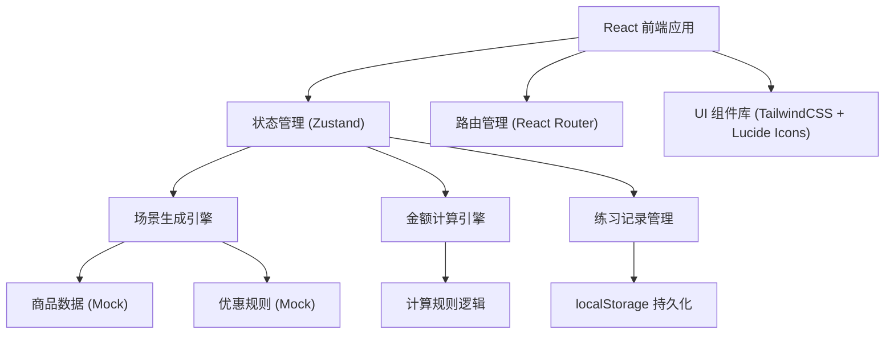

## 1. 架构设计

本项目为纯前端单页应用，无需后端服务，所有数据通过浏览器 localStorage 持久化存储。



## 2. 技术选型

### 2.1 核心技术栈
- **前端框架**：React@18 + TypeScript@5
- **构建工具**：Vite@5
- **样式方案**：TailwindCSS@3
- **状态管理**：Zustand@4
- **路由管理**：React Router DOM@6
- **图标库**：Lucide React@latest

### 2.2 初始化方式
使用 vite-init 脚手架初始化 React + TypeScript 项目
```bash
npm init vite-init@latest -y . -- --template react-ts --force
```

### 2.3 后端方案
- **无需后端**：纯前端应用
- **数据持久化**：浏览器 localStorage
- **Mock 数据**：内置商品、优惠券、店员等基础数据

## 3. 路由定义

| 路由路径 | 页面名称 | 功能说明 |
|----------|---------|----------|
| `/` | 首页 | 角色选择、店员列表、练习概览 |
| `/practice/:staffId` | 训练场景页 | 随机场景生成、金额输入、答案反馈 |
| `/records/:staffId` | 练习记录页 | 个人错题、未通过场景、掌握度统计 |
| `/manager` | 店长登录页 | 店长密码验证 |
| `/manager/dashboard` | 店长管理页 | 店员统计、错误分析、上岗管理 |

## 4. 数据模型

### 4.1 核心数据类型定义

```typescript
// 商品类型
interface Product {
  id: string;
  name: string;
  price: number;
  category: 'cake' | 'drink' | 'dessert';
  emoji: string;
}

// 购物车商品项
interface CartItem {
  product: Product;
  quantity: number;
  subtotal: number;
}

// 优惠券类型
interface Coupon {
  id: string;
  type: 'full_reduction' | 'discount' | 'points';
  name: string;
  description: string;
  condition?: number;  // 满减条件金额
  discountValue?: number;  // 满减金额 或 折扣率(0-1)
  isStackable: boolean;  // 是否可叠加
  isDamaged?: boolean;  // 是否破损券
  damageNote?: string;  // 破损说明
}

// 支付方式
type PaymentMethod = 'cash' | 'electronic';

// 支付信息
interface Payment {
  method: PaymentMethod;
  amountPaid: number;  // 顾客支付金额
}

// 场景特殊事件
type SpecialEventType = 'none' | 'exchange' | 'partial_refund' | 'damaged_coupon' | 'group_order';

interface SpecialEvent {
  type: SpecialEventType;
  description: string;
  ruleExplanation: string;
  exchangeItems?: { from: CartItem; to: CartItem }[];
  refundItems?: CartItem[];
}

// 训练场景
interface Scenario {
  id: string;
  type: 'basic' | 'stacking' | 'special' | 'complex';
  cartItems: CartItem[];
  coupons: Coupon[];
  memberPoints: number;  // 可用积分
  pointsRate: number;  // 积分抵扣率（100积分=1元）
  payment: Payment;
  specialEvent: SpecialEvent;
  originalTotal: number;  // 原始总价
  discountTotal: number;  // 优惠后金额
  pointsDeduction: number;  // 积分抵扣金额
  finalTotal: number;  // 最终应收
  changeAmount: number;  // 找零金额
  refundAmount: number;  // 退款金额（退单场景）
  requiredInputs: ('finalTotal' | 'changeAmount' | 'refundAmount')[];
}

// 答题记录
interface AnswerRecord {
  scenarioId: string;
  scenario: Scenario;
  userInputs: {
    finalTotal?: number;
    changeAmount?: number;
    refundAmount?: number;
  };
  isCorrect: boolean;
  wrongFields: string[];
  attemptedAt: string;
  attempts: number;
}

// 店员信息
interface Staff {
  id: string;
  name: string;
  avatar: string;
  status: 'observing' | 'practicing' | 'ready';
  statusNote?: string;
  createdAt: string;
}

// 店员练习统计
interface StaffStats {
  staffId: string;
  totalPractice: number;
  correctCount: number;
  wrongCount: number;
  accuracy: number;
  errorByType: Record<string, number>;
  unpassedScenarios: string[];  // 未通过场景ID列表
  lastPracticeAt: string;
}

// 应用全局状态
interface AppState {
  currentStaff: Staff | null;
  isManagerMode: boolean;
  staffList: Staff[];
  currentScenario: Scenario | null;
  answerRecords: Record<string, AnswerRecord[]>;  // staffId -> records
  staffStats: Record<string, StaffStats>;  // staffId -> stats
}
```

### 4.2 数据持久化结构

localStorage 存储键名：
- `dessert_train_staff_list`：店员列表
- `dessert_train_records_{staffId}`：店员答题记录
- `dessert_train_stats_{staffId}`：店员统计数据
- `dessert_train_manager_password`：店长密码（默认: admin123）

## 5. 核心模块设计

### 5.1 场景生成引擎 (ScenarioGenerator)

```typescript
class ScenarioGenerator {
  // 按概率分布选择场景类型
  static selectScenarioType(): Scenario['type'];
  
  // 生成随机商品组合
  static generateCartItems(): CartItem[];
  
  // 生成随机优惠券组合
  static generateCoupons(type: Scenario['type']): Coupon[];
  
  // 生成随机特殊事件
  static generateSpecialEvent(type: Scenario['type']): SpecialEvent;
  
  // 生成支付信息
  static generatePayment(finalTotal: number): Payment;
  
  // 完整生成一个场景
  static generate(): Scenario;
  
  // 从错题记录重现场景
  static replay(scenarioId: string): Scenario | null;
}
```

### 5.2 金额计算引擎 (AmountCalculator)

```typescript
class AmountCalculator {
  // 计算购物车原始总价
  static calculateOriginalTotal(cartItems: CartItem[]): number;
  
  // 应用优惠券（支持叠加）
  static applyCoupons(
    total: number,
    coupons: Coupon[],
    ruleExplanations: string[]
  ): { discountedTotal: number; explanations: string[] };
  
  // 计算积分抵扣
  static calculatePointsDeduction(
    total: number,
    memberPoints: number,
    pointsRate: number
  ): { deduction: number; remainingPoints: number; explanation: string };
  
  // 计算最终应收
  static calculateFinalTotal(scenario: Scenario): number;
  
  // 计算找零
  static calculateChange(finalTotal: number, amountPaid: number): number;
  
  // 计算退款金额
  static calculateRefund(
    originalItems: CartItem[],
    refundItems: CartItem[],
    appliedCoupons: Coupon[]
  ): { refundAmount: number; explanation: string };
  
  // 处理商品交换
  static handleExchange(
    cartItems: CartItem[],
    exchangeItems: { from: CartItem; to: CartItem }[]
  ): { newCartItems: CartItem[]; explanation: string };
}
```

### 5.3 规则解释器 (RuleExplainer)

```typescript
class RuleExplainer {
  // 满减规则解释
  static explainFullReduction(coupon: Coupon, actualSaving: number): string;
  
  // 折扣规则解释
  static explainDiscount(coupon: Coupon, actualSaving: number): string;
  
  // 积分抵扣解释
  static explainPointsDeduction(points: number, deduction: number): string;
  
  // 叠加规则解释
  static explainStacking(coupons: Coupon[]): string;
  
  // 破损券规则解释
  static explainDamagedCoupon(coupon: Coupon): string;
  
  // 换商品规则解释
  static explainExchange(exchangeItems: any[]): string;
  
  // 部分退单规则解释
  static explainPartialRefund(refundItems: CartItem[], refundAmount: number): string;
  
  // 拼单规则解释
  static explainGroupOrder(): string;
}
```

## 6. 状态管理 (Zustand Store)

```typescript
// useAppStore
interface AppStore {
  // 状态
  staffList: Staff[];
  currentStaff: Staff | null;
  currentScenario: Scenario | null;
  isManagerMode: boolean;
  answerRecords: Record<string, AnswerRecord[]>;
  staffStats: Record<string, StaffStats>;
  
  // 店员管理
  loadStaffList(): void;
  selectStaff(staffId: string): void;
  addStaff(name: string): void;
  updateStaffStatus(staffId: string, status: Staff['status'], note?: string): void;
  resetStaffProgress(staffId: string): void;
  
  // 场景管理
  generateNewScenario(): void;
  replayScenario(scenarioId: string): void;
  
  // 答题逻辑
  submitAnswer(
    inputs: { finalTotal?: number; changeAmount?: number; refundAmount?: number }
  ): { isCorrect: boolean; wrongFields: string[]; explanations: string[] };
  
  // 记录管理
  loadRecords(staffId: string): void;
  getUnpassedScenarios(staffId: string): AnswerRecord[];
  getStatsByStaff(staffId: string): StaffStats;
  getAllStats(): StaffStats[];
  
  // 店长模式
  enterManagerMode(password: string): boolean;
  exitManagerMode(): void;
}
```

## 7. 页面组件结构

```
src/
├── pages/
│   ├── Home.tsx              # 首页 - 角色选择、店员列表
│   ├── Practice.tsx          # 训练场景页
│   ├── Records.tsx           # 练习记录页
│   ├── ManagerLogin.tsx      # 店长登录页
│   └── ManagerDashboard.tsx  # 店长管理页
├── components/
│   ├── layout/
│   │   ├── Header.tsx
│   │   └── Layout.tsx
│   ├── staff/
│   │   ├── StaffCard.tsx
│   │   └── StaffSelector.tsx
│   ├── scenario/
│   │   ├── ScenarioCard.tsx
│   │   ├── CartList.tsx
│   │   ├── CouponList.tsx
│   │   ├── PaymentInfo.tsx
│   │   ├── SpecialEventBadge.tsx
│   │   ├── AmountInput.tsx
│   │   └── FeedbackModal.tsx
│   ├── records/
│   │   ├── ErrorCategoryTabs.tsx
│   │   ├── WrongRecordCard.tsx
│   │   └── MasteryChart.tsx
│   └── manager/
│       ├── StatsOverview.tsx
│       ├── StaffStatsTable.tsx
│       ├── ErrorTypeChart.tsx
│       └── StatusManager.tsx
├── hooks/
│   ├── useScenarioGenerator.ts
│   ├── useAmountCalculator.ts
│   └── useLocalStorage.ts
├── store/
│   └── useAppStore.ts
├── utils/
│   ├── scenarioGenerator.ts
│   ├── amountCalculator.ts
│   ├── ruleExplainer.ts
│   ├── formatters.ts
│   └── constants.ts
├── data/
│   ├── products.ts      # 商品 mock 数据
│   ├── coupons.ts       # 优惠券模板
│   └── staff.ts         # 初始店员数据
├── types/
│   └── index.ts         # 全局类型定义
└── router/
    └── AppRouter.tsx
```

## 8. Mock 数据示例

### 8.1 商品数据
```typescript
export const PRODUCTS: Product[] = [
  { id: 'p1', name: '草莓奶油蛋糕', price: 38, category: 'cake', emoji: '🍰' },
  { id: 'p2', name: '巧克力慕斯', price: 42, category: 'cake', emoji: '🍫' },
  { id: 'p3', name: '抹茶千层', price: 35, category: 'cake', emoji: '🍵' },
  { id: 'p4', name: '珍珠奶茶', price: 18, category: 'drink', emoji: '🧋' },
  { id: 'p5', name: '美式咖啡', price: 22, category: 'drink', emoji: '☕' },
  { id: 'p6', name: '芒果班戟', price: 16, category: 'dessert', emoji: '🥭' },
  // ... 更多商品
];
```

### 8.2 优惠券模板
```typescript
export const COUPON_TEMPLATES: Omit<Coupon, 'id'>[] = [
  { type: 'full_reduction', name: '满50减10', description: '满50元减10元', condition: 50, discountValue: 10, isStackable: true },
  { type: 'full_reduction', name: '满100减25', description: '满100元减25元', condition: 100, discountValue: 25, isStackable: false },
  { type: 'discount', name: '会员9折', description: '全场9折优惠', discountValue: 0.9, isStackable: true },
  { type: 'discount', name: '生日特惠8折', description: '生日当月8折', discountValue: 0.8, isStackable: false },
  { type: 'points', name: '积分抵扣', description: '100积分抵扣1元', isStackable: true },
];
```

### 8.3 初始店员数据
```typescript
export const INITIAL_STAFF: Staff[] = [
  { id: 's1', name: '小明', avatar: '👦', status: 'practicing', createdAt: '2024-01-15' },
  { id: 's2', name: '小红', avatar: '👧', status: 'observing', createdAt: '2024-01-20' },
  { id: 's3', name: '小李', avatar: '🧑', status: 'ready', createdAt: '2023-12-01', statusNote: '已通过考核' },
];
```

## 9. 计算规则说明

### 9.1 满减叠加规则
- 可叠加券：按金额从大到小依次应用
- 不可叠加券：只应用最优的一张
- 满减后金额可继续参与折扣计算

### 9.2 计算顺序
1. 计算商品原始总价
2. 应用不可叠加优惠券（取最优）
3. 应用可叠加满减券（从高到低）
4. 应用可叠加折扣券
5. 应用会员积分抵扣
6. 四舍五入到分（保留2位小数）

### 9.3 部分退单规则
- 按商品原价比例分摊已享受的优惠
- 退款金额 = 退商品原价 - 分摊的优惠金额
- 已使用的优惠券不退还

### 9.4 破损券规则
- 破损券按券面标注的特殊规则处理
- 通常只能按面额的一定比例使用
- 需向顾客说明破损券的使用限制
