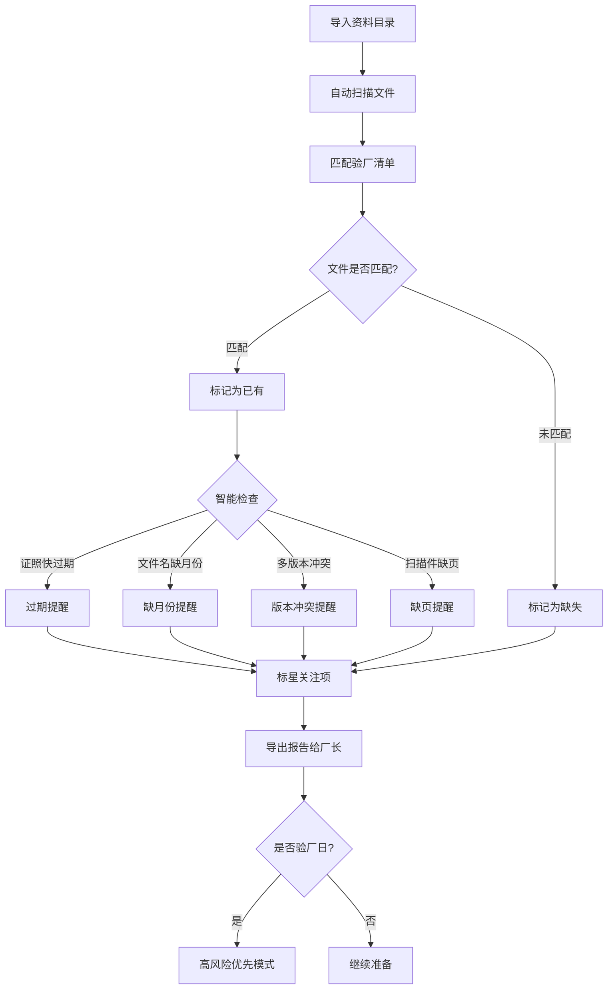

## 1. 产品概述

验厂文件夹助手是面向外贸工厂行政人员的桌面端工具，用于在客户验厂前快速梳理资料文件夹的完整性。导入本地资料目录后，系统按验厂清单逐项比对，标记已有、缺失、过期和需更新的文件，并在证照快过期、文件名缺月份、同一资料多版本、扫描件缺页时发出提醒。所有数据本地保存，不上传外网，支持导出准备进度报告和当天需补材料清单给厂长。

- **核心问题**：验厂资料文件夹新旧版本混杂，人工翻找耗时且易遗漏
- **目标用户**：外贸工厂行政人员、品控人员、厂长
- **产品价值**：将验厂准备时间从数天缩短至数小时，降低因资料不齐导致验厂失败的风险

## 2. 核心功能

### 2.1 用户角色

| 角色 | 使用方式 | 核心权限 |
|------|----------|----------|
| 行政人员 | 直接使用 | 导入目录、管理清单、标星关注项、导出报告 |
| 厂长 | 查看报告 | 查看准备进度、接收补材料清单 |

### 2.2 功能模块

1. **仪表盘页面**：准备进度总览、高风险提醒卡片、验厂日倒计时、快捷操作入口
2. **清单比对页面**：验厂清单逐项显示文件状态（已有/缺失/过期/需更新）、星标关注项、智能提醒
3. **文件管理页面**：导入资料目录、查看文件详情、标记缺页/版本问题、手动关联清单项
4. **导出报告页面**：准备进度报告、当天需补材料清单、客户特别关注项汇总

### 2.3 页面详情

| 页面名称 | 模块名称 | 功能描述 |
|----------|----------|----------|
| 仪表盘 | 进度环形图 | 显示总体准备完成率，按类别分色 |
| 仪表盘 | 高风险提醒 | 证照过期、缺页、缺月份等预警卡片，按紧急度排序 |
| 仪表盘 | 验厂倒计时 | 距验厂天数，倒计时到期自动切换验厂日模式 |
| 仪表盘 | 今日待办 | 当天需要补齐的材料清单快捷入口 |
| 清单比对 | 清单列表 | 按验厂分类（证照类、培训类、消防类、人事类、整改类）分组显示 |
| 清单比对 | 状态标签 | 每项显示：✅已有 / ❌缺失 / ⚠️过期 / 🔄需更新 |
| 清单比对 | 星标标记 | 客户特别关注项可标星，星标项置顶显示 |
| 清单比对 | 智能提醒 | 展开项显示：证照快过期提醒、缺月份提醒、多版本冲突、缺页警告 |
| 文件管理 | 目录导入 | 选择本地文件夹，自动扫描文件名和修改时间 |
| 文件管理 | 文件列表 | 按清单分类展示已扫描文件，显示版本和日期 |
| 文件管理 | 问题标记 | 手动标记缺页、版本冲突等问题 |
| 导出报告 | 进度报告 | 生成准备进度概览，含完成率、风险项统计 |
| 导出报告 | 补材料清单 | 列出当天需要补齐的材料及优先级 |
| 导出报告 | 关注项汇总 | 客户特别关注项的当前状态汇总 |

## 3. 核心流程

**主流程**：行政导入资料目录 → 系统自动匹配验厂清单 → 标记文件状态 → 智能提醒异常 → 标星关注项 → 导出报告给厂长 → 验厂日切换高风险优先模式

## 4. 用户界面设计

### 4.1 设计风格

- **设计方向**：工业实用主义（Industrial Utilitarian）— 专为工厂行政场景设计，注重信息密度和操作效率
- **主色**：深炭灰 (#1C1C1E) 背景，搭配暖琥珀色 (#F59E0B) 作为强调色，象征工厂车间的安全警示
- **辅色**：石板灰 (#3F3F46) 用于卡片和面板，雾白 (#FAFAFA) 用于文字
- **状态色**：翠绿 (#10B981) 已有、珊瑚红 (#EF4444) 缺失、琥珀 (#F59E0B) 过期、天蓝 (#3B82F6) 需更新
- **按钮风格**：圆角微凸，深色按钮带细微投影，操作按钮带图标
- **字体**：思源黑体（Noto Sans SC）作为中文主字体，JetBrains Mono 用于数据和编号
- **布局风格**：左侧固定导航栏 + 主内容区，顶部状态条，卡片式内容布局
- **图标风格**：Lucide 线性图标，与整体工业简约风格统一

### 4.2 页面设计概览

| 页面名称 | 模块名称 | UI要素 |
|----------|----------|--------|
| 仪表盘 | 进度环形图 | SVG环形进度条，中心显示百分比，按类别分色段 |
| 仪表盘 | 高风险提醒 | 紧急度从高到低的警告卡片，左侧色条标识类别 |
| 仪表盘 | 验厂倒计时 | 大号数字倒计时，临近7天变红闪烁 |
| 清单比对 | 清单列表 | 树形分组列表，每行含状态标签+文件名+日期+星标 |
| 清单比对 | 智能提醒 | 展开行内嵌提醒标签，带图标和简短说明 |
| 文件管理 | 目录导入 | 虚线拖拽区域 + 文件夹选择按钮 |
| 导出报告 | 报告预览 | A4纸张样式预览，右上角导出按钮 |

### 4.3 响应式设计

- 桌面优先（1280px+），适配1024px最小宽度
- 不做移动端适配（工厂行政场景以桌面为主）
- 左侧导航栏可折叠以适配较小屏幕

### 4.4 3D场景

不适用
