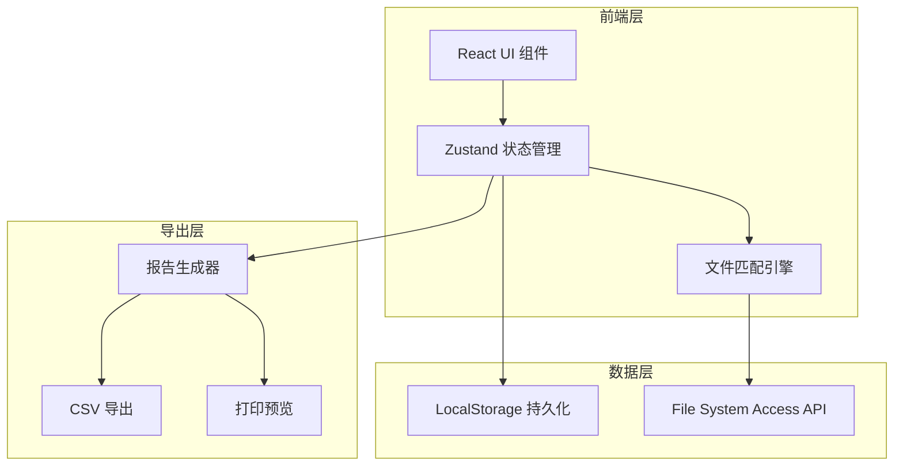
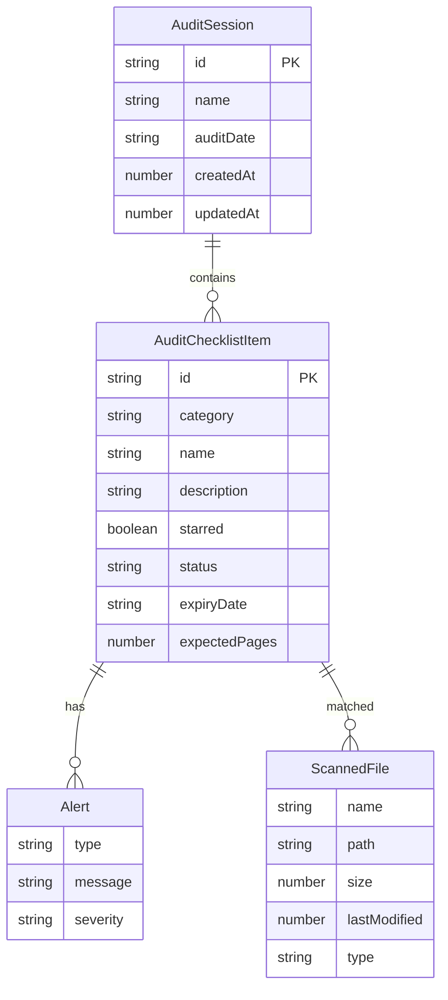

## 1. 架构设计



## 2. 技术说明

- **前端框架**：React@18 + TypeScript + Vite
- **样式方案**：Tailwind CSS@3
- **状态管理**：Zustand（含 persist 中间件实现本地持久化）
- **路由**：react-router-dom@6
- **文件系统**：File System Access API（浏览器原生，无需后端）
- **导出**：纯前端生成 CSV 和打印友好页面
- **后端**：无（纯前端应用，所有数据本地保存）
- **数据库**：无（使用 LocalStorage + Zustand persist）

## 3. 路由定义

| 路由 | 用途 |
|------|------|
| / | 仪表盘：进度总览、高风险提醒、倒计时 |
| /checklist | 清单比对：验厂清单逐项状态、智能提醒 |
| /files | 文件管理：目录导入、文件列表、问题标记 |
| /export | 导出报告：进度报告、补材料清单 |

## 4. API 定义

无后端 API。使用浏览器 File System Access API 读取本地文件。

### 4.1 文件系统接口

```typescript
interface FileSystemHandle {
  kind: 'file' | 'directory'
  name: string
}

interface ScannedFile {
  name: string
  path: string
  size: number
  lastModified: number
  type: string
}
```

### 4.2 核心数据类型

```typescript
type FileStatus = 'existing' | 'missing' | 'expired' | 'needs_update'

type AlertType = 'expiring_soon' | 'missing_month' | 'multiple_versions' | 'missing_pages'

type AuditCategory = 'license' | 'training' | 'fire_safety' | 'employee' | 'rectification'

interface AuditChecklistItem {
  id: string
  category: AuditCategory
  name: string
  description: string
  requiredFiles: string[]
  starred: boolean
  status: FileStatus
  matchedFiles: ScannedFile[]
  alerts: Alert[]
  expiryDate?: string
  expectedPages?: number
}

interface Alert {
  type: AlertType
  message: string
  severity: 'critical' | 'warning' | 'info'
}

interface AuditSession {
  id: string
  name: string
  auditDate: string
  checklist: AuditChecklistItem[]
  scannedFiles: ScannedFile[]
  createdAt: number
  updatedAt: number
}

interface ExportReport {
  completionRate: number
  totalItems: number
  existingCount: number
  missingCount: number
  expiredCount: number
  needsUpdateCount: number
  criticalAlerts: Alert[]
  starredItems: AuditChecklistItem[]
  todaySupplementList: AuditChecklistItem[]
}
```

## 5. 服务端架构图

不适用（纯前端应用）

## 6. 数据模型

### 6.1 数据模型定义



### 6.2 数据存储方案

使用 Zustand persist 中间件将 `AuditSession` 数据序列化存入 LocalStorage，键名格式 `audit-session-{id}`。默认验厂清单模板作为初始数据内置在应用中。

### 6.3 默认验厂清单模板

内置5大分类的验厂清单项：

| 分类 | 清单项示例 |
|------|-----------|
| license（证照类）| 营业执照、生产许可证、出口许可证、ISO证书 |
| training（培训类）| 新员工培训签到、消防培训签到、安全操作培训签到 |
| fire_safety（消防类）| 消防巡检记录、灭火器检查记录、消防演练记录 |
| employee（人事类）| 员工花名册、劳动合同、社保缴纳凭证 |
| rectification（整改类）| 上次验厂整改记录、客户投诉整改记录、不符合项整改报告 |
