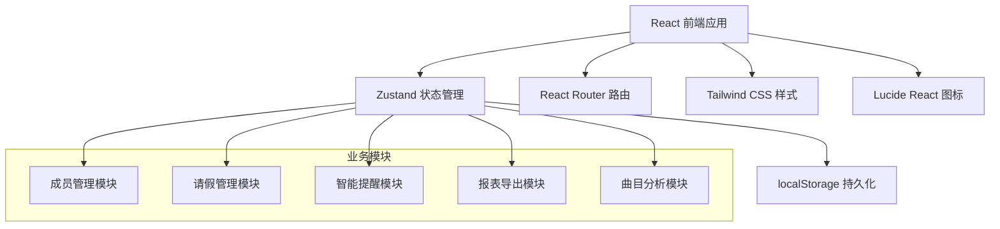
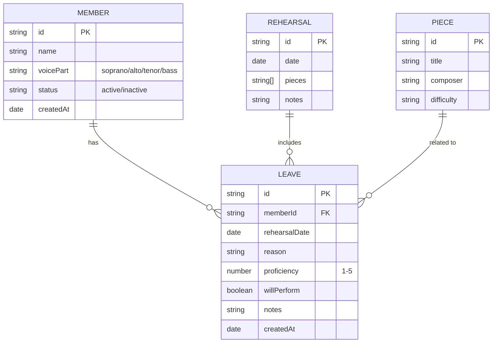

## 1. 架构设计



## 2. 技术描述

- **前端框架**：React@18 + TypeScript
- **构建工具**：Vite@5
- **状态管理**：Zustand@4（轻量级，支持persist中间件）
- **路由管理**：React Router@6
- **样式方案**：Tailwind CSS@3
- **图标库**：Lucide React
- **数据持久化**：localStorage（通过zustand-persist）
- **数据导出**：原生CSV生成，window.print()打印
- **初始化模板**：react-ts（纯前端项目，无后端）

## 3. 路由定义

| Route | 页面 | 权限 |
|-------|------|------|
| `/` | 仪表盘（Dashboard） | 所有角色 |
| `/members` | 成员管理 | 团长 |
| `/leave` | 请假管理 | 所有角色 |
| `/leader` | 团长面板 | 团长 |
| `/conductor` | 指挥面板 | 指挥 |
| `/profile` | 个人出勤记录 | 成员 |

## 4. 数据模型

### 4.1 数据模型ER图



### 4.2 数据实体定义

```typescript
// 声部类型
type VoicePart = 'soprano' | 'alto' | 'tenor' | 'bass';

// 成员
interface Member {
  id: string;
  name: string;
  voicePart: VoicePart;
  status: 'active' | 'inactive';
  createdAt: string;
}

// 曲目
interface Piece {
  id: string;
  title: string;
  composer: string;
  difficulty: 'easy' | 'medium' | 'hard';
}

// 请假记录
interface LeaveRecord {
  id: string;
  memberId: string;
  rehearsalDate: string;
  reason: string;
  proficiency: number; // 1-5
  willPerform: boolean;
  notes: string;
  createdAt: string;
}

// 提醒类型
type AlertType = 'duplicate' | 'consecutive' | 'shortage' | 'online';

interface Alert {
  id: string;
  type: AlertType;
  message: string;
  memberId?: string;
  voicePart?: VoicePart;
  rehearsalDate?: string;
  createdAt: string;
  read: boolean;
}

// 应用状态
interface AppState {
  members: Member[];
  pieces: Piece[];
  leaveRecords: LeaveRecord[];
  alerts: Alert[];
  currentRole: 'leader' | 'conductor' | 'member';
  currentMemberId?: string;
}
```

### 4.3 初始Mock数据

```typescript
// 初始成员
const initialMembers: Member[] = [
  { id: '1', name: '王芳', voicePart: 'soprano', status: 'active', createdAt: '2024-01-01' },
  { id: '2', name: '李明', voicePart: 'tenor', status: 'active', createdAt: '2024-01-01' },
  { id: '3', name: '张伟', voicePart: 'bass', status: 'active', createdAt: '2024-01-01' },
  { id: '4', name: '刘静', voicePart: 'alto', status: 'active', createdAt: '2024-01-01' },
  { id: '5', name: '陈强', voicePart: 'bass', status: 'active', createdAt: '2024-01-01' },
];

// 初始曲目
const initialPieces: Piece[] = [
  { id: '1', title: '黄河大合唱', composer: '冼星海', difficulty: 'hard' },
  { id: '2', title: '半个月亮爬上来', composer: '王洛宾', difficulty: 'medium' },
  { id: '3', title: '欢乐颂', composer: '贝多芬', difficulty: 'easy' },
];
```

## 5. 核心业务逻辑

### 5.1 智能提醒生成逻辑

```typescript
// 1. 重复请假检测：30天内超过3次
function checkDuplicateLeaves(memberId: string, records: LeaveRecord[]): Alert | null {
  const thirtyDaysAgo = new Date();
  thirtyDaysAgo.setDate(thirtyDaysAgo.getDate() - 30);
  const count = records.filter(
    r => r.memberId === memberId && new Date(r.rehearsalDate) >= thirtyDaysAgo
  ).length;
  return count > 3 ? { type: 'duplicate', message: `该成员30天内已请假${count}次` } : null;
}

// 2. 连续缺席检测：演出前连续缺席2次以上
function checkConsecutiveAbsence(memberId: string, records: LeaveRecord[], nextPerformanceDate: Date): Alert | null {
  const sortedRecords = records
    .filter(r => r.memberId === memberId)
    .sort((a, b) => new Date(b.rehearsalDate).getTime() - new Date(a.rehearsalDate).getTime());
  
  let consecutive = 0;
  for (const record of sortedRecords) {
    if (new Date(record.rehearsalDate) < nextPerformanceDate) {
      consecutive++;
    } else {
      break;
    }
  }
  return consecutive >= 2 ? { type: 'consecutive', message: `演出前已连续缺席${consecutive}次` } : null;
}

// 3. 声部人数不足检测：出席率低于60%
function checkVoicePartShortage(voicePart: VoicePart, date: string, members: Member[], records: LeaveRecord[]): Alert | null {
  const totalInPart = members.filter(m => m.voicePart === voicePart && m.status === 'active').length;
  const onLeave = records.filter(r => r.rehearsalDate === date && members.find(m => m.id === r.memberId)?.voicePart === voicePart).length;
  const attendanceRate = (totalInPart - onLeave) / totalInPart;
  return attendanceRate < 0.6 ? { type: 'shortage', message: `${getVoicePartName(voicePart)}出席率仅${Math.round(attendanceRate * 100)}%` } : null;
}

// 4. 线上练习提醒：备注关键词检测
function checkOnlinePractice(notes: string): Alert | null {
  const keywords = ['线上', '远程', '不能到场', '线上练习', '在家'];
  return keywords.some(k => notes.includes(k)) ? { type: 'online', message: '该成员备注需要线上练习' } : null;
}
```

### 5.2 报表生成逻辑

```typescript
// 本周点名表生成
function generateWeeklyRollCall(members: Member[], weekStart: Date): object[] {
  const weekDates = Array.from({ length: 7 }, (_, i) => {
    const d = new Date(weekStart);
    d.setDate(d.getDate() + i);
    return d.toISOString().split('T')[0];
  });
  
  return members
    .filter(m => m.status === 'active')
    .sort((a, b) => a.voicePart.localeCompare(b.voicePart))
    .map(m => ({
      name: m.name,
      voicePart: getVoicePartName(m.voicePart),
      ...Object.fromEntries(weekDates.map(d => [d, '']))
    }));
}

// CSV导出
function exportToCSV(data: object[], filename: string): void {
  const headers = Object.keys(data[0]).join(',');
  const rows = data.map(row => Object.values(row).join(','));
  const csv = [headers, ...rows].join('\n');
  const blob = new Blob(['\ufeff' + csv], { type: 'text/csv;charset=utf-8;' });
  const link = document.createElement('a');
  link.href = URL.createObjectURL(blob);
  link.download = filename;
  link.click();
}
```

## 6. 项目结构

```
src/
├── components/          # 通用组件
│   ├── Layout.tsx       # 布局组件（导航、侧边栏）
│   ├── AlertCard.tsx    # 提醒卡片
│   ├── MemberForm.tsx   # 成员表单
│   ├── LeaveForm.tsx    # 请假表单
│   ├── StarRating.tsx   # 星级评分
│   ├── DataTable.tsx    # 数据表格
│   └── StatsCard.tsx    # 统计卡片
├── pages/               # 页面组件
│   ├── Dashboard.tsx    # 仪表盘
│   ├── Members.tsx      # 成员管理
│   ├── LeaveRecords.tsx # 请假管理
│   ├── LeaderPanel.tsx  # 团长面板
│   ├── ConductorPanel.tsx # 指挥面板
│   └── Profile.tsx      # 个人中心
├── store/               # 状态管理
│   └── useStore.ts      # Zustand store
├── utils/               # 工具函数
│   ├── alerts.ts        # 提醒检测逻辑
│   ├── export.ts        # 导出功能
│   ├── date.ts          # 日期处理
│   └── voiceParts.ts    # 声部相关
├── types/               # 类型定义
│   └── index.ts
├── data/                # 初始数据
│   └── mockData.ts
├── App.tsx
├── main.tsx
└── index.css
```

## 7. 状态管理设计

```typescript
// useStore.ts
import { create } from 'zustand';
import { persist } from 'zustand/middleware';

interface AppStore extends AppState {
  // Member actions
  addMember: (member: Omit<Member, 'id' | 'createdAt'>) => void;
  updateMember: (id: string, data: Partial<Member>) => void;
  deleteMember: (id: string) => void;
  
  // Leave actions
  addLeave: (leave: Omit<LeaveRecord, 'id' | 'createdAt'>) => void;
  deleteLeave: (id: string) => void;
  
  // Alert actions
  markAlertRead: (id: string) => void;
  clearAlerts: () => void;
  
  // Role
  setCurrentRole: (role: 'leader' | 'conductor' | 'member') => void;
  setCurrentMember: (memberId: string) => void;
  
  // Piece actions
  addPiece: (piece: Omit<Piece, 'id'>) => void;
  updatePiece: (id: string, data: Partial<Piece>) => void;
  deletePiece: (id: string) => void;
}

export const useStore = create<AppStore>()(
  persist(
    (set, get) => ({
      // ... state and actions
    }),
    {
      name: 'choir-leave-storage',
    }
  )
);
```
