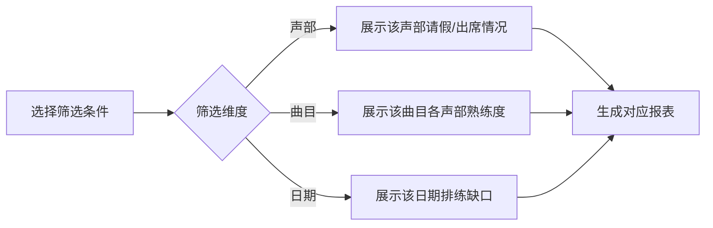

## 1. 产品概述
社区合唱团请假管理系统，解决传统微信群请假导致的信息混乱、声部缺口发现不及时等问题。帮助团长和指挥高效管理排练出勤，提前预警风险，优化排练计划。

### 1.1 核心问题
- 微信群请假信息分散，指挥到现场才发现声部缺人
- 难以跟踪成员连续缺席情况
- 演出名单需要临时调整
- 无法快速分析曲目熟练度和声部缺口

### 1.2 目标用户
- **团长**：管理成员信息、打印点名表、提醒成员补练
- **指挥**：查看声部缺口、导出演出名单、分析曲目维度、安排排练计划
- **成员**：录入请假信息、查看自己的出勤记录

---

## 2. 核心功能

### 2.1 用户角色
| 角色 | 核心权限 |
|------|----------|
| 团长 | 成员CRUD、打印点名表、按人提醒补练、查看所有数据 |
| 指挥 | 查看声部缺口、导出演出名单、导出补练声部、曲目维度分析 |
| 成员 | 录入请假、查看个人出勤记录 |

### 2.2 功能模块
1. **仪表盘**：全局概览、智能提醒中心、今日/本周排练概况
2. **成员管理**：成员录入（姓名、声部）、声部配置
3. **请假管理**：请假录入表单、请假列表、筛选查询
4. **智能提醒**：重复请假预警、连续缺席预警、声部人数不足预警、线上练习提醒
5. **团长功能**：本周排练点名表打印、按人提醒补练
6. **指挥功能**：演出名单导出、补练声部导出、曲目维度缺口分析

### 2.3 页面详情
| 页面名称 | 模块名称 | 功能描述 |
|-----------|-------------|---------------------|
| 仪表盘 | 智能提醒中心 | 展示所有预警信息，按类型分类展示 |
| 仪表盘 | 排练概览 | 今日/本周排练出席情况、声部缺口统计 |
| 成员管理 | 成员列表 | 展示所有成员，支持按声部筛选、增删改 |
| 成员管理 | 成员表单 | 录入姓名、选择声部、设置状态 |
| 请假管理 | 请假录入表单 | 选择成员、排练日期、请假原因、曲目熟练度（1-5星）、是否参加演出、备注 |
| 请假管理 | 请假列表 | 展示所有请假记录，支持按声部、日期、曲目筛选 |
| 团长面板 | 点名表生成 | 生成本周排练点名表，支持打印 |
| 团长面板 | 补练提醒 | 按人统计缺席情况，生成补练提醒列表 |
| 指挥面板 | 演出名单导出 | 根据出席情况和演出意愿生成演出名单，支持导出CSV |
| 指挥面板 | 曲目缺口分析 | 按曲目维度展示各声部熟练度和出席缺口，辅助排练计划 |

---

## 3. 核心流程

### 3.1 请假录入流程

### 3.2 智能提醒触发条件
1. **重复请假提醒**：同一人30天内请假超过3次
2. **连续缺席提醒**：演出前连续缺席2次以上
3. **声部人数不足**：某次排练某声部出席率低于60%
4. **线上练习提醒**：备注中包含"线上"、"远程"、"不能到场"等关键词

### 3.3 数据筛选流程

---

## 4. 用户界面设计

### 4.1 设计风格
- **主色调**：深勃艮第红（#722F37），代表合唱团的优雅与热情
- **辅助色**：暖金色（#D4AF37），用于高亮和重要提醒
- **中性色**：象牙白（#FFFFF0）背景，深炭灰（#36454F）文字
- **按钮风格**：圆角矩形，微立体阴影，悬停时轻微上浮
- **字体**：标题使用"Noto Serif SC"，正文使用"Noto Sans SC"
- **布局风格**：卡片式布局，顶部导航，左侧角色切换
- **图标风格**：使用lucide-react线性图标，音乐相关元素点缀

### 4.2 页面设计概述
| 页面名称 | 模块名称 | UI Elements |
|-----------|-------------|-------------|
| 仪表盘 | 提醒中心 | 卡片式提醒列表，不同类型用不同颜色标识，带动画效果 |
| 仪表盘 | 统计卡片 | 4个核心指标卡片（总成员、今日出席、声部缺口、待处理提醒） |
| 成员管理 | 成员列表 | 表格布局，按声部分组，支持搜索和快速编辑 |
| 请假管理 | 表单 | 分步表单，带进度指示，星级评分组件 |
| 团长面板 | 点名表 | 可打印的表格视图，按声部排列，带签名栏 |
| 指挥面板 | 曲目分析 | 热力图展示各声部对各曲目的熟练度，缺口用红色高亮 |

### 4.3 响应式设计
- 桌面端（>1024px）：侧边导航 + 主内容区，三栏布局
- 平板端（768-1024px）：顶部导航，两栏布局
- 移动端（<768px）：底部导航，单栏滚动，优化触摸区域

### 4.4 交互细节
- 页面加载：卡片依次淡入，带0.1s延迟的stagger动画
- 悬停效果：按钮上浮2px，阴影加深；表格行高亮
- 提醒通知：右上角滑入，带轻微弹跳效果
- 数据刷新：loading骨架屏，平滑过渡
