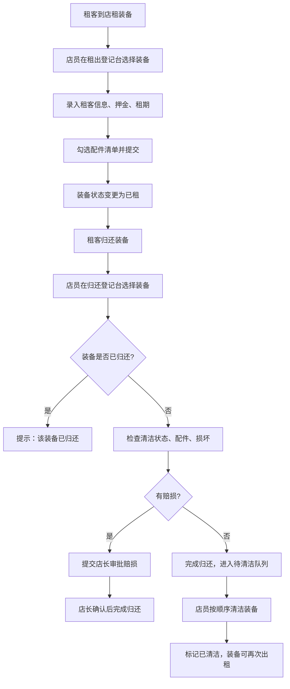

## 1. 产品概述

户外店露营装备租还管理系统，解决纸质登记混乱、装备状态遗漏、赔损不清等问题。实现装备租出/归还全流程数字化，追踪清洁、维修状态，管理押金与赔损结算，提醒清洁顺序避免潮湿装备堆积。

## 2. 核心功能

### 2.1 用户角色

| 角色 | 核心权限 |
|------|----------|
| 店员 | 登记租出/归还、查看待清洁、记录清洁/维修、查看装备状态 |
| 店长/老板 | 以上全部 + 确认赔损扣款、导出报表（押金/赔损/可租装备） |

### 2.2 功能模块

1. **租出登记台**：选择装备、录入租客信息、押金、租期、配件清单、备注
2. **归还登记台**：扫码/选择装备、检查归还状态、记录配件缺失、清洁状态、赔损备注
3. **待清洁队列**：按归还时间排序，高亮超期未清洁
4. **装备库存管理**：查看所有装备及当前状态（可租/已租/清洁中/维修中）
5. **赔损审批**：店长确认赔损扣款
6. **报表导出**：押金明细、赔损记录、下周可租装备清单

### 2.3 页面详情

| 页面名称 | 模块名称 | 功能描述 |
|----------|----------|----------|
| 工作台 | 状态概览卡片 | 今日租出/归还、待清洁数量、待审批赔损、可租装备数 |
| 工作台 | 待清洁队列 | 按归还时间倒序排列，显示装备名、归还时间、清洁状态 |
| 租出登记 | 装备选择 | 多选可租装备，显示规格和配件 |
| 租出登记 | 租客信息 | 姓名、电话、身份证、押金金额、租期（起止日期） |
| 租出登记 | 配件清单 | 每件装备勾选自带配件 |
| 归还登记 | 装备选择 | 搜索/扫描已租出装备，重复归还自动提示 |
| 归还登记 | 状态检查 | 清洁状态、配件缺失、损坏描述、赔损金额 |
| 归还登记 | 赔损提交 | 超过阈值自动提交店长审批 |
| 装备管理 | 装备列表 | 全部装备，按状态筛选，快速查看详情 |
| 装备管理 | 装备详情 | 租还历史、清洁/维修记录、配件清单 |
| 报表中心 | 押金报表 | 时间段筛选、按租客汇总、导出CSV |
| 报表中心 | 赔损报表 | 待审批/已审批、店长确认记录 |
| 报表中心 | 可租预报 | 下周可租装备清单、按类别统计 |

## 3. 核心流程

## 4. 用户界面设计

### 4.1 设计风格
- **主色调**：深森林绿 `#2D5016` 体现户外自然感
- **辅助色**：暖橙色 `#E87C2B` 用于强调操作和提醒
- **中性色**：米白 `#F5F1E8` 背景、深棕灰 `#3A3530` 文字
- **按钮风格**：圆角 10px，轻微阴影，悬停上浮效果
- **字体**：思源黑体（Source Han Sans）+ Lora 展示字体
- **布局**：顶部导航 + 左侧快速菜单 + 主内容卡片式布局
- **图标风格**：Lucide 线性图标，户外主题（帐篷、火焰、山等）

### 4.2 页面设计概览

| 页面名称 | 模块名称 | UI 元素 |
|----------|----------|----------|
| 工作台 | 状态概览 | 4 张渐变卡片，带图标和数字，悬停微动效 |
| 工作台 | 待清洁队列 | 时间线式列表，归还时间标签颜色区分紧急程度 |
| 租出/归还 | 表单 | 分区卡片式表单，装备选择器带缩略图和状态标签 |
| 装备管理 | 列表 | 网格/列表切换，状态徽章，快速操作按钮 |
| 报表中心 | 数据表格 | 斑马纹行，汇总行加粗，导出按钮固定右上角 |

### 4.3 响应式
桌面端优先（1440px 基准），平板端（768px+）收起左侧菜单为图标，移动端（<768px）顶部 Tab 切换，表单单列布局。
