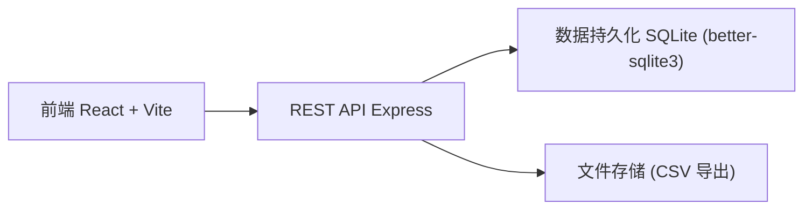
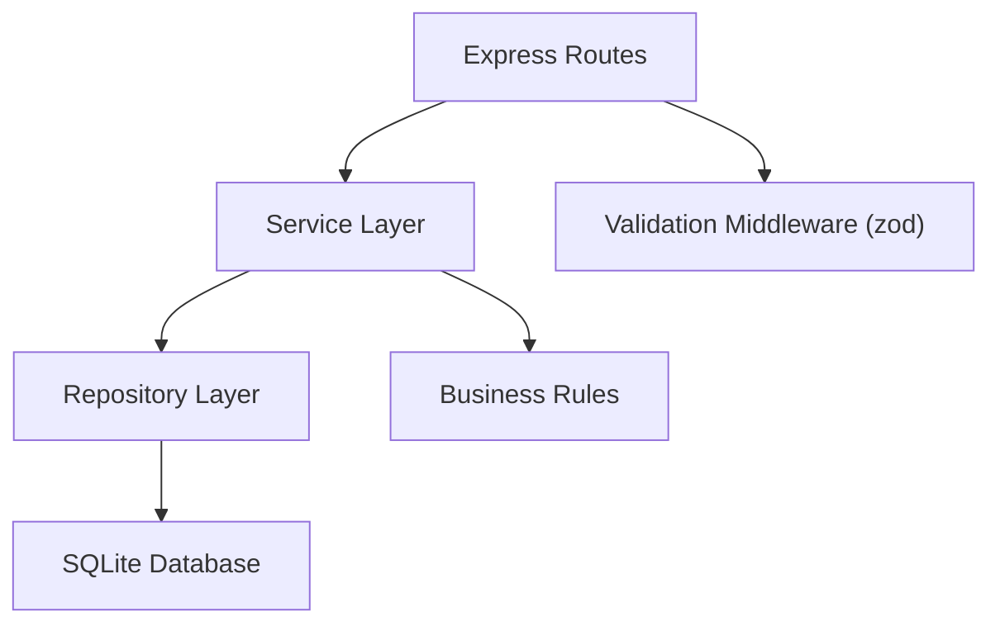
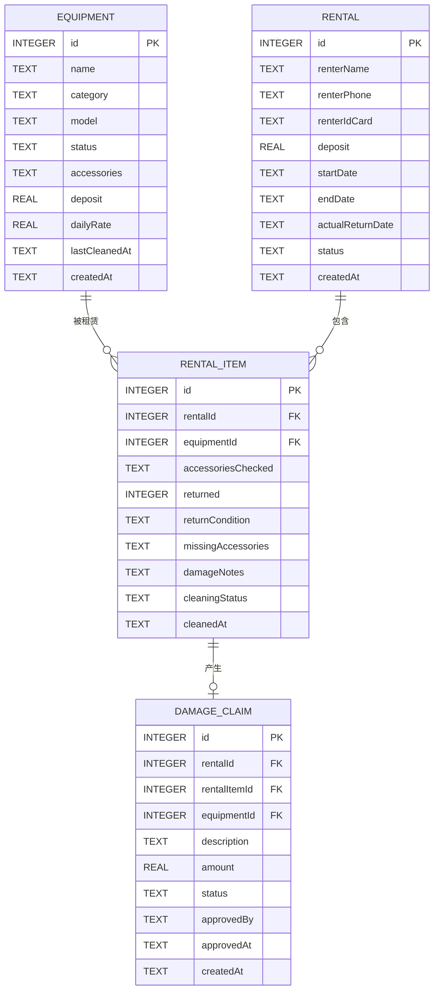

## 1. 架构设计



## 2. 技术描述

- **前端**：React 18 + TypeScript + Vite 6 + Tailwind CSS 3 + Zustand 状态管理 + React Router DOM 6
- **后端**：Express 4 + TypeScript + better-sqlite3（文件型数据库，零配置）
- **初始化工具**：vite-init react-express-ts 模板
- **UI 组件**：Lucide React 图标库 + 自定义 Tailwind 组件
- **数据持久化**：SQLite 本地数据库，刷新后数据一致

## 3. 路由定义

| 前端路由 | 页面 | 后端 API 路径 |
|----------|------|---------------|
| `/` | 工作台（待清洁队列） | - |
| `/rent` | 租出登记 | `POST /api/rentals` |
| `/return` | 归还登记 | `POST /api/rentals/:id/return` |
| `/equipment` | 装备管理 | `GET /api/equipment`, `POST /api/equipment` |
| `/equipment/:id` | 装备详情 | `GET /api/equipment/:id` |
| `/approvals` | 赔损审批 | `GET /api/claims`, `PUT /api/claims/:id/approve` |
| `/reports` | 报表中心 | `GET /api/reports/*` |

## 4. API 定义

```typescript
// 装备
interface Equipment {
  id: number;
  name: string;
  category: 'tent' | 'stove' | 'sleeping_bag' | 'mat' | 'backpack' | 'other';
  model: string;
  status: 'available' | 'rented' | 'cleaning' | 'repairing' | 'retired';
  accessories: string[];
  deposit: number;
  dailyRate: number;
  lastCleanedAt: string | null;
  createdAt: string;
}

// 租单
interface Rental {
  id: number;
  renterName: string;
  renterPhone: string;
  renterIdCard?: string;
  deposit: number;
  startDate: string;
  endDate: string;
  actualReturnDate: string | null;
  items: RentalItem[];
  status: 'active' | 'returned' | 'settled';
  createdAt: string;
}

interface RentalItem {
  id: number;
  rentalId: number;
  equipmentId: number;
  accessoriesChecked: string[];
  returned: boolean;
  returnCondition?: 'clean' | 'needs_cleaning' | 'damaged';
  missingAccessories?: string[];
  damageNotes?: string;
  cleaningStatus?: 'pending' | 'in_progress' | 'done';
  cleanedAt?: string;
}

// 赔损
interface DamageClaim {
  id: number;
  rentalId: number;
  rentalItemId: number;
  equipmentId: number;
  description: string;
  amount: number;
  status: 'pending' | 'approved' | 'rejected';
  approvedBy?: string;
  approvedAt?: string;
  createdAt: string;
}
```

## 5. 服务端架构



## 6. 数据模型

### 6.1 ER 图



### 6.2 初始化数据

预置 10+ 件装备样例数据（帐篷 3、炉具 3、睡袋 3、防潮垫 2 等），2-3 条示例租单。
