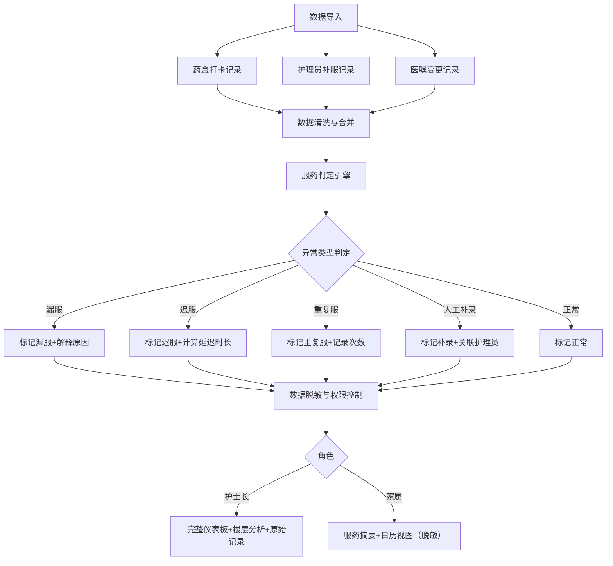

## 1. 产品概述

养老机构智能药盒漏服统计与分析系统，解决医生临时改医嘱、药盒离线、护理员手写备注等场景下的服药数据同步难题，实现按老人、药品、时段多维度分析漏服、迟服、重复服用和人工补录情况。

- **核心痛点**：医嘱变更漏同步、跨夜时段判定模糊、药盒离线数据缺失、设备与人工记录冲突
- **目标用户**：护士长（管理决策）、家属（知情权）
- **产品价值**：降低用药差错率，明确责任边界，提升养老机构护理质量

---

## 2. 核心功能

### 2.1 用户角色

| 角色 | 登录方式 | 核心权限 |
|------|----------|----------|
| 护士长 | 工号+密码登录 | 查看全量数据、趋势分析、楼层分析、高风险预警、原始记录追溯、内部备注可见 |
| 家属 | 手机号+验证码登录 | 仅查看所关联老人的服药摘要、隐藏内部责任备注、无统计分析权限 |

### 2.2 功能模块

1. **数据导入中心**：药盒打卡记录导入、护理员补服记录导入、医嘱变更记录导入
2. **护士长仪表板**：漏服趋势、高风险老人榜单、楼层漏服热力图、设备vs班次归因分析
3. **家属仪表板**：老人服药日历、服药情况摘要、正常/异常状态展示
4. **服药详情页**：单老人单药品时段明细、异常记录解释、原始记录对比
5. **楼层分析页**：按楼层/班次维度聚合、设备问题识别、交接环节漏洞定位

### 2.3 页面详情

| 页面名称 | 模块名称 | 功能描述 |
|----------|----------|----------|
| 登录页 | 角色选择 | 护士长/家属角色切换，表单验证，错误提示 |
| 数据导入中心 | 文件上传 | 支持Excel/CSV批量导入，数据预览与校验，导入进度反馈 |
| 护士长仪表板 | 趋势概览 | 近7/30天漏服率趋势折线图，迟服/重复服/补录分类统计卡片 |
| 护士长仪表板 | 高风险老人 | 按漏服次数排序的老人列表，风险等级标签（红/黄/绿） |
| 护士长仪表板 | 楼层分析 | 楼层漏服率热力图，设备离线率柱状图，班次交接问题分布 |
| 服药详情页 | 时段明细 | 按早/中/晚/睡前展示服药记录，异常标记，跨夜时段特殊标识 |
| 服药详情页 | 原始记录 | 药盒打卡、护理备注、医嘱变更三线对比，冲突记录高亮 |
| 家属仪表板 | 服药日历 | 月视图日历，每日服药状态色块（正常/漏服/迟服） |
| 家属仪表板 | 摘要卡片 | 本月服药依从率，异常次数统计，无内部备注信息 |

---

## 3. 核心流程

---

## 4. 特殊场景判定规则

### 4.1 时段定义
- **早餐时段**：06:00 - 09:00
- **午餐时段**：11:00 - 13:30
- **晚餐时段**：17:00 - 19:30
- **睡前时段**：21:00 - 次日02:00（跨夜）

### 4.2 异常判定规则
| 场景 | 判定逻辑 | 解释字段 |
|------|----------|----------|
| 漏服 | 时段内无药盒打卡且无护理员补录 | 无打卡记录 / 药盒离线 / 医嘱已停药 |
| 迟服 | 打卡时间晚于时段结束时间30分钟内 | 延迟XX分钟 |
| 重复服 | 同一时段内出现2次及以上打卡记录 | 重复打卡X次，疑似设备故障 |
| 人工补录 | 时段内无药盒打卡但有护理员备注 | 护理员XXX于XX时间补服 |
| 医嘱停药 | 医嘱记录显示该时段已停药 | 医嘱变更：停止服用 |
| 设备离线 | 药盒连续4小时无心跳记录 | 设备离线，数据可能缺失 |
| 记录冲突 | 药盒打卡与护理备注不一致 | 打卡显示已服，护理备注漏服，请核实 |

### 4.3 数据脱敏规则
- 家属端隐藏：护理员姓名、内部责任备注、楼层设备故障率、其他老人信息
- 家属端可见：老人服药状态、服药时间、药品名称（脱敏显示）、总体依从率

---

## 5. 用户界面设计

### 5.1 设计风格
- **主色调**：医疗蓝 `#165DFF`（专业、可信）
- **辅助色**：警示红 `#F53F3F`（漏服）、提醒橙 `#FF7D00`（迟服）、成功绿 `#00B42A`（正常）、补录紫 `#722ED1`（人工补录）
- **中性色**：浅灰背景 `#F7F8FA`、深灰文字 `#1D2129`
- **字体**：标题使用「思源黑体 Bold」，正文使用「思源黑体 Regular」，数字使用等宽字体提升可读性
- **布局**：卡片式布局，顶部导航+侧边栏，仪表板采用网格栅格系统
- **图标**：使用线性图标，异常状态使用填充图标增强视觉警示

### 5.2 页面设计概览

| 页面名称 | 模块名称 | UI元素 |
|----------|----------|--------|
| 登录页 | 登录表单 | 大色块背景，卡片式登录框，角色切换Tab，输入框微动效 |
| 护士长仪表板 | 顶部概览 | 4张统计卡片带图标，数字滚动动效，趋势小箭头 |
| 护士长仪表板 | 趋势图 | 双Y轴折线图，支持时段筛选，hover显示详情 |
| 护士长仪表板 | 高风险榜单 | 头像+姓名+风险标签+漏服次数，行hover高亮 |
| 护士长仪表板 | 楼层热力图 | 色块矩阵，颜色深浅代表漏服率，点击钻取详情 |
| 服药详情页 | 时间轴 | 垂直时间轴，每个时段节点带状态图标，异常记录红色边框 |
| 家属仪表板 | 月历视图 | 日历网格，每日色块标记，点击查看当日详情 |
| 数据导入页 | 上传区域 | 拖拽上传区，文件列表，校验进度条，错误提示 |

### 5.3 交互细节
- **页面加载**：骨架屏占位，数据返回后渐入显示
- **图表交互**：支持hover详情、点击筛选、图例开关
- **异常记录**：鼠标悬停显示完整解释气泡
- **数据导入**：实时进度条，错误记录高亮并支持下载修正模板
- **角色切换**：登录时角色选择有明确视觉区分

### 5.4 响应式设计
- 桌面端（1280px+）：完整侧边栏+内容区，多列布局
- 平板端（768px-1279px）：折叠式侧边栏，自适应网格
- 移动端（<768px）：底部Tab导航，单列堆叠布局，家属端优先适配
