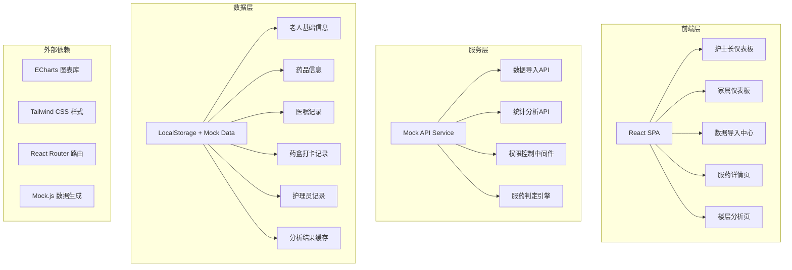
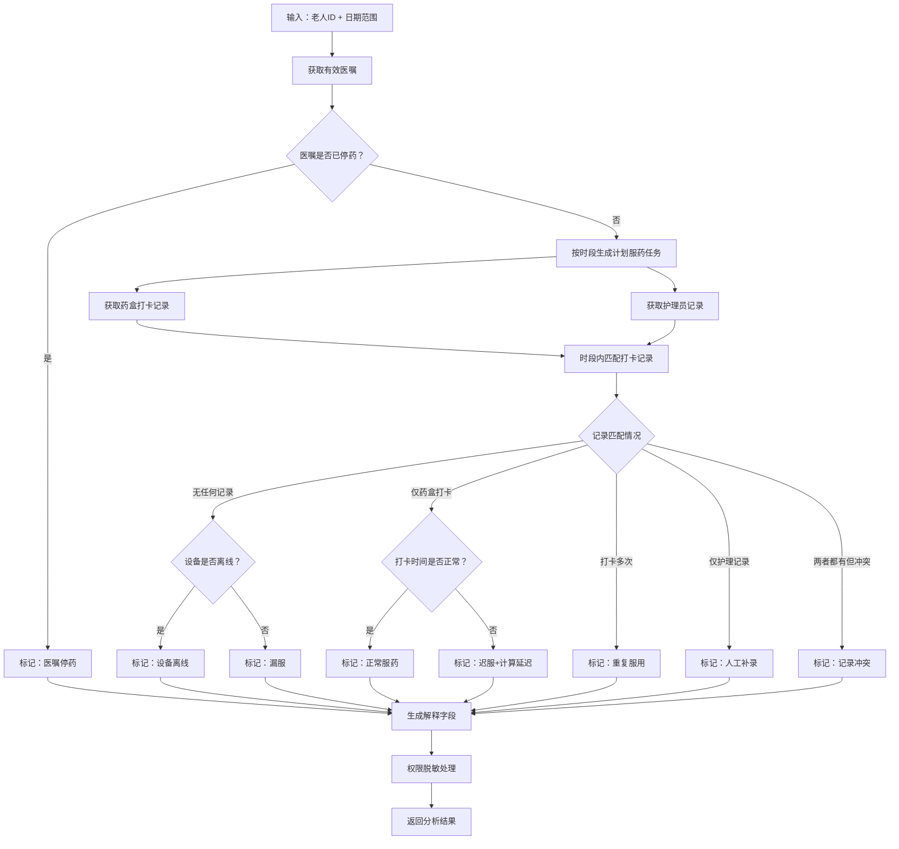
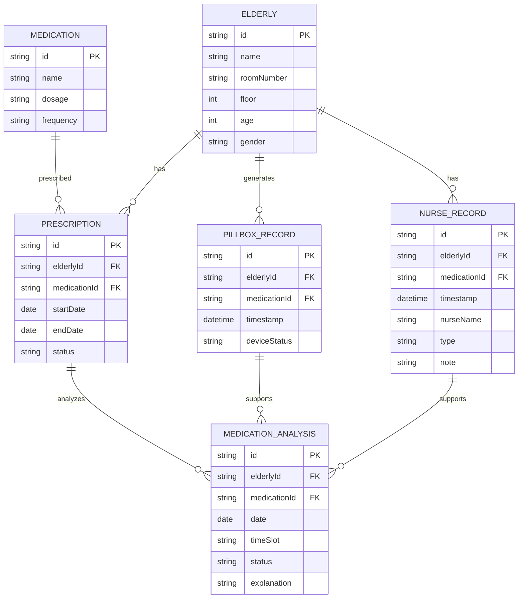

## 1. 架构设计



---

## 2. 技术选型说明

- **前端框架**：React@18 + TypeScript
- **构建工具**：Vite@5
- **样式方案**：Tailwind CSS@3
- **图表库**：ECharts@5（功能强大，适合复杂统计图表）
- **路由管理**：React Router DOM@6
- **状态管理**：React Context + useReducer（轻量级，满足需求）
- **数据持久化**：LocalStorage（模拟后端存储）
- **Mock方案**：自定义Mock Service + Mock.js生成模拟数据
- **UI组件**：Ant Design@5（企业级组件库，适合管理后台）

---

## 3. 路由定义

| 路由路径 | 页面名称 | 权限控制 | 说明 |
|----------|----------|----------|------|
| `/login` | 登录页 | 公开 | 角色选择、身份验证 |
| `/nurse/dashboard` | 护士长仪表板 | 护士长 | 漏服趋势、高风险老人、概览统计 |
| `/nurse/floor` | 楼层分析页 | 护士长 | 楼层维度分析、设备vs班次归因 |
| `/elderly/:id` | 服药详情页 | 护士长/家属（仅本人） | 单老人服药明细、原始记录对比 |
| `/family/dashboard` | 家属仪表板 | 家属 | 服药日历、摘要统计（脱敏） |
| `/import` | 数据导入中心 | 护士长 | 三类数据的批量导入与校验 |
| `/` | 首页重定向 | - | 根据角色自动跳转对应仪表板 |

---

## 4. 核心数据类型定义

```typescript
// 老人基础信息
interface Elderly {
  id: string;
  name: string;
  roomNumber: string;
  floor: number;
  age: number;
  gender: 'male' | 'female';
  avatar?: string;
  familyMembers: string[]; // 家属关联ID
}

// 药品信息
interface Medication {
  id: string;
  name: string;
  genericName: string;
  dosage: string;
  frequency: 'qd' | 'bid' | 'tid' | 'qid' | 'qn'; // 每日次数
  times: string[]; // 服药时间点，如 ['08:00', '12:00', '18:00']
}

// 医嘱记录
interface Prescription {
  id: string;
  elderlyId: string;
  medicationId: string;
  startDate: string;
  endDate?: string; // 为空表示长期有效
  status: 'active' | 'discontinued' | 'completed';
  changeReason?: string;
  changeTime?: string;
  doctorName: string;
}

// 药盒打卡记录
interface PillboxRecord {
  id: string;
  elderlyId: string;
  medicationId: string;
  timestamp: string;
  deviceId: string;
  deviceStatus: 'online' | 'offline' | 'low_battery';
  isSuccess: boolean;
}

// 护理员记录
interface NurseRecord {
  id: string;
  elderlyId: string;
  medicationId: string;
  timestamp: string;
  nurseName: string;
  type: 'supplement' | 'missed' | 'noted';
  note: string; // 内部备注，家属端隐藏
  publicNote?: string; // 公开备注，家属端可见
}

// 时段定义
type TimeSlot = 'breakfast' | 'lunch' | 'dinner' | 'bedtime';

// 服药判定结果
type MedicationStatus = 'taken' | 'missed' | 'late' | 'duplicate' | 'supplemented' | 'discontinued' | 'offline' | 'conflict';

interface MedicationAnalysis {
  id: string;
  elderlyId: string;
  medicationId: string;
  date: string;
  timeSlot: TimeSlot;
  status: MedicationStatus;
  plannedTime: string;
  actualTime?: string;
  delayMinutes?: number;
  explanation: string;
  pillboxRecord?: PillboxRecord;
  nurseRecord?: NurseRecord;
  prescription?: Prescription;
  isInternalNote: boolean; // 是否包含内部备注
}

// 统计汇总
interface DailyStatistics {
  date: string;
  totalDoses: number;
  taken: number;
  missed: number;
  late: number;
  duplicate: number;
  supplemented: number;
  discontinued: number;
  offline: number;
  conflict: number;
}

interface FloorStatistics {
  floor: number;
  totalDoses: number;
  missedRate: number;
  offlineRate: number;
  shiftIssues: {
    morning: number;
    afternoon: number;
    night: number;
  };
  deviceIssues: number;
}

interface ElderlyRisk {
  elderlyId: string;
  name: string;
  floor: number;
  roomNumber: string;
  missedCount: number;
  lateCount: number;
  riskLevel: 'high' | 'medium' | 'low';
  last30DaysRate: number;
}
```

---

## 5. API 接口定义

### 5.1 认证接口
```typescript
POST /api/auth/login
Request: { role: 'nurse' | 'family', username: string, password: string }
Response: { 
  success: boolean, 
  token: string, 
  user: { id: string, name: string, role: string, elderlyIds?: string[] }
}
```

### 5.2 数据导入接口
```typescript
POST /api/import/pillbox
Request: FormData { file: File }
Response: { success: boolean, imported: number, errors: Array<{row: number, message: string}> }

POST /api/import/nurse
Request: FormData { file: File }
Response: { success: boolean, imported: number, errors: Array<{row: number, message: string}> }

POST /api/import/prescription
Request: FormData { file: File }
Response: { success: boolean, imported: number, errors: Array<{row: number, message: string}> }
```

### 5.3 统计分析接口
```typescript
GET /api/statistics/daily
Query: { startDate: string, endDate: string, floor?: number }
Response: DailyStatistics[]

GET /api/statistics/floor
Query: { date: string }
Response: FloorStatistics[]

GET /api/statistics/risk
Query: { limit?: number }
Response: ElderlyRisk[]

GET /api/elderly/:id/medications
Query: { startDate: string, endDate: string }
Response: MedicationAnalysis[]

GET /api/elderly/:id/summary
Response: {
  name: string,
  adherenceRate: number,
  thisMonth: { total: number, normal: number, abnormal: number },
  recentRecords: MedicationAnalysis[]
}
```

---

## 6. 核心分析引擎设计

### 6.1 判定流程


### 6.2 关键算法

**时段判定算法**：
```typescript
function getTimeSlot(time: string): TimeSlot | null {
  const hour = parseInt(time.split(':')[0]);
  if (hour >= 6 && hour < 9) return 'breakfast';
  if (hour >= 11 && hour < 13.5 * 60) return 'lunch';
  if (hour >= 17 && hour < 19.5 * 60) return 'dinner';
  if (hour >= 21 || hour < 2) return 'bedtime'; // 跨夜处理
  return null;
}
```

**依从率计算**：
```typescript
function calculateAdherenceRate(records: MedicationAnalysis[]): number {
  const validRecords = records.filter(r => 
    r.status !== 'discontinued' && r.status !== 'offline'
  );
  if (validRecords.length === 0) return 100;
  const normal = validRecords.filter(r => 
    r.status === 'taken' || r.status === 'supplemented'
  );
  return Math.round((normal.length / validRecords.length) * 100);
}
```

**风险等级判定**：
```typescript
function getRiskLevel(missedCount: number, lateCount: number, totalDoses: number): 'high' | 'medium' | 'low' {
  const abnormalRate = (missedCount + lateCount) / totalDoses;
  if (abnormalRate > 0.15 || missedCount > 3) return 'high';
  if (abnormalRate > 0.05 || missedCount > 0) return 'medium';
  return 'low';
}
```

---

## 7. 数据模型 ER 图



---

## 8. 项目目录结构

```
src/
├── assets/              # 静态资源
├── components/          # 公共组件
│   ├── charts/         # 图表组件
│   ├── layout/         # 布局组件
│   ├── status/         # 状态展示组件
│   └── ui/             # 基础UI组件
├── context/            # React Context
│   ├── AuthContext.tsx
│   └── DataContext.tsx
├── hooks/              # 自定义Hooks
│   ├── useAnalysis.ts
│   └── useStatistics.ts
├── mock/               # Mock数据与服务
│   ├── data/           # 模拟数据生成
│   ├── api.ts          # Mock API接口
│   └── engine.ts       # 分析引擎实现
├── pages/              # 页面组件
│   ├── Login.tsx
│   ├── nurse/
│   │   ├── Dashboard.tsx
│   │   ├── FloorAnalysis.tsx
│   │   └── ImportCenter.tsx
│   ├── family/
│   │   └── Dashboard.tsx
│   └── ElderlyDetail.tsx
├── router/             # 路由配置
│   └── index.tsx
├── types/              # TypeScript类型定义
│   └── index.ts
├── utils/              # 工具函数
│   ├── analysis.ts     # 分析算法
│   ├── format.ts       # 格式化工具
│   └── permission.ts   # 权限控制
├── App.tsx
└── main.tsx
```
