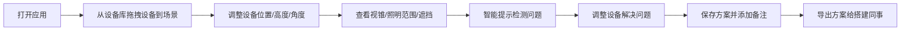
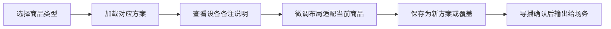
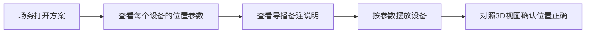

## 1. 产品概述

直播棚3D机位推演工具，帮助直播团队在搭建前虚拟规划演播室布局，避免现场发现遮挡、距离不当等问题。支持拖拽式设备布置、实时视锥与照明预览、智能问题检测、多方案管理和备注记录，让运营、产品、灯光、导播、场务高效协作。

### 目标用户
- **运营**：规划全身镜头与整体布局
- **产品经理**：规划产品细节特写机位
- **灯光师**：规划灯位与照明范围
- **导播**：保存最佳机位备注，快速切换布局
- **场务**：按备注复位设备位置

### 产品价值
- 减少现场调试时间，提升搭建效率
- 避免遮挡、距离不当等现场问题
- 沉淀最佳机位经验，复用相似商品布局
- 多角色协同，统一布局认知

---

## 2. 核心功能

### 2.1 用户角色

| 角色 | 使用场景 | 核心需求 |
|------|----------|----------|
| 运营 | 开播前规划整体布局 | 全身镜头、主播动线、商品台位置 |
| 产品经理 | 规划产品展示机位 | 细节特写、产品展示角度 |
| 灯光师 | 规划灯光布置 | 照明范围、灯架高度、避免遮挡 |
| 导播 | 管理多套方案 | 保存备注、按商品切换、导出方案 |
| 场务 | 现场复位设备 | 查看备注、按方案复位 |

### 2.2 功能模块

1. **3D场景画布**：演播室空间、网格地面、设备模型、实时渲染
2. **设备库面板**：主播区、商品台、相机、灯光、通道区域
3. **属性控制面板**：选中设备的参数调节（位置、高度、角度等）
4. **智能提示面板**：实时检测问题并给出警告/建议
5. **方案管理面板**：保存方案、切换方案、导出方案、导入方案
6. **备注系统**：为每个设备添加备注，导播记录最佳机位
7. **视锥与照明可视化**：相机视锥、灯光照明范围、遮挡检测

### 2.3 页面详情

| 页面名称 | 模块名称 | 功能描述 |
|----------|----------|----------|
| 主工作台 | 顶部工具栏 | 视图切换、撤销重做、保存导出、方案切换 |
| 主工作台 | 左侧设备库 | 设备分类列表，拖拽添加到场景 |
| 主工作台 | 中间3D画布 | 3D场景渲染、设备拖拽、视锥/照明显示 |
| 主工作台 | 右侧属性面板 | 选中设备参数调节、备注编辑 |
| 主工作台 | 底部提示栏 | 智能检测结果列表，点击定位问题 |
| 方案管理弹窗 | 方案列表 | 已保存方案、按商品类型筛选、删除 |
| 方案管理弹窗 | 方案操作 | 新建、重命名、导出JSON、导入JSON |
| 备注面板 | 设备备注 | 每个设备的备注文字、导播建议 |

---

## 3. 核心流程

### 3.1 布局规划流程

### 3.2 方案复用流程

### 3.3 现场复位流程

---

## 4. 用户界面设计

### 4.1 设计风格

**工业专业工具风格（深色主题）**
- **主色调**：深空蓝 `#1e3a5f`，代表专业与科技感
- **强调色**：电气蓝 `#3b82f6` 用于交互元素；琥珀橙 `#f59e0b` 用于警告提示；翠绿 `#10b981` 用于正常状态
- **背景色**：深炭灰 `#0f172a` 主背景；石板灰 `#1e293b` 面板背景
- **文字色**：青白 `#e2e8f0` 主文字；灰蓝 `#94a3b8` 次要文字
- **质感**：微玻璃拟态 + 微妙阴影 + 1px 描边分层

**设计理念**：
- 专业工具感：深色主题适合长时间使用，减少视觉疲劳
- 功能优先：清晰的信息层级，快速找到所需功能
- 数据可视化：视锥、照明范围用半透明色块直观展示
- 微动效：设备选中、面板展开有平滑过渡动画

### 4.2 排版与字体

- **标题字体**：JetBrains Mono 等宽字体，技术感强
- **正文字体**：Inter 或系统无衬线字体，清晰易读
- **字号层级**：
  - 大标题：20px / 600
  - 面板标题：14px / 600
  - 正文：13px / 400
  - 辅助文字：11px / 400

### 4.3 页面设计概览

| 页面/模块 | 设计要点 |
|-----------|----------|
| 顶部工具栏 | 深色底、图标+文字按钮、方案下拉选择器、视图切换按钮组 |
| 左侧设备库 | 分类折叠面板、设备卡片带缩略图、支持拖拽 |
| 3D画布 | 深色空间、网格地面、设备半写实模型、选中高亮边框 |
| 右侧属性面板 | 分组折叠、数值输入框+滑块、颜色选择器、备注输入框 |
| 底部提示栏 | 可展开列表、警告图标+文字、点击跳转到对应设备 |
| 方案弹窗 | 卡片式方案列表、搜索/筛选、导入导出按钮 |

### 4.4 响应式

- **桌面端优先**：主要在 1440px+ 宽屏使用，三栏布局
- **平板适配**：侧边栏可折叠，画布自适应
- **触摸优化**：设备支持触控拖拽，数值支持滑动调节

### 4.5 3D场景指导

**环境与氛围**
- 深色演播室空间，模拟真实直播棚环境
- 柔和环境光 + 设备自发光标识，保证可读性
- 地面带网格辅助线，便于定位距离

**光照设置**
- 环境光：弱ambient，保证基础可见度
- 方向光：模拟主光源，产生阴影增强空间感
- 设备光源：灯光设备自带光效，可视化照明范围

**相机设置**
- 默认透视相机，45度俯视视角
- 支持轨道控制：缩放、旋转、平移
- 支持预设视角切换：顶视图、正视图、透视图

**交互与动画**
- 设备拖拽：平滑跟随，吸附网格
- 选中效果：高亮边框 + 微放大
- 视锥/照明范围：半透明渐变着色，边缘羽化
- 警告状态：设备闪烁红色边框 + 脉冲动画

**后期效果**
- 轻微泛光：灯光设备有柔和光晕
- 暗角：增强场景沉浸感
- 色彩分级：统一的深色科技感色调
