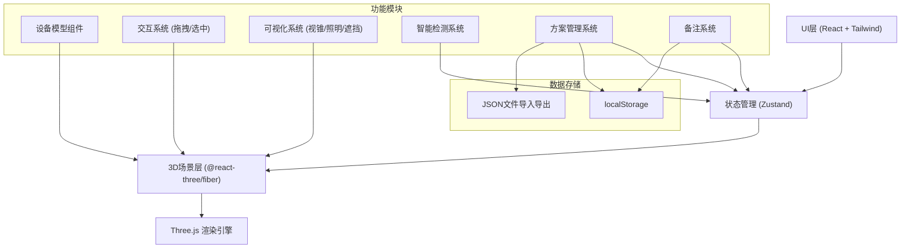

## 1. 架构设计



---

## 2. 技术说明

### 2.1 前端技术栈

| 技术 | 版本 | 用途 |
|------|------|------|
| React | 18.x | 前端框架 |
| TypeScript | 5.x | 类型安全 |
| Vite | 5.x | 构建工具 |
| Tailwind CSS | 3.x | 样式框架 |
| Zustand | 4.x | 状态管理 |
| Three.js | 0.160.x | 3D渲染引擎 |
| @react-three/fiber | 8.x | React Three.js 渲染器 |
| @react-three/drei | 9.x | Three.js 常用组件库 |
| @react-three/postprocessing | 2.x | 后期效果 |
| lucide-react | 0.x | 图标库 |

### 2.2 技术选型说明

- **@react-three/fiber**：将 Three.js 声明式化，与 React 生态完美结合，组件化开发3D场景
- **@react-three/drei**：提供 OrbitControls、网格、辅助线等常用组件，加速开发
- **Zustand**：轻量状态管理，跨组件共享3D场景状态和方案数据
- **localStorage**：本地存储方案和配置，无需后端
- **JSON导入导出**：方案文件标准化，便于团队协作

### 2.3 初始化方式

使用 vite-init 模板初始化 React + TypeScript 项目：
```bash
npm init vite-init@latest -y . -- --template react-ts --force
```

---

## 3. 目录结构

```
src/
├── components/          # React 组件
│   ├── layout/         # 布局组件
│   │   ├── TopToolbar.tsx
│   │   ├── LeftSidebar.tsx
│   │   ├── RightPanel.tsx
│   │   └── BottomBar.tsx
│   ├── devices/        # 设备库组件
│   │   ├── DeviceLibrary.tsx
│   │   └── DeviceCard.tsx
│   ├── properties/     # 属性面板组件
│   │   ├── PropertyPanel.tsx
│   │   ├── NumberInput.tsx
│   │   └── SliderInput.tsx
│   ├── alerts/         # 提示组件
│   │   └── AlertPanel.tsx
│   ├── schemes/        # 方案管理组件
│   │   ├── SchemeModal.tsx
│   │   └── SchemeCard.tsx
│   └── common/         # 通用组件
│       ├── Button.tsx
│       └── Modal.tsx
├── store/              # 状态管理
│   └── useStudioStore.ts
├── three/              # 3D 场景相关
│   ├── StudioCanvas.tsx   # 3D画布主组件
│   ├── devices/           # 3D设备模型
│   │   ├── AnchorZone.tsx
│   │   ├── ProductTable.tsx
│   │   ├── Camera.tsx
│   │   ├── Light.tsx
│   │   └── Cable.tsx
│   ├── helpers/           # 可视化辅助
│   │   ├── CameraFrustum.tsx
│   │   ├── LightCone.tsx
│   │   └── GridFloor.tsx
│   ├── controls/          # 交互控制
│   │   ├── DragControls.tsx
│   │   └── SelectionHighlight.tsx
│   └── hooks/             # 3D相关 hooks
│       ├── useDrag.ts
│       └── useCollision.ts
├── utils/              # 工具函数
│   ├── detection.ts    # 智能检测算法
│   ├── scheme.ts       # 方案序列化
│   └── math.ts         # 数学计算
├── types/              # TypeScript 类型定义
│   ├── device.ts
│   ├── scheme.ts
│   └── alert.ts
├── data/               # 初始数据与常量
│   ├── defaultDevices.ts
│   └── defaultSchemes.ts
├── pages/              # 页面
│   └── StudioPage.tsx  # 主工作台页面
├── App.tsx
├── main.tsx
└── index.css
```

---

## 4. 数据模型

### 4.1 设备类型定义

```typescript
type DeviceType = 'anchor' | 'productTable' | 'camera' | 'light' | 'cable' | 'zone';

interface BaseDevice {
  id: string;
  type: DeviceType;
  name: string;
  position: { x: number; y: number; z: number };
  rotation: { x: number; y: number; z: number };
  scale?: { x: number; y: number; z: number };
  note?: string;
}

interface AnchorDevice extends BaseDevice {
  type: 'anchor';
  size: { width: number; depth: number };
}

interface ProductTableDevice extends BaseDevice {
  type: 'productTable';
  size: { width: number; depth: number; height: number };
}

interface CameraDevice extends BaseDevice {
  type: 'camera';
  fov: number;
  near: number;
  far: number;
  height: number;
  targetId?: string;
}

interface LightDevice extends BaseDevice {
  type: 'light';
  lightType: 'spot' | 'point' | 'area';
  intensity: number;
  color: string;
  height: number;
  angle?: number;
  penumbra?: number;
  targetId?: string;
}

interface CableDevice extends BaseDevice {
  type: 'cable';
  points: { x: number; y: number; z: number }[];
  fromDeviceId?: string;
  toDeviceId?: string;
}

interface ZoneDevice extends BaseDevice {
  type: 'zone';
  zoneType: 'walkway' | 'backstage';
  size: { width: number; depth: number };
  color: string;
}

type StudioDevice = AnchorDevice | ProductTableDevice | CameraDevice | LightDevice | CableDevice | ZoneDevice;
```

### 4.2 方案数据模型

```typescript
interface StudioScheme {
  id: string;
  name: string;
  productType: string;
  description: string;
  createdAt: number;
  updatedAt: number;
  devices: StudioDevice[];
  studioSize: { width: number; depth: number };
}
```

### 4.3 智能提示数据模型

```typescript
type AlertLevel = 'error' | 'warning' | 'info';

interface Alert {
  id: string;
  level: AlertLevel;
  title: string;
  description: string;
  deviceId?: string;
  relatedDeviceIds?: string[];
  suggestion?: string;
}
```

---

## 5. 核心模块设计

### 5.1 状态管理 (Zustand Store)

```typescript
interface StudioState {
  // 场景数据
  devices: StudioDevice[];
  selectedId: string | null;
  studioSize: { width: number; depth: number };
  
  // 当前方案
  currentScheme: StudioScheme | null;
  
  // 方案列表
  schemes: StudioScheme[];
  
  // 智能提示
  alerts: Alert[];
  
  // 视图设置
  showFrustum: boolean;
  showLightRange: boolean;
  showGrid: boolean;
  
  // 操作
  addDevice: (device: StudioDevice) => void;
  removeDevice: (id: string) => void;
  updateDevice: (id: string, updates: Partial<StudioDevice>) => void;
  selectDevice: (id: string | null) => void;
  
  // 方案管理
  saveScheme: (name: string, productType: string) => void;
  loadScheme: (id: string) => void;
  deleteScheme: (id: string) => void;
  exportScheme: (id: string) => string;
  importScheme: (json: string) => void;
  
  // 智能检测
  runDetection: () => void;
}
```

### 5.2 智能检测算法

检测项目：
1. **相机距离检测**：相机与主播/商品台距离过近/过远
2. **遮挡检测**：相机视锥被其他设备遮挡
3. **灯架高度检测**：灯光高度不合适（过低/过高）
4. **主播动线检测**：主播区到商品台距离过远
5. **线缆通道检测**：线缆穿过通道区域
6. **光照重叠检测**：多灯照明范围重叠浪费
7. **设备碰撞检测**：设备位置重叠

### 5.3 拖拽交互

使用 Three.js Raycaster 实现：
- 鼠标悬停高亮
- 点击选中设备
- 拖拽移动设备（沿地平面）
- 网格吸附（可选）
- 高度调节手柄

---

## 6. 路由定义

| 路由 | 页面 | 说明 |
|------|------|------|
| `/` | StudioPage | 主工作台（单页应用，主要页面） |

> 本项目为单页工具应用，使用单一路由，所有功能在主工作台内完成。

---

## 7. 方案存储格式

### 7.1 导出格式 (JSON)

```json
{
  "version": "1.0",
  "scheme": {
    "id": "scheme-xxx",
    "name": "美妆全身直播方案",
    "productType": "美妆",
    "description": "适合美妆类商品，全身+细节双机位",
    "studioSize": { "width": 10, "depth": 8 },
    "devices": [...]
  }
}
```

### 7.2 本地存储

- Key: `studio_schemes` - 方案列表
- Key: `studio_current_scheme` - 当前方案ID
- Key: `studio_settings` - 用户设置

---

## 8. 性能优化策略

1. **3D渲染优化**：
   - 设备模型使用低多边形几何体
   - 灯光使用阴影贴图缓存
   - 视锥和照明范围使用 ShaderMaterial 减少绘制调用

2. **React 渲染优化**：
   - 使用 React.memo 避免不必要重渲染
   - Zustand 选择器订阅最小化状态
   - 拖拽使用 requestAnimationFrame 节流

3. **内存管理**：
   - 设备移除时清理 Three.js 资源
   - 纹理和几何体复用
