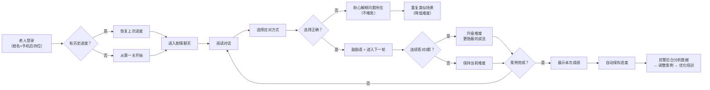

## 1. 产品概述

社区防诈骗剧情课是一款面向老年人的互动式防诈骗教育游戏，通过模拟真实聊天场景让老人在游戏中学习识别诈骗手段。产品解决传统PPT教育"听过就忘"的问题，让老人在沉浸式剧情中掌握防骗技能，同时为民警提供案例管理和数据分析能力。

- **目标用户**：社区老年人（60岁+）、社区民警、社工
- **核心价值**：用游戏化方式提升老人防诈骗意识，用数据驱动优化社区防骗培训效果

## 2. 核心功能

### 2.1 用户角色

| 角色 | 登录方式 | 核心权限 |
|------|----------|----------|
| 老人用户 | 姓名+手机号后四位 | 玩剧情游戏、保存/恢复进度、查看个人学习记录 |
| 社区民警 | 账号密码登录 | 管理案例库、调整案例顺序、查看数据分析报表、导出培训数据、按年龄段分析 |
| 社工 | 账号密码登录 | 查看重点老人学习情况、跟进记录、添加备注 |

### 2.2 功能模块

1. **老人游戏端**：剧情聊天界面、选项选择、即时反馈、进度保存
2. **案例管理系统**：案例增删改查、案例排序、案例分类管理
3. **数据分析中心**：中招率统计、年龄段易错分析、骗局类型排名、数据导出
4. **社工跟进模块**：重点老人标记、跟进记录、学习情况查看
5. **进度管理系统**：游戏进度自动保存、断点续玩

### 2.3 页面详情

| 页面名称 | 模块名称 | 功能描述 |
|----------|----------|----------|
| 登录选择页 | 角色选择 | 选择"老人开始游戏"或"工作人员登录" |
| 老人首页 | 欢迎界面 | 大字体欢迎语、开始/继续游戏按钮、个人进度展示 |
| 剧情游戏页 | 聊天界面 | 模拟微信/短信聊天、消息气泡、选项按钮、反馈弹窗 |
| 游戏结果页 | 成绩展示 | 本次正确率、易错点提醒、鼓励语、保存进度 |
| 民警登录页 | 登录表单 | 账号密码输入、登录验证 |
| 案例管理页 | 案例列表 | 案例分类展示、拖拽排序、添加/编辑/删除按钮 |
| 案例编辑页 | 表单编辑 | 案例标题、对话内容、选项设置、正确答案、解释文案 |
| 数据分析页 | 数据报表 | 中招率排行饼图、年龄段分析柱状图、时间趋势折线图 |
| 社工管理页 | 老人列表 | 重点老人标记、学习记录查看、跟进记录添加 |

## 3. 核心流程

### 3.1 老人游戏流程
老人进入首页 → 输入姓名和手机后四位 → 系统加载历史进度（如有）→ 进入剧情聊天 → 根据对话选择选项 → 系统即时反馈（正确鼓励/错误耐心解释）→ 继续下一轮对话 → 完成后展示成绩 → 自动保存进度

### 3.2 民警管理流程
民警登录 → 进入管理后台 → 查看案例列表 → 添加/编辑本地真实案例 → 调整案例顺序 → 查看数据分析报表 → 导出易中招骗局统计 → 根据年龄段分析调整培训重点

### 3.3 社工跟进流程
社工登录 → 查看社区老人列表 → 标记重点关注老人 → 查看老人游戏记录和易错点 → 添加跟进记录和备注 → 下次培训重点提醒

### 3.4 核心流程图

## 4. 用户界面设计

### 4.1 设计风格

**老人端（重点）**：
- **主色调**：温暖的橙色（#FF7A45）搭配深绿（#2E7D32），橙色代表活力和警示，绿色代表安全
- **辅助色**：明黄（#FFD54F）用于重要提示，深红（#C62828）用于危险警告
- **字体**：超大号字体（最小20px），选择易读的无衬线字体，加粗显示
- **按钮**：圆角大按钮（最小高度60px），充足的点击区域，清晰的文字
- **布局**：卡片式布局，大间距，避免信息拥挤
- **交互**：点击反馈明显，避免复杂手势操作

**管理端**：
- **主色调**：深蓝（#1565C0）搭配白色，专业稳重
- **字体**：清晰的中文字体，常规大小
- **布局**：侧边栏导航 + 内容区，数据可视化清晰

### 4.2 页面设计概览

| 页面名称 | 模块名称 | UI元素 |
|----------|----------|--------|
| 登录选择页 | 角色卡片 | 两大卡片："我是老人，开始学习"（橙色大按钮）、"我是工作人员"（蓝色按钮） |
| 剧情游戏页 | 聊天界面 | 仿微信聊天界面，对方消息在左（灰色气泡），老人选项在底部（大按钮），正确反馈绿色边框弹窗，错误反馈黄色边框弹窗（温和提醒） |
| 案例管理页 | 案例列表 | 卡片列表展示，拖拽排序手柄，编辑/删除图标，分类标签（冒充客服/投资群/假冒亲友/验证码/链接诈骗） |
| 数据分析页 | 图表区域 | 饼图展示各类型骗局中招率，柱状图展示不同年龄段易错点，表格展示详细数据，导出按钮 |

### 4.3 响应式设计
- 老人端：优先适配平板和手机端，触摸操作优化，按钮最小48x48px
- 管理端：桌面端优先，适配常见1920x1080分辨率
- 整体采用弹性布局，确保在不同设备上都有良好体验

### 4.4 老人端特殊优化
- **高对比度**：文字与背景对比度不低于4.5:1，符合无障碍标准
- **语音支持**：重要文字可点击朗读
- **避免闪烁**：不使用快速闪烁的动画
- **操作确认**：重要操作（如返回）需要二次确认
- **错误反馈**：温和的提醒，不使用"你错了"之类的负面词汇，而是"我们来看看哪里需要注意..."
