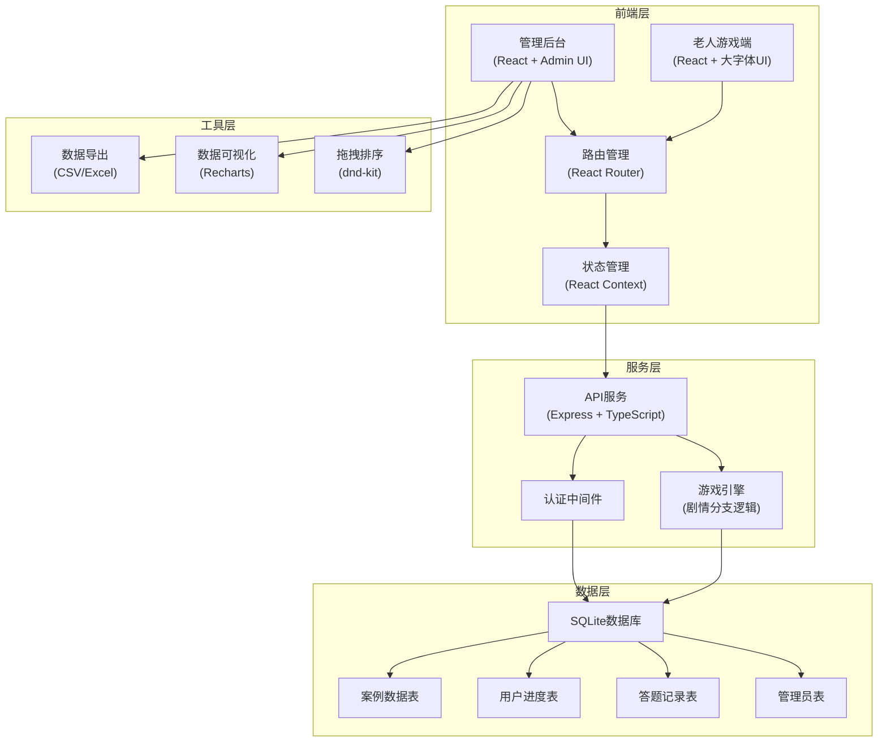
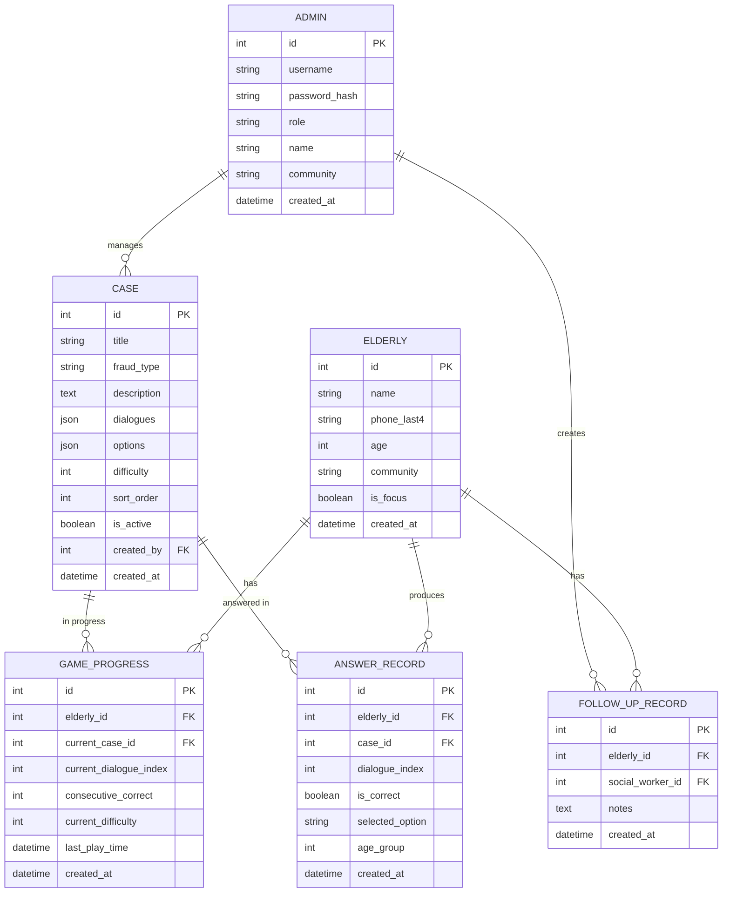

## 1. 架构设计



## 2. 技术选型

| 层级 | 技术栈 | 版本 | 说明 |
|------|--------|------|------|
| 前端框架 | React | 18.x | 组件化开发，生态成熟 |
| 前端语言 | TypeScript | 5.x | 类型安全，便于维护 |
| 构建工具 | Vite | 5.x | 快速开发体验 |
| 样式方案 | Tailwind CSS | 3.x | 快速构建大字体无障碍UI |
| 路由管理 | React Router | 6.x | 单页应用路由 |
| 图表库 | Recharts | 2.x | React友好的数据可视化 |
| 拖拽库 | @dnd-kit/core | 6.x | 案例拖拽排序 |
| 后端框架 | Express | 4.x | 轻量级API服务 |
| 后端语言 | TypeScript | 5.x | 前后端类型一致 |
| 数据库 | SQLite | 3.x | 轻量级，无需独立部署，适合社区场景 |
| ORM | better-sqlite3 | 9.x | 高性能SQLite驱动 |
| 认证 | bcrypt + JWT | - | 密码哈希 + 令牌认证 |
| 数据导出 | csv-writer | - | CSV格式数据导出 |

## 3. 目录结构

```
yzz100443/
├── client/                    # 前端应用
│   ├── src/
│   │   ├── components/        # 公共组件
│   │   │   ├── elderly/       # 老人端组件
│   │   │   └── admin/         # 管理端组件
│   │   ├── pages/             # 页面组件
│   │   │   ├── elderly/       # 老人端页面
│   │   │   └── admin/         # 管理端页面
│   │   ├── context/           # 状态管理
│   │   ├── hooks/             # 自定义Hooks
│   │   ├── services/          # API服务
│   │   ├── types/             # TypeScript类型定义
│   │   └── utils/             # 工具函数
│   └── package.json
├── server/                    # 后端服务
│   ├── src/
│   │   ├── controllers/       # 控制器
│   │   ├── services/          # 业务逻辑
│   │   ├── models/            # 数据模型
│   │   ├── routes/            # 路由定义
│   │   ├── middleware/        # 中间件
│   │   ├── types/             # 类型定义
│   │   └── database/          # 数据库初始化
│   └── package.json
├── .trae/
│   └── documents/             # 项目文档
└── package.json               # 根目录脚本
```

## 4. 路由定义

### 前端路由

| 路由路径 | 页面 | 权限 | 说明 |
|----------|------|------|------|
| `/` | 角色选择页 | 公开 | 选择老人/工作人员入口 |
| `/elderly/login` | 老人登录页 | 公开 | 输入姓名+手机后四位 |
| `/elderly/home` | 老人首页 | 老人 | 欢迎页，开始/继续游戏 |
| `/elderly/game` | 剧情游戏页 | 老人 | 核心游戏界面 |
| `/elderly/result` | 游戏结果页 | 老人 | 成绩展示与鼓励 |
| `/admin/login` | 管理员登录页 | 公开 | 民警/社工登录 |
| `/admin/dashboard` | 数据概览 | 民警/社工 | 数据报表总览 |
| `/admin/cases` | 案例管理 | 民警 | 案例增删改查、排序 |
| `/admin/cases/new` | 新建案例 | 民警 | 案例编辑表单 |
| `/admin/cases/:id/edit` | 编辑案例 | 民警 | 案例编辑表单 |
| `/admin/analytics` | 数据分析 | 民警 | 中招率、年龄段分析 |
| `/admin/elderly` | 老人管理 | 社工 | 重点老人跟进 |

### 后端API路由

| 方法 | 路径 | 模块 | 说明 |
|------|------|------|------|
| POST | `/api/elderly/login` | 老人模块 | 老人登录（姓名+手机后四位） |
| GET | `/api/elderly/:id/progress` | 老人模块 | 获取老人游戏进度 |
| POST | `/api/elderly/:id/progress` | 老人模块 | 保存游戏进度 |
| POST | `/api/elderly/:id/answer` | 老人模块 | 提交答题记录 |
| GET | `/api/cases` | 案例模块 | 获取案例列表（按排序） |
| GET | `/api/cases/:id` | 案例模块 | 获取单案例详情 |
| POST | `/api/cases` | 案例模块 | 新建案例 |
| PUT | `/api/cases/:id` | 案例模块 | 更新案例 |
| DELETE | `/api/cases/:id` | 案例模块 | 删除案例 |
| POST | `/api/cases/reorder` | 案例模块 | 重新排序案例 |
| GET | `/api/analytics/fraud-types` | 分析模块 | 各类型骗局中招率 |
| GET | `/api/analytics/age-groups` | 分析模块 | 年龄段易错分析 |
| GET | `/api/analytics/export` | 分析模块 | 导出数据CSV |
| GET | `/api/social-worker/elderly` | 社工模块 | 获取老人列表 |
| POST | `/api/social-worker/follow-up` | 社工模块 | 添加跟进记录 |
| POST | `/api/admin/login` | 管理员模块 | 民警/社工登录 |

## 5. 数据模型

### 5.1 ER图



### 5.2 数据库初始化DDL

```sql
-- 老人表
CREATE TABLE elderly (
    id INTEGER PRIMARY KEY AUTOINCREMENT,
    name VARCHAR(100) NOT NULL,
    phone_last4 VARCHAR(4) NOT NULL,
    age INTEGER,
    community VARCHAR(200),
    is_focus BOOLEAN DEFAULT 0,
    created_at DATETIME DEFAULT CURRENT_TIMESTAMP,
    UNIQUE(name, phone_last4)
);

-- 管理员表（民警/社工）
CREATE TABLE admin (
    id INTEGER PRIMARY KEY AUTOINCREMENT,
    username VARCHAR(50) UNIQUE NOT NULL,
    password_hash VARCHAR(255) NOT NULL,
    role VARCHAR(20) NOT NULL CHECK(role IN ('police', 'social_worker')),
    name VARCHAR(100) NOT NULL,
    community VARCHAR(200),
    created_at DATETIME DEFAULT CURRENT_TIMESTAMP
);

-- 案例表
CREATE TABLE cases (
    id INTEGER PRIMARY KEY AUTOINCREMENT,
    title VARCHAR(200) NOT NULL,
    fraud_type VARCHAR(50) NOT NULL,
    description TEXT,
    dialogues JSON NOT NULL,
    options JSON NOT NULL,
    difficulty INTEGER DEFAULT 1,
    sort_order INTEGER DEFAULT 0,
    is_active BOOLEAN DEFAULT 1,
    created_by INTEGER,
    created_at DATETIME DEFAULT CURRENT_TIMESTAMP,
    FOREIGN KEY (created_by) REFERENCES admin(id)
);

-- 游戏进度表
CREATE TABLE game_progress (
    id INTEGER PRIMARY KEY AUTOINCREMENT,
    elderly_id INTEGER NOT NULL,
    current_case_id INTEGER,
    current_dialogue_index INTEGER DEFAULT 0,
    consecutive_correct INTEGER DEFAULT 0,
    current_difficulty INTEGER DEFAULT 1,
    last_play_time DATETIME,
    created_at DATETIME DEFAULT CURRENT_TIMESTAMP,
    FOREIGN KEY (elderly_id) REFERENCES elderly(id),
    FOREIGN KEY (current_case_id) REFERENCES cases(id),
    UNIQUE(elderly_id)
);

-- 答题记录表
CREATE TABLE answer_records (
    id INTEGER PRIMARY KEY AUTOINCREMENT,
    elderly_id INTEGER NOT NULL,
    case_id INTEGER NOT NULL,
    dialogue_index INTEGER NOT NULL,
    is_correct BOOLEAN NOT NULL,
    selected_option TEXT NOT NULL,
    age_group VARCHAR(20),
    created_at DATETIME DEFAULT CURRENT_TIMESTAMP,
    FOREIGN KEY (elderly_id) REFERENCES elderly(id),
    FOREIGN KEY (case_id) REFERENCES cases(id)
);

-- 跟进记录表
CREATE TABLE follow_up_records (
    id INTEGER PRIMARY KEY AUTOINCREMENT,
    elderly_id INTEGER NOT NULL,
    social_worker_id INTEGER NOT NULL,
    notes TEXT NOT NULL,
    created_at DATETIME DEFAULT CURRENT_TIMESTAMP,
    FOREIGN KEY (elderly_id) REFERENCES elderly(id),
    FOREIGN KEY (social_worker_id) REFERENCES admin(id)
);

-- 索引
CREATE INDEX idx_answer_elderly ON answer_records(elderly_id);
CREATE INDEX idx_answer_case ON answer_records(case_id);
CREATE INDEX idx_answer_age ON answer_records(age_group);
CREATE INDEX idx_cases_sort ON cases(sort_order);
CREATE INDEX idx_follow_elderly ON follow_up_records(elderly_id);
```

## 6. 核心数据结构

### 6.1 案例对话结构

```typescript
interface Dialogue {
  id: number;
  speaker: 'scammer' | 'elderly' | 'system';
  content: string;
  delay?: number; // 消息显示延迟（毫秒）
}

interface Option {
  id: string;
  text: string;
  isCorrect: boolean;
  feedback: {
    title: string;
    content: string;
    explanation: string; // 解释哪里不对劲
  };
}

interface CaseData {
  id: number;
  title: string;
  fraudType: 'fake_service' | 'investment' | 'fake_relative' | 'verification_code' | 'malicious_link';
  difficulty: 1 | 2 | 3;
  dialogues: Dialogue[];
  options: Option[];
  correctAnswerId: string;
  warningPoints: string[]; // 本案例的防骗要点
}
```

### 6.2 游戏状态结构

```typescript
interface GameState {
  elderlyId: number;
  currentCase: CaseData | null;
  currentDialogueIndex: number;
  displayedDialogues: Dialogue[];
  showOptions: boolean;
  selectedOption: Option | null;
  showFeedback: boolean;
  consecutiveCorrect: number;
  currentDifficulty: number;
  totalCorrect: number;
  totalQuestions: number;
}
```

## 7. 核心算法

### 7.1 难度递进算法

```typescript
function adjustDifficulty(
  consecutiveCorrect: number,
  currentDifficulty: number
): number {
  if (consecutiveCorrect >= 3 && currentDifficulty < 3) {
    return currentDifficulty + 1;
  }
  if (consecutiveCorrect === 0 && currentDifficulty > 1) {
    return currentDifficulty - 1;
  }
  return currentDifficulty;
}
```

### 7.2 年龄段分组

```typescript
function getAgeGroup(age: number): string {
  if (age < 60) return '60岁以下';
  if (age < 70) return '60-69岁';
  if (age < 80) return '70-79岁';
  return '80岁以上';
}
```

### 7.3 中招率计算

```typescript
function calculateFraudRate(records: AnswerRecord[]): Map<string, number> {
  const typeStats = new Map<string, { total: number; incorrect: number }>();
  
  records.forEach(record => {
    const existing = typeStats.get(record.fraudType) || { total: 0, incorrect: 0 };
    existing.total++;
    if (!record.isCorrect) existing.incorrect++;
    typeStats.set(record.fraudType, existing);
  });
  
  const rates = new Map<string, number>();
  typeStats.forEach((stats, type) => {
    rates.set(type, stats.total > 0 ? (stats.incorrect / stats.total) * 100 : 0);
  });
  
  return rates;
}
```

## 8. 初始化数据

### 默认管理员账号（初始化时插入）
- 民警账号：`police` / `123456`
- 社工账号：`social` / `123456`

### 初始案例（5大诈骗类型，各2个难度级别）
1. 冒充客服类 - 2个案例
2. 投资群诈骗类 - 2个案例  
3. 假冒亲友类 - 2个案例
4. 验证码诈骗类 - 2个案例
5. 恶意链接类 - 2个案例

共10个初始案例，覆盖所有诈骗场景。
