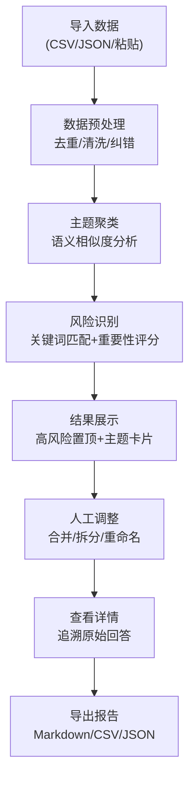

## 1. 产品概述
面向市场研究员的问卷开放题智能归并分析工具，解决数千条散乱回答难以快速归类提炼的痛点。通过自动主题聚类、风险识别置顶、人工调整等功能，帮助研究员高效完成开放题分析，输出产品经理可理解的摘要报告，同时保留追溯原始回答的能力。

- **核心价值**：将散乱的开放题回答自动化聚类，保留代表性原话，确保低频但高风险意见不被淹没，支持人工调整并导出专业报告
- **目标用户**：市场研究员、用户研究团队、产品经理
- **解决痛点**：词云无法体现语义归类、重要风险被高频普通意见淹没、人工归类效率低、难以追溯原始回答

## 2. 核心功能

### 2.1 用户角色
| 角色 | 使用场景 | 核心需求 |
|------|---------|---------|
| 市场研究员 | 导入数据、聚类分析、人工调整、导出报告 | 高效归类、风险置顶、追溯原始、可导出 |
| 产品经理 | 查看分析报告、了解用户意见 | 清晰易懂、重点突出、可追溯详情 |

### 2.2 功能模块
1. **数据导入页**：支持CSV/JSON文件导入、粘贴文本导入、示例数据加载
2. **聚类分析页**：自动主题聚类、风险识别置顶、主题卡片展示、数量统计
3. **人工调整页**：合并主题、拆分主题、重命名主题、调整代表原话、置顶/取消置顶
4. **详情查看页**：单主题所有回答列表、原始回答追溯、关键词高亮
5. **报告导出页**：Markdown/CSV/JSON导出、摘要报告生成

### 2.3 页面详情
| 页面名称 | 模块名称 | 功能描述 |
|---------|---------|----------|
| 数据导入页 | 导入区域 | 拖拽上传CSV/JSON、粘贴文本区、示例数据按钮、导入进度显示 |
| 数据导入页 | 数据预览 | 导入后数据列表预览、去重统计、清洗规则配置 |
| 聚类分析页 | 聚类控制 | 聚类敏感度调节、重新聚类按钮、风险关键词配置 |
| 聚类分析页 | 置顶主题区 | 高风险/重要主题独立展示区、醒目标识 |
| 聚类分析页 | 主题卡片列表 | 主题名称、回答数量、占比饼图、3条代表原话、操作按钮 |
| 人工调整页 | 主题管理 | 拖拽合并主题、点击拆分主题、编辑主题名称 |
| 人工调整页 | 回答分配 | 单条回答拖拽移动到其他主题、批量选择移动 |
| 详情查看页 | 回答列表 | 分页展示所有回答、关键词高亮、显示用户ID/时间 |
| 报告导出页 | 导出配置 | 选择导出格式、选择包含内容、生成预览 |

## 3. 核心流程
1. 研究员导入开放题回答数据（支持文件上传或粘贴）
2. 系统自动进行数据预处理：去重、清洗表情、修正常见错别字
3. 系统进行主题聚类，同时识别高风险关键词标记重要意见
4. 系统将高风险/重要意见自动置顶，避免被高频普通主题淹没
5. 研究员查看聚类结果，可进行人工调整：合并、拆分、重命名主题
6. 研究员可查看任一主题下的所有原始回答，追溯详情
7. 研究员导出分析报告，包含各主题摘要、代表原话、风险提示

## 4. 用户界面设计

### 4.1 设计风格
- **主色调**：深海蓝 #1e3a5f（专业、可信赖），搭配警示橙 #ff6b35（风险标识）、成功绿 #10b981（中性/正面）
- **次色调**：浅灰蓝 #f1f5f9（背景）、深灰 #334155（文字）、中灰 #64748b（辅助文字）
- **按钮风格**：圆角8px，悬停有细微阴影和颜色加深效果，主要按钮使用渐变蓝
- **字体**：标题使用 "Noto Serif SC"（专业学术感），正文使用 "Noto Sans SC"（清晰易读）
- **布局风格**：卡片式布局，主题卡片使用白色背景+细微阴影，高风险卡片使用橙色边框+警示图标
- **图标风格**：使用 Lucide 图标，保持统一线性风格

### 4.2 页面设计概述
| 页面名称 | 模块名称 | UI 元素 |
|---------|---------|---------|
| 数据导入页 | 导入区域 | 大尺寸虚线拖拽区、渐变上传按钮、三栏切换（文件/粘贴/示例）、柔和阴影效果 |
| 聚类分析页 | 置顶主题区 | 橙色边框卡片、醒目的"⚠️ 重要风险"标签、加粗字体、数量红色高亮 |
| 聚类分析页 | 主题卡片 | 白色卡片、顶部主题名称+数量标签、中部3条代表原话（缩进显示）、底部操作按钮组 |
| 人工调整页 | 拖拽区域 | 拖拽时半透明效果、放置区域高亮、合并时显示"+"提示动画 |
| 详情查看页 | 回答列表 | 斑马纹背景、关键词黄色高亮、悬停显示完整内容、右侧操作按钮 |

### 4.3 响应式设计
- **桌面端优先**：主要面向PC端使用，1200px以上最佳展示
- **平板适配**：900-1200px，主题卡片改为2列布局，侧边栏收起
- **移动适配**：900px以下，单列布局，顶部导航改为汉堡菜单
- **触摸优化**：按钮最小高度44px，拖拽操作支持触摸滑动

### 4.4 动效设计
- **页面加载**：卡片从下往上淡入，依次延迟50ms，营造有序感
- **聚类动画**：聚类进度条渐变色流动，完成后数字滚动动画
- **拖拽交互**：拖拽时卡片缩放95%+半透明，放置目标区域高亮边框
- **风险标识**：高风险卡片轻微呼吸动画（透明度变化），吸引注意力
- **导出动画**：导出按钮点击后旋转加载，完成后显示对勾并自动下载

### 4.5 数据可视化
- 各主题数量占比使用小型环形图（卡片右上角）
- 情感倾向分布使用横向柱状图（正面/中性/负面）
- 聚类前后数量变化使用对比条形图
- 置顶风险使用红色预警标识，数量使用大号字体
