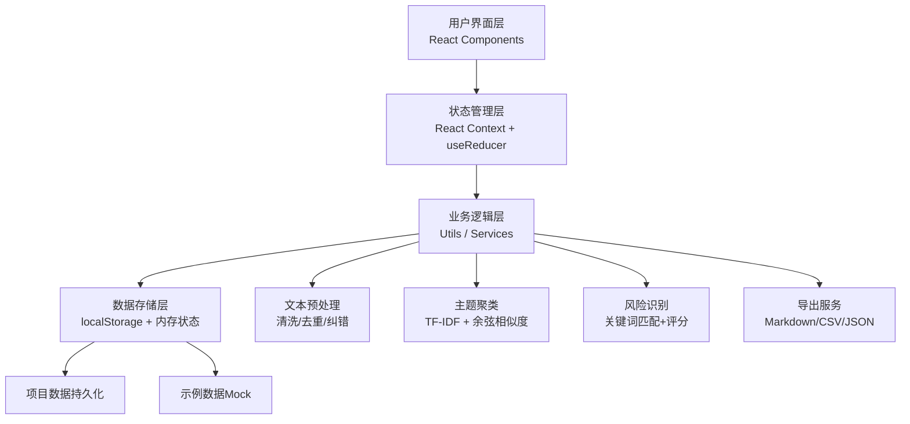
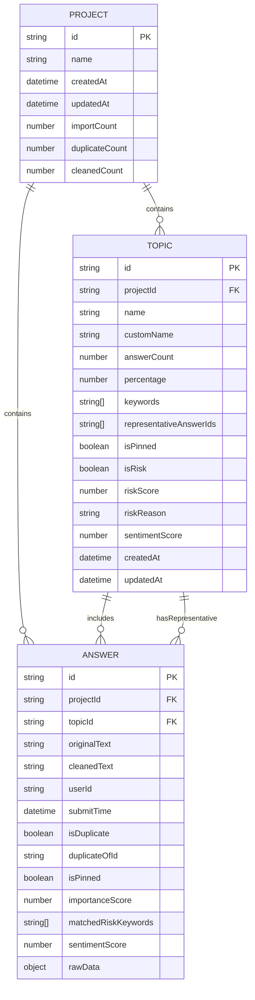

## 1. 架构设计

本项目为纯前端单页应用，所有数据处理均在浏览器端完成，无需后端服务。数据存储使用浏览器 localStorage 实现本地持久化。



## 2. 技术描述

- **前端框架**：React@18 + TypeScript@5
- **构建工具**：Vite@5
- **样式方案**：TailwindCSS@3.4 + CSS Variables
- **状态管理**：React Context + useReducer（轻量级，无需 Redux）
- **路由管理**：React Router DOM@6
- **图标库**：Lucide React
- **拖拽交互**：@dnd-kit/core + @dnd-kit/sortable
- **图表可视化**：Recharts
- **中文分词**：@node-rs/jieba-wasm（WebAssembly，浏览器端运行）
- **文本相似度**：自己实现 TF-IDF + 余弦相似度算法
- **后端服务**：无（纯前端应用）
- **数据库**：浏览器 localStorage

## 3. 目录结构

```
src/
├── types/              # TypeScript 类型定义
│   └── index.ts
├── context/            # React Context 状态管理
│   └── ProjectContext.tsx
├── utils/              # 工具函数
│   ├── preprocess.ts   # 文本预处理（清洗、去重、纠错）
│   ├── clustering.ts   # 主题聚类算法
│   ├── riskDetection.ts # 风险识别与评分
│   ├── export.ts       # 导出功能
│   └── storage.ts      # localStorage 操作
├── components/         # 组件
│   ├── layout/         # 布局组件（Header、Sidebar）
│   ├── import/         # 数据导入组件
│   ├── clustering/     # 聚类结果展示组件
│   ├── topic/          # 主题卡片组件
│   ├── detail/         # 详情查看组件
│   ├── export/         # 导出组件
│   └── common/         # 通用组件（Button、Modal等）
├── pages/              # 页面组件
│   ├── ImportPage.tsx
│   ├── AnalysisPage.tsx
│   └── ExportPage.tsx
├── data/               # 静态数据
│   ├── sampleData.ts   # 示例数据
│   ├── typos.ts        # 常见错别字映射
│   └── riskKeywords.ts # 风险关键词库
├── App.tsx
├── main.tsx
└── index.css
```

## 4. 路由定义

| 路由 | 页面 | 用途 |
|------|------|------|
| `/` | ImportPage | 数据导入页面，默认首页 |
| `/analysis` | AnalysisPage | 聚类分析与人工调整页面 |
| `/export` | ExportPage | 报告导出页面 |
| `/topic/:id` | TopicDetailPage | 单主题详情查看页面 |

## 5. 数据模型

### 5.1 核心数据结构



### 5.2 TypeScript 类型定义

```typescript
// 回答数据
interface Answer {
  id: string;
  projectId: string;
  topicId: string | null;
  originalText: string;
  cleanedText: string;
  userId?: string;
  submitTime?: Date;
  isDuplicate: boolean;
  duplicateOfId?: string;
  isPinned: boolean;
  importanceScore: number;
  matchedRiskKeywords: string[];
  sentimentScore: number; // -1 负面, 0 中性, 1 正面
  rawData?: Record<string, any>;
}

// 主题聚类
interface Topic {
  id: string;
  projectId: string;
  name: string;
  customName?: string;
  answerCount: number;
  percentage: number;
  keywords: string[];
  representativeAnswerIds: string[];
  isPinned: boolean;
  isRisk: boolean;
  riskScore: number;
  riskReason: string;
  sentimentScore: number;
  createdAt: Date;
  updatedAt: Date;
}

// 项目
interface Project {
  id: string;
  name: string;
  createdAt: Date;
  updatedAt: Date;
  importCount: number;
  duplicateCount: number;
  cleanedCount: number;
  answers: Answer[];
  topics: Topic[];
  settings: ProjectSettings;
}

// 项目设置
interface ProjectSettings {
  clusteringSensitivity: number; // 0-1, 越高分类越细
  riskKeywords: string[];
  enableTypoCorrection: boolean;
  enableEmojiRemoval: boolean;
  minAnswerLength: number;
}

// 聚类结果
interface ClusteringResult {
  topics: Topic[];
  answers: Answer[];
  processingTime: number;
  stats: {
    totalAnswers: number;
    clusteredAnswers: number;
    unclusteredAnswers: number;
    riskTopics: number;
    riskAnswers: number;
  };
}
```

## 6. 核心算法设计

### 6.1 文本预处理流程
1. **表情过滤**：使用正则匹配并移除 emoji 表情符号
2. **去重处理**：计算文本相似度，相似度 > 0.95 标记为重复
3. **错别字修正**：基于预定义的常见错别字映射表进行替换
4. **长短句过滤**：过滤过短（< 3字）和过长（> 500字）的异常回答
5. **格式规范化**：统一全角半角、去除多余空格和换行

### 6.2 主题聚类算法
1. **中文分词**：使用 jieba-wasm 对清洗后的文本进行分词
2. **停用词过滤**：过滤常用停用词（的、了、是等）
3. **TF-IDF 计算**：计算每个词的 TF-IDF 权重
4. **余弦相似度**：计算回答之间的余弦相似度矩阵
5. **层次聚类**：使用层次聚类算法，根据设定的敏感度阈值进行聚类
6. **主题命名**：提取每个聚类中 TF-IDF 权重最高的 3-5 个词作为主题关键词，自动生成主题名称

### 6.3 风险识别与评分
1. **关键词匹配**：匹配预定义的风险关键词库（安全、健康、法律等）
2. **严重程度评分**：
   - 高风险（安全、健康）：+3 分
   - 中风险（售后、质量）：+2 分
   - 低风险（体验、建议）：+1 分
3. **情感倾向**：负面情感 +1 分
4. **置顶规则**：
   - 风险评分 >= 3 分 → 自动置顶
   - 包含高风险关键词 → 自动置顶
   - 数量虽少但风险等级高 → 独立置顶区域展示

### 6.4 代表原话选择
1. **长度优先**：选择长度适中（20-100字）的回答
2. **关键词覆盖**：选择包含最多主题关键词的回答
3. **多样性**：确保代表原话之间语义有差异，不完全重复
4. **情感均衡**：尽量覆盖不同情感倾向的回答

## 7. 性能优化策略

1. **WebWorker 处理**：聚类算法在 WebWorker 中运行，避免阻塞主线程
2. **增量更新**：人工调整时只重新计算受影响的部分，不全局重算
3. **虚拟滚动**：回答列表使用虚拟滚动，支持万级数据流畅展示
4. **防抖节流**：聚类敏感度调节使用防抖，避免频繁重算
5. **懒加载**：图表和详情面板按需加载

## 8. 数据安全

1. **本地存储**：所有数据仅存储在用户浏览器 localStorage，不上传服务器
2. **数据导出**：导出文件可选择加密（密码保护）
3. **项目删除**：支持彻底删除项目数据，不可恢复
4. **隐私保护**：导入时可选择自动脱敏用户ID等敏感信息
