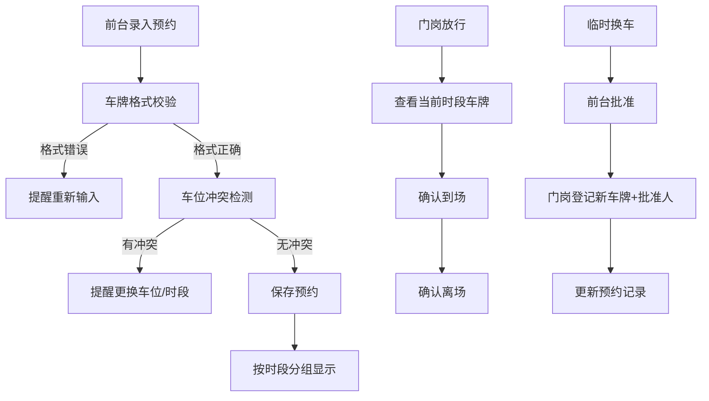

## 1. 产品概述

产业园访客车位管理系统，解决园区访客车位紧张、人工登记效率低、临时换车放行难等问题。面向前台行政、门岗安保两类核心用户，实现预约登记、智能提醒、放行管理、数据统计的全流程数字化。

## 2. 核心功能

### 2.1 用户角色

| 角色 | 登录方式 | 核心权限 |
|------|----------|----------|
| 前台行政 | 本地身份选择 | 预约登记、编辑/取消预约、车牌变更审批、打印放行单、导出统计报表 |
| 门岗安保 | 本地身份选择 | 查看当前时段可放行车牌、确认到场/离场、临时换车登记、交接复核 |

### 2.2 功能模块

1. **预约管理页**：预约录入表单、预约列表（分组显示）、智能提醒
2. **门岗放行页**：当前时段可放行车牌、到场/离场确认、临时换车登记
3. **统计导出页**：超时占位统计、高频来访公司统计、数据导出
4. **安保交接页**：交接记录、未处理事项复核

### 2.3 页面详情

| 页面名称 | 模块名称 | 功能描述 |
|-----------|-------------|---------------------|
| 预约管理页 | 预约录入表单 | 录入来访单位、被访人、车牌（格式校验）、预约时段、车位、备注；支持日期选择 |
| 预约管理页 | 预约列表 | 按上午、下午、已到场、超时四个分组展示预约卡片 |
| 预约管理页 | 智能提醒 | 车牌格式错误、车位时间重叠、未到占全天、车牌临时变更四类提醒 |
| 预约管理页 | 操作区 | 打印放行单、编辑/取消预约、车牌变更审批 |
| 门岗放行页 | 可放行车牌列表 | 按当前时段筛选可放行车牌，显示来访单位、被访人、车位信息 |
| 门岗放行页 | 到场/离场管理 | 一键确认到场/离场，自动记录时间 |
| 门岗放行页 | 临时换车 | 输入新车牌、选择批准人，记录变更历史 |
| 统计导出页 | 超时占位统计 | 统计超时未离场车辆，显示占用时长 |
| 统计导出页 | 高频来访统计 | 按来访单位统计来访频次，支持排序 |
| 统计导出页 | 数据导出 | 导出CSV格式报表 |
| 安保交接页 | 交接记录 | 记录交接时间、交接人、未处理事项 |
| 安保交接页 | 事项复核 | 列出待复核事项，支持标记已处理 |

## 3. 核心流程

### 3.1 预约登记流程
前台选择日期 → 填写来访信息 → 系统校验车牌格式 → 系统检测车位冲突 → 保存预约 → 分组显示

### 3.2 门岗放行流程
门岗选择当前时段 → 查看可放行车牌 → 车辆到达 → 确认到场 → 车辆离开 → 确认离场

### 3.3 临时换车流程
访客联系前台 → 前台批准 → 门岗登记新车牌 → 录入批准人 → 更新预约信息 → 显示变更记录

## 4. 用户界面设计

### 4.1 设计风格
- **主色调**：深蓝(#1e3a5f) + 橙色(#f59e0b)，专业稳重兼具辨识度
- **按钮风格**：圆角8px，悬停微上浮，点击反馈明显
- **字体**：标题用"Noto Sans SC"，正文用系统无衬线字体
- **布局风格**：顶部导航 + 左侧标签页 + 右侧主内容区，卡片式分组
- **图标**：使用Font Awesome线性图标，状态用不同颜色标识

### 4.2 页面设计概述

| 页面名称 | 模块名称 | UI Elements |
|-----------|-------------|-------------|
| 预约管理页 | 预约表单 | 蓝色边框输入框，橙色提交按钮，表单错误红色提示 |
| 预约管理页 | 分组列表 | 四个卡片组：上午(灰蓝)、下午(浅蓝)、已到场(绿色)、超时(红色) |
| 预约管理页 | 提醒横幅 | 顶部固定提醒条，不同类型不同颜色，可关闭 |
| 门岗放行页 | 车牌列表 | 大字体车牌显示，卡片悬停高亮，到场按钮醒目 |
| 统计导出页 | 统计表格 | 斑马纹表格，支持排序，数据可视化柱状图 |
| 安保交接页 | 交接表单 | 时间自动填充，事项清单勾选，交接签名区域 |

### 4.3 响应性
- 桌面端优先，适配1280px及以上分辨率
- 平板端支持横向使用，优化侧边栏宽度
- 移动端简化布局，标签页改为底部导航

### 4.4 动效设计
- 页面加载：内容淡入，卡片依次出现
- 提醒：顶部滑入，轻微脉动效果
- 按钮：悬停上移2px，点击凹陷效果
- 状态切换：颜色渐变过渡
