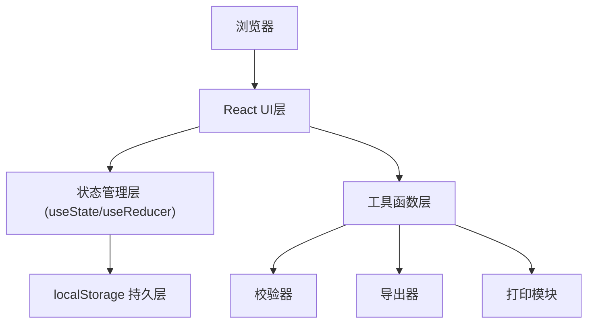
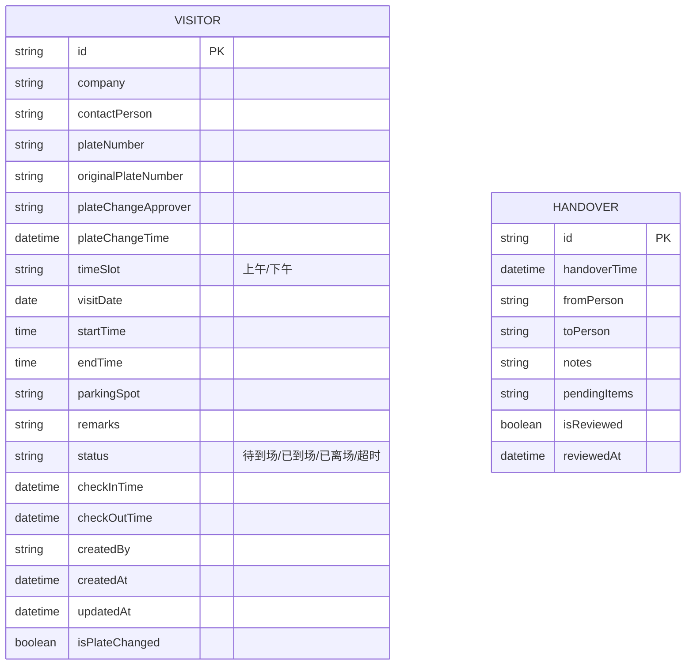

## 1. 架构设计



## 2. 技术描述

- **前端框架**: React@18 + TypeScript + Vite
- **样式方案**: TailwindCSS@3
- **图标库**: Font Awesome
- **数据持久化**: localStorage（无需后端）
- **构建工具**: Vite

### 技术选型理由
1. **React + TypeScript**：组件化开发，类型安全，适合复杂交互场景
2. **TailwindCSS**：快速构建UI，响应式设计便捷
3. **localStorage**：数据本地持久化，刷新后数据不丢失，满足"刷新后预约还在"需求
4. **纯前端方案**：无需后端服务器，部署简单，适合小型园区内部使用

## 3. 路由定义

| Route | 页面 | 用途 |
|-------|------|------|
| / | 预约管理页 | 预约录入、分组列表、智能提醒 |
| /gate | 门岗放行页 | 当前时段车牌、到场/离场、临时换车 |
| /stats | 统计导出页 | 超时统计、高频来访、数据导出 |
| /handover | 安保交接页 | 交接记录、事项复核 |

## 4. 数据模型

### 4.1 实体关系图



### 4.2 TypeScript 类型定义

```typescript
// 访客预约
interface Visitor {
  id: string;
  company: string;
  contactPerson: string;
  plateNumber: string;
  originalPlateNumber?: string;
  plateChangeApprover?: string;
  plateChangeTime?: string;
  timeSlot: 'morning' | 'afternoon';
  visitDate: string;
  startTime: string;
  endTime: string;
  parkingSpot: string;
  remarks?: string;
  status: 'pending' | 'arrived' | 'checked_out' | 'overdue';
  checkInTime?: string;
  checkOutTime?: string;
  createdBy: string;
  createdAt: string;
  updatedAt: string;
  isPlateChanged: boolean;
}

// 交接记录
interface Handover {
  id: string;
  handoverTime: string;
  fromPerson: string;
  toPerson: string;
  notes: string;
  pendingItems: string[];
  isReviewed: boolean;
  reviewedAt?: string;
}

// 提醒类型
type AlertType = 'plate_error' | 'parking_conflict' | 'all_day_occupied' | 'plate_changed';

interface Alert {
  id: string;
  type: AlertType;
  message: string;
  visitorId?: string;
  timestamp: string;
  dismissed: boolean;
}

// 用户角色
type UserRole = 'reception' | 'security';

interface CurrentUser {
  name: string;
  role: UserRole;
}
```

## 5. 核心工具函数

### 5.1 车牌校验器
```typescript
// 验证中国车牌格式（含新能源）
function validatePlateNumber(plate: string): boolean;
```

### 5.2 车位冲突检测
```typescript
// 检测同一车位在相同时段是否已被预约
function checkParkingConflict(
  parkingSpot: string,
  visitDate: string,
  startTime: string,
  endTime: string,
  excludeId?: string
): Visitor[];
```

### 5.3 超时检测
```typescript
// 检查是否超时未离场
function checkOverdue(visitor: Visitor): boolean;
```

### 5.4 数据导出
```typescript
// 导出CSV
function exportToCSV(data: any[], filename: string): void;
```

### 5.5 打印模块
```typescript
// 打印放行单
function printGatePass(visitor: Visitor): void;
```

## 6. localStorage 存储键

| 键名 | 数据类型 | 说明 |
|------|----------|------|
| visitors | Visitor[] | 所有预约记录 |
| handovers | Handover[] | 交接记录 |
| alerts | Alert[] | 提醒记录 |
| currentUser | CurrentUser | 当前登录用户 |
| parkingSpots | string[] | 车位列表配置 |
