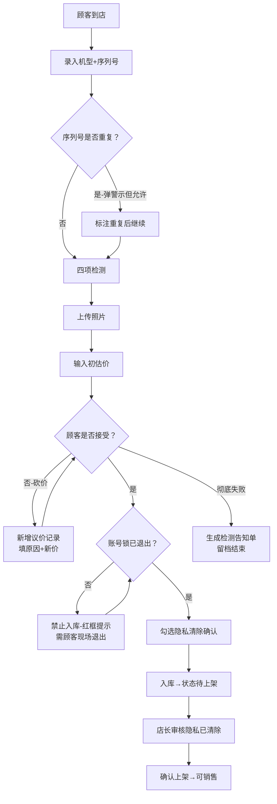

## 1. 产品概述

面向数码店的旧手机回收全流程管理系统，解决纸单登记易遗漏、价格追溯难、风险管控缺失等痛点。覆盖从顾客到店检测、议价、入库到上架销售的完整链路，同时支持店长导出报表和风险机监控。

- 核心用户：门店店员（登记+检测+议价）、店长（监管+导出+风控）
- 产品价值：杜绝漏项、全流程可追溯、关键节点强校验（账号锁/隐私清除/重复序列号）

---

## 2. 核心功能

### 2.1 用户角色

| 角色 | 登录方式 | 核心权限 |
|------|----------|----------|
| 店员 | 工号选择登录 | 新建回收单、检测登记、议价操作、入库申请、打印告知单 |
| 店长 | 工号选择登录+管理密码 | 全部店员权限 + 每日回收导出、让价原因汇总、待处理风险机管理、上架确认、价格变动审计 |

### 2.2 功能模块

1. **回收登记台（核心页）**：机型/序列号录入、四项检测（屏幕/电池/进水/账号锁）、照片上传、初估价、议价记录、状态流转
2. **回收列表页**：全量回收记录、多维度筛选（状态/日期/机型/风险）、快速搜索、详情抽屉
3. **回收详情页**：完整信息展示、价格变动时间线、检测不通过原因、操作日志、状态流转按钮
4. **店长工作台**：今日概览看板、三种报表导出（每日回收/让价原因/待处理风险机）、待上架审核
5. **风险机队列**：账号未退出、隐私未清除、检测异常机器的集中管理

### 2.3 页面详情

| 页面名称 | 模块名称 | 功能描述 |
|----------|----------|----------|
| 回收登记台 | 基础信息录入 | 品牌/机型/容量/颜色/序列号/IMEI，自动查重序列号并弹警示 |
| 回收登记台 | 四项检测面板 | 屏幕（划痕/碎裂/显示）、电池（健康度/鼓包）、进水（试纸变色）、账号锁（ID是否退出）——每项必选 |
| 回收登记台 | 照片上传区 | 支持正面/背面/侧面/细节最多6张，缩略图预览+删除 |
| 回收登记台 | 初估价与议价 | 系统初估价（可改）、议价次数无上限、每次变动记录原因+操作人+时间，保留完整历史 |
| 回收登记台 | 检测不通过告知 | 生成可打印/截图的顾客告知单，列出所有未通过项及说明文字，成交失败也留痕 |
| 回收登记台 | 入库强制校验 | 账号锁未退出→禁止入库按钮+红框提示；隐私清除未勾选→禁止下一步 |
| 回收列表页 | 搜索筛选区 | 日期范围、状态标签（待入库/已入库/待上架/已上架/已退回/议价失败）、机型搜索、序列号精确搜索 |
| 回收列表页 | 数据表格 | 缩略图、机型、序列号、初估价/成交价、差价、当前状态、操作人、操作按钮 |
| 回收详情页 | 价格时间线 | 垂直时间轴展示每次价格变动：旧价→新价、原因、操作人、精确时间 |
| 回收详情页 | 状态流转卡片 | 当前状态高亮+可操作按钮（入库→待上架→已上架/退回），每步强制校验前置条件 |
| 店长工作台 | 今日数据看板 | 今日回收量、成交总额、平均让价、待处理风险数、待上架数 |
| 店长工作台 | 报表导出区 | 三个独立导出按钮：①每日回收明细CSV ②让价原因汇总（带分类统计）③待处理风险机清单 |
| 店长工作台 | 上架审核列表 | 仅隐私清除已确认的机器可上架，批量/单条确认 |

---

## 3. 核心流程

**主要用户流程（店员→顾客回收）：**
顾客到店 → 店员录入机型与序列号（系统查重→重复则弹红警示但允许继续并标注）→ 逐项检测屏幕/电池/进水/账号锁 → 上传实物照片 → 输入初估价 → 顾客砍价→新增议价记录（填原因）→ 最终达成或失败 → 达成则校验账号锁已退出→勾选隐私清除确认→入库；失败则生成检测不通过告知单→留档

**店长流程：**
登录店长身份 → 查看今日数据看板 → 检查待处理风险机队列（优先处理账号未退出/隐私未确认）→ 审核入库机器隐私清除状态→确认上架 → 日终导出三份报表（每日回收/让价分析/风险机）

---

## 4. 用户界面设计

### 4.1 设计风格

- **主色**：深青绿 `#0F766E`（信任感+科技感），强调色琥珀橙 `#F59E0B`（警示+议价标识），危险色朱砂红 `#DC2626`（账号锁/风险提示）
- **辅色**：石板灰底色 `#F8FAFC`，卡片纯白 `#FFFFFF`，分割线用浅青灰 `#E2E8F0`
- **按钮风格**：圆角10px，主按钮饱满渐变+微阴影（悬停上浮2px），危险按钮红边白底，次级按钮灰底黑字
- **字体**：标题用「思源黑体 Heavy」加粗无衬线，正文用「PingFang SC」，数字价格用「JetBrains Mono」等宽对齐
- **布局**：左侧固定导航（店长/店员切换）+ 右侧主内容区卡片式布局，登记台用双栏（左检测区/右价格与状态）
- **图标/emoji**：📱手机、🔍检测、💰价格、⚠️风险、✅完成、📤导出、🚫退回

### 4.2 页面设计概览

| 页面名称 | 模块名称 | UI元素 |
|----------|----------|--------|
| 回收登记台 | 四项检测面板 | 大卡片四象限布局，每项绿色PASS/红色FAIL大按钮，未操作时灰态显示"待检测" |
| 回收登记台 | 议价时间线 | 右侧竖向时间轴，每次议价用橙色卡片突出差价箭头，最新一条高亮闪烁 |
| 回收登记台 | 账号锁校验区 | 状态红黄绿三色徽章+开关式确认按钮，未确认时入库按钮整体灰态+禁用标识 |
| 回收列表页 | 状态标签 | 胶囊形彩色标签，待入库=灰、已入库=蓝、待上架=橙、已上架=绿、已退回=红、议价失败=棕 |
| 回收详情页 | 价格时间线 | 左侧竖向粗线节点，每个节点含旧价删除线+新价大号字体，原因用斜体小字 |
| 店长工作台 | 数据看板 | 5个大数字卡片并排，数字用2xl等宽字体+渐变色块背景，风险数红色闪烁 |
| 店长工作台 | 导出区 | 三个并列大按钮带图标：📊每日、💰让价、⚠️风险，hover时图标轻微晃动 |

### 4.3 响应式

- **桌面优先**（1440px+）：左导航固定240px宽，主区最大1200px居中
- **平板适配**（768-1439px）：导航折叠为顶部横条，登记台双栏改单栏上下堆叠
- **触控优化**：所有操作按钮最小高44px，检测项大按钮支持iPad横屏单手操作

### 4.4 关键交互细节

- 序列号输入后**即时防抖查重**（500ms），重复时输入框红边+下方弹出"⚠️ 该序列号已于YYYY-MM-DD回收过，点击查看详情"
- 议价新增时**价格输入框自动聚焦**，原因输入框配快捷标签（屏幕划痕/电池健康低/市场行情/顾客要求/多台回收优惠）一键填充
- 入库按钮**多条件联动**：账号锁未退出→hover显示"❌ 请先让顾客退出账号ID"；隐私未确认→显示"⚠️ 请确认隐私数据已清除"
- 刷新页面后**详情和列表状态强一致**：数据层用全局唯一状态仓库，详情操作后列表同步更新，localStorage持久化
- 检测不通过告知单**生成A4比例卡片**，含店名水印、二维码（链接到该回收单详情）、未通过项逐条加粗标红
